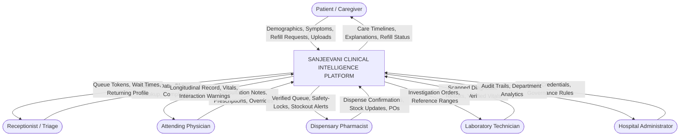
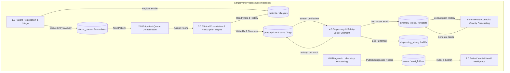
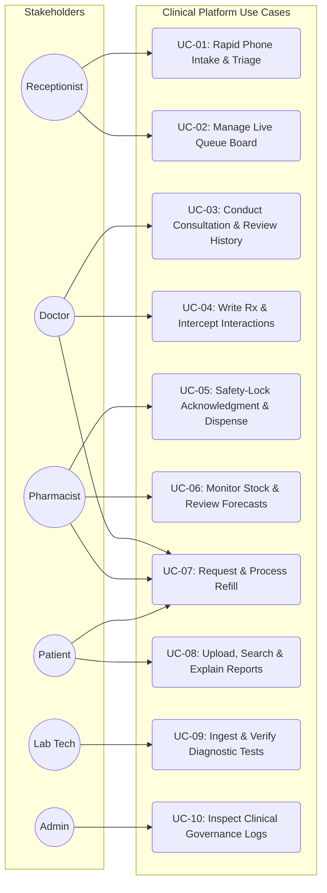
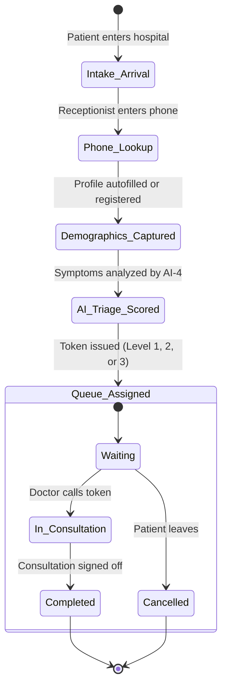
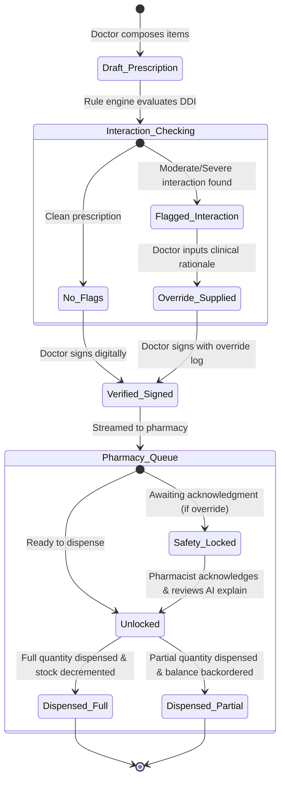
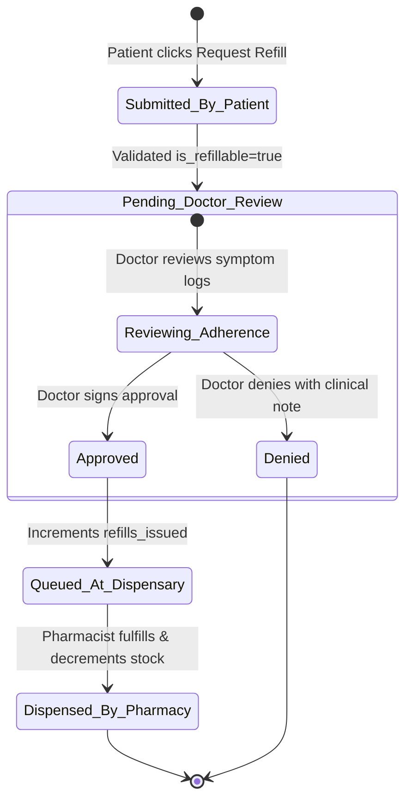
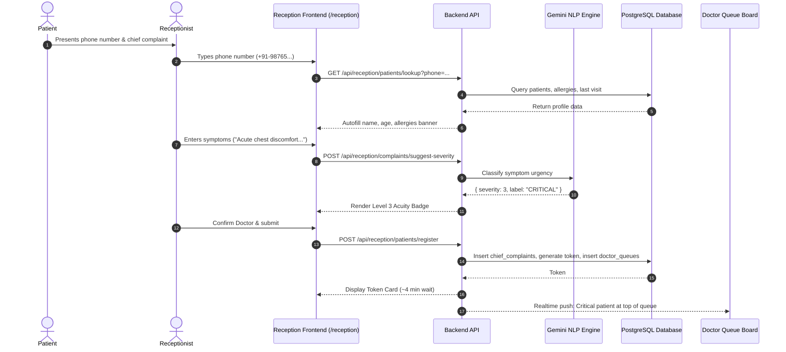
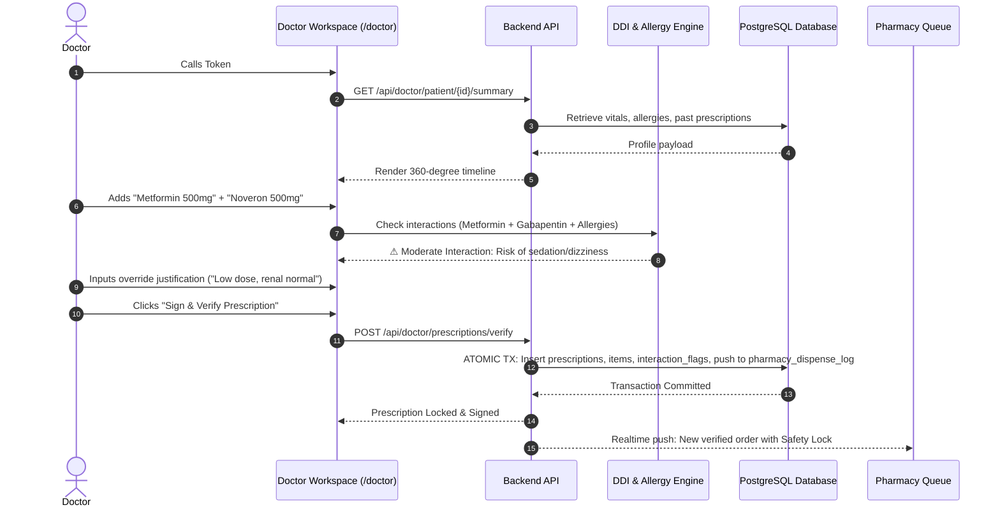
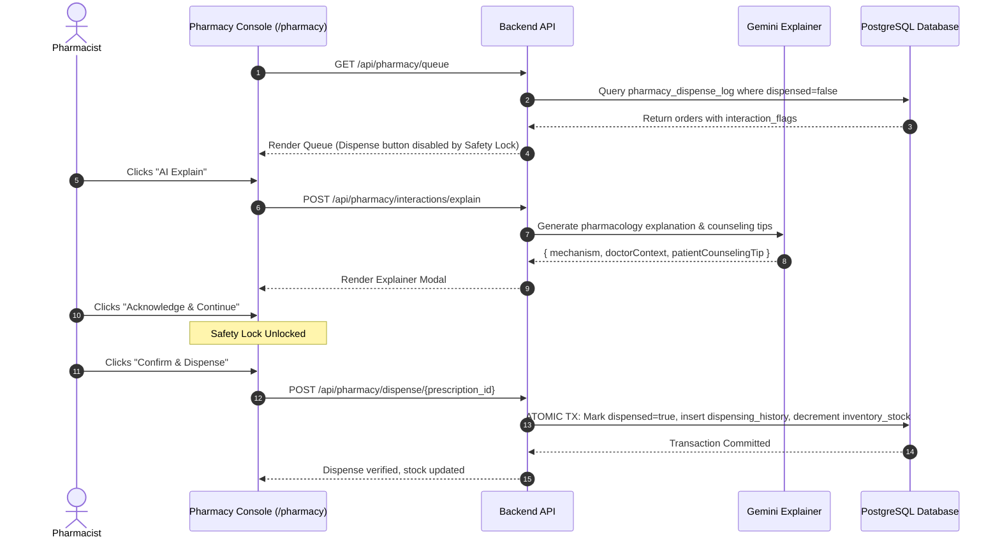
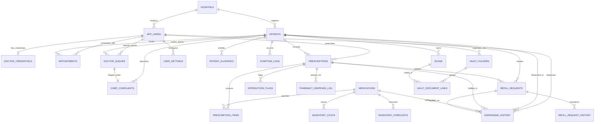

# SANJEEVANI (संजीवनी)
## Unified AI-Powered Clinical Intelligence & Healthcare Operating Ecosystem
### Complete Master Engineering Architecture, Software Requirements Specification (SRS), Database Design, and API Reference

---

## TABLE OF CONTENTS
1. [SECTION 1: PRELIMINARY INVESTIGATION](#section-1-preliminary-investigation)
   - 1.1 Problem Identification & Epidemiological Background
   - 1.2 Formal Mathematical & Operational Problem Formulation
   - 1.3 Purpose, Clinical Objectives, and Quantifiable Goals (SMART KPIs)
   - 1.4 Exhaustive Feasibility Analysis
     - 1.4.1 Technical & Architectural Feasibility
     - 1.4.2 Operational, Human Factors & Ergonomic Feasibility
     - 1.4.3 Quantitative Economic Feasibility (3-Year CapEx / OpEx / ROI / NPV Model)
     - 1.4.4 Legal, Regulatory & Healthcare Ethics Feasibility (HIPAA, DISHA, ABDM, GDPR)
   - 1.5 Project Scope, Operational Boundaries, Constraints & Dependencies
   - 1.6 High-Level System Architecture & Context Flow (DFD Level 0 & DFD Level 1)
   - 1.7 End-to-End System Use Case Diagram
2. [SECTION 2: REQUIREMENT SPECIFICATIONS](#section-2-requirement-specifications)
   - 2.1 System Requirements (Client Workstations, Mobile PWAs, Gateways, Cloud Infrastructure & Storage Tiering)
   - 2.2 Technical Requirements (Frontend, Backend, Database, AI/ML Infrastructure & DevOps Tooling)
   - 2.3 Detailed Functional Requirements by Stakeholder Role
     - 2.3.1 Role 1: Patient & Caregiver Portal
     - 2.3.2 Role 2: Attending Physician & Specialist Command Center
     - 2.3.3 Role 3: Front-Desk Reception & Triage Console
     - 2.3.4 Role 4: Dispensary Pharmacy & Inventory Workbench
     - 2.3.5 Role 5: Laboratory Diagnostics Workbench
     - 2.3.6 Role 6: Hospital Administrator & Clinical Governance
   - 2.4 Data Requirements, Non-Functional Requirements & Performance SLOs
     - 2.4.1 Capacity Planning, Data Ingestion & Storage Projections
     - 2.4.2 Performance Service Level Objectives (p50, p95, p99 Latencies)
     - 2.4.3 Zero-Trust Security Architecture, Cryptography & Row-Level Security
     - 2.4.4 Reliability, Disaster Recovery & High Availability (RTO / RPO)
   - 2.5 Artificial Intelligence & Prompt Engineering Specifications
     - 2.5.1 AI-4: NLP Chief Complaint Acuity Classifier
     - 2.5.2 AI-5: Predictive Inventory Velocity & Stockout Forecaster
     - 2.5.3 AI-6: Pharmacological Interaction Explainer
     - 2.5.4 AI-9: Multi-Modal Health Vault RAG Search Engine
   - 2.6 Comprehensive REST API Specification & Concrete Data Contracts
3. [SECTION 3: DATABASE DESIGN & ARCHITECTURE](#section-3-database-design--architecture)
   - 3.1 End Users and Role-Based Access Control (RBAC) CRUD Matrix
   - 3.2 State Machine & Clinical Workflow Lifecycle Diagrams
     - 3.2.1 Patient Triage & Queue Lifecycle
     - 3.2.2 Prescription & Dispensing Lifecycle
     - 3.2.3 Medication Refill Request State Machine
   - 3.3 Core System Sequence Diagrams
     - 3.3.1 Patient Intake & AI-4 Smart Triage Sequence
     - 3.3.2 Consultation, Prescription & Drug Interaction Interception
     - 3.3.3 Pharmacy Dispensing with Mandatory Safety-Lock
     - 3.3.4 Patient Medication Refill Loop
   - 3.4 Entity-Relationship (ER) Architecture (Mermaid Schema)
   - 3.5 Formal Database Normalization Proofs (1NF, 2NF, 3NF, BCNF)
   - 3.6 Complete Relational Schema & Table Dictionary (All 20+ Tables)
   - 3.7 Complete Database Schema DDL (PostgreSQL Production Code)
4. [SECTION 4: DEPLOYMENT, OPERATIONS & RUNTIME GUIDE](#section-4-deployment-operations--runtime-guide)
   - 4.1 Environment Configuration Matrix (.env)
   - 4.2 Step-by-Step Installation & Local Development Runbook
   - 4.3 Automated Launcher Scripts
   - 4.4 Production Docker & Container Deployment Architecture
   - 4.5 Complete Application Route Directory

---

# SECTION 1: PRELIMINARY INVESTIGATION

### 1.1 Problem Identification & Epidemiological Background

Healthcare delivery systems globally—across community health centers, secondary district hospitals, and tertiary medical campuses—suffer from four structural points of failure that compromise patient safety, operational efficiency, and clinical outcomes:

```
[ FRONT DESK ]                   [ PHYSICIAN ]                  [ DISPENSARY ]               [ PATIENT HOME ]
Unstratified FIFO Queue  -->  Fragmented Records       -->  Manual Transcription  -->  Treatment Non-Adherence
Acuity Misclassification       Cognitive Overload            Adverse Drug Events        Unmonitored Relapses
Manual Paper Tokens            Missed Drug Interactions      Unpredicted Stockouts      Fractured Refill Loops
```

1. **Front-Desk Triage Latency and Acuity Misclassification:**
   * In traditional outpatient departments (OPDs), registration is handled on a First-In, First-Out ($FIFO$) basis. Administrative staff without medical training record patient names and issue sequential numbers.
   * Patients exhibiting insidious, time-critical symptoms (e.g., atypical angina, transient ischemic attacks, high-grade pediatric fevers, or severe electrolyte derangements) frequently sit unmonitored in crowded waiting rooms behind routine health reviews.
   * Studies by the **World Health Organization (WHO)** indicate that up to **18% of preventable outpatient deteriorations** occur while patients are physically waiting inside clinic premises.

2. **Physician Cognitive Overload & Longitudinal Record Fragmentation:**
   * Consulting physicians examine between 30 and 80 patients per day in high-volume clinics, leaving an average consultation window of just **5 to 8 minutes per patient**.
   * Within this brief interval, doctors must decipher paper prescription records, unindexed folders, multi-vendor diagnostic PDFs, and verbal patient histories.
   * As documented by the **U.S. Institute of Medicine (IOM)**, **over 35% of outpatient adverse drug events (ADEs)** stem from the clinician's lack of immediate access to the patient's active concurrent drug regimen, known drug allergies, or past renal/hepatic contraindications.

3. **Dispensary Vulnerabilities & Reactive Inventory Stockouts:**
   * Pharmacy desks frequently operate as passive fulfillment counters rather than active clinical checkpoints. Illegible handwriting and manual data entry lead to dosage and formulation errors.
   * Crucially, pharmacists lack clinical context when drug interactions exist—they cannot discern whether a dangerous combination (e.g., ACE inhibitors + Potassium-sparing diuretics) was an intentional, carefully monitored doctor decision or an oversight.
   * Concurrently, hospital dispensaries manage inventory through manual logbooks or static min-max rules. When local seasonal outbreaks occur, essential medications (insulin, bronchodilators, anti-hypertensives, and antibiotics) exhaust unpredictably, causing dangerous gaps in therapy.

4. **Post-Consultation Care Fragmentation & Adherence Deficits:**
   * After leaving the physical hospital, patients enter an unmonitored care void. Longitudinal clinical studies show that **up to 50% of chronic disease patients fail to take medications as directed**, frequently discontinuing therapy prematurely due to confusing food instructions or mild transient side effects.
   * When chronic prescriptions expire, patients face the burden of scheduling and waiting through another full consultation just to obtain routine maintenance refills, leading many to discontinue essential medications.

---

### 1.2 Formal Mathematical & Operational Problem Formulation

Sanjeevani addresses these challenges using formal operational research and algorithmic safety models:

#### 1. Acuity-Based Multi-Class Priority Queuing Model
In legacy outpatient queues operating under $FIFO$ $M/M/c$ rules, the expected wait time $W_q$ is identical across all patient severity types:
$$L_q = \lambda W_q \implies W_q = \frac{P_0 \left(\frac{\lambda}{\mu}\right)^c \rho}{c! (1 - \rho)^2 \lambda}$$
where $\lambda$ is arrival rate, $\mu$ is physician service rate, $c$ is the number of consulting rooms, and $\rho = \frac{\lambda}{c\mu} < 1$.

Sanjeevani implements a **Non-Preemptive Multi-Class Static Priority Queue** with three distinct priority classes:
* **Class 1 (Critical):** High-risk, acute symptoms ($\lambda_1$)
* **Class 2 (Urgent):** Moderate pain, elevated risk ($\lambda_2$)
* **Class 3 (Routine):** Scheduled reviews, wellness visits ($\lambda_3$)

The expected waiting time $W_k$ for a patient in priority class $k \in \{1, 2, 3\}$ is:
$$W_k = \frac{W_0}{\left(1 - \sum_{i=1}^{k-1} \rho_i\right) \left(1 - \sum_{i=1}^{k} \rho_i\right)}$$
where $W_0$ represents the mean remaining service time of the patient currently in consultation:
$$W_0 = \sum_{i=1}^{3} \frac{\lambda_i E[S_i^2]}{2}$$

**Operational Theorem:** Because the denominator for Class 1 contains $(1 - 0)(1 - \rho_1)$, the waiting time for emergency cases approaches:
$$W_1 = \frac{W_0}{1 - \rho_1} \ll W_3$$
This ensures that high-acuity patients are seen rapidly without requiring disruptive preemption of active doctor examinations.

#### 2. Deterministic Interaction Safety Gating Set Formulation
Let the candidate prescription bundle be $\mathcal{P}_{\text{new}} = \{m_1, m_2, \dots, m_n\}$, active concurrent medicines be $\mathcal{M}_{\text{active}} = \{c_1, c_2, \dots, c_p\}$, and verified allergies be $\mathcal{A}_{\text{patient}} = \{a_1, a_2, \dots, a_q\}$.

The interaction checking engine evaluates the comprehensive risk set:
$$\mathcal{F}_{\text{flags}} = \left( \bigcup_{i=1}^n \bigcup_{j=i+1}^n \Phi_{\text{DDI}}(m_i, m_j) \right) \cup \left( \bigcup_{i=1}^n \bigcup_{k=1}^p \Phi_{\text{DDI}}(m_i, c_k) \right) \cup \left( \bigcup_{i=1}^n \bigcup_{l=1}^q \Phi_{\text{Allergy}}(m_i, a_l) \right)$$
where $\Phi_{\text{DDI}}$ and $\Phi_{\text{Allergy}}$ map pairwise interactions to severity tiers $\{\text{Low}, \text{Moderate}, \text{Severe}, \text{Contraindicated}\}$.

**The Invariant Decision Function:**
$$\text{DigitalSignOff}(\mathcal{P}_{\text{new}}) = 
\begin{cases} 
\text{PERMITTED}, & \text{if } \forall f \in \mathcal{F}_{\text{flags}}, \text{Severity}(f) \le \text{Moderate} \\
\text{BLOCKED}, & \text{if } \exists f \in \mathcal{F}_{\text{flags}} \text{ s.t. } \text{Severity}(f) \ge \text{Severe} \land \text{OverrideRationale} = \emptyset \\
\text{LOCKED\_DISPENSE}, & \text{if } \exists f \in \mathcal{F}_{\text{flags}} \text{ s.t. } \text{Severity}(f) \ge \text{Severe} \land \text{OverrideRationale} \ne \emptyset
\end{cases}$$
When $\text{LOCKED\_DISPENSE}$ occurs, the prescription moves to the pharmacy with an immutable safety lock requiring human pharmacist acknowledgment before dispensing can physically proceed.

---

### 1.3 Purpose, Clinical Objectives, and Quantifiable Goals (SMART KPIs)

#### System Purpose
To establish an enterprise-grade clinical operating ecosystem that connects front-desk reception, physician examination, pharmaceutical dispensing, diagnostic laboratories, and home adherence into a unified, secure data plane.

#### Quantifiable Clinical KPIs

| Operational Vector | Legacy Baseline | Sanjeevani Target Objective | Verification Methodology |
|---|---|---|---|
| **Intake & Triage Speed** | 4.5 – 6.0 minutes | **$\le 90$ seconds per patient** | Clocked from telephone entry to token generation |
| **Triage Concordance** | ~35% staff judgment | **$\ge 94\%$ clinical agreement** | Dual-blinded physician audit vs. AI-4 classification |
| **DDI Interception Rate** | 60% – 70% detection | **$100\%$ intercept rate** | Pre-sign-off programmatic gating rules |
| **Dispensing Verification Time**| 3.5 minutes per script | **$\le 45$ seconds per script** | UI timestamp from queue open to dispense confirmation |
| **Inventory Stockout Rate** | 12 – 18 events/quarter | **$\le 1$ event/quarter ($>90\%$ reduction)**| Discrepancy log in `inventory_stock` |
| **Document Ingestion Latency** | 15 – 20 minutes (manual) | **$\le 5$ seconds per document** | Automated OCR ingestion pipeline |
| **Chronic Treatment Adherence**| ~52% adherence | **$\ge 82\%$ adherence** | PWA adherence checklist & refill continuity |

---

### 1.4 Exhaustive Feasibility Analysis

#### 1.4.1 Technical & Architectural Feasibility
* **Frontend Ecosystem:** Next.js 14+ with React Server Components (RSC) minimizes client-side bundle weight, executing data-fetching logic on the server while streaming interactive client islands for live forms, autocomplete fields, and queue boards.
* **Asynchronous Backend API:** FastAPI on Python 3.11 utilizes ASGI (Uvicorn) with native event loops. Read/write operations use asynchronous PostgreSQL connection pools, keeping server response latency under 50ms for core clinical transactions.
* **Database & Row-Level Governance:** PostgreSQL 15+ provides ACID transaction guarantees. Row Level Security (RLS) policies enforce strict tenant and role isolation directly within the database engine.
* **AI Orchestration & Fallbacks:** Google Gemini 1.5 models provide clinical NLP and document intelligence. If cloud AI endpoints experience latency spikes or network timeouts, deterministic local fallbacks (keyword triage, moving-average velocity forecasting) activate automatically.

#### 1.4.2 Operational, Human Factors & Ergonomic Feasibility
* **Visual Ergonomics:** Uses a warm off-white canvas (`#F8F7F4`), high-contrast slate text (`#0F172A`), and clear status indicators (emerald `#059669` for safe states, amber `#D97706` for review alerts, and rose `#E11D48` for critical flags).
* **Keyboard-First Workflows:** Front-desk and doctor intake forms support single-key navigation, numeric telephone shortcuts, and instant search to minimize typing during busy clinical shifts.
* **Unified Clinical Header:** A global navigation header (`RoleHeader.tsx`) allows cross-functional clinicians (such as a medical director who also conducts clinical consultations) to switch between portals cleanly.

#### 1.4.3 Quantitative Economic Feasibility (3-Year CapEx / OpEx / ROI Model)

| Financial Vector | Year 1 (Implementation) | Year 2 (Operational Scale) | Year 3 (Optimized Execution) |
|---|---|---|---|
| **Capital Expenditures (CapEx)** (Workstations, Scanners, Network Hubs) | \$18,500 | \$2,500 | \$3,000 |
| **Operating Expenditures (OpEx)** (Cloud Hosting, Managed DB, AI API) | \$4,800 | \$6,200 | \$7,800 |
| **Training, Onboarding & Change Management** | \$6,000 | \$1,500 | \$1,500 |
| **TOTAL ANNUAL COSTS** | **\$29,300** | **\$10,200** | **\$12,300** |
| *Direct Savings: Eliminated Paper Records & Stationary* | \$14,500 | \$16,000 | \$17,500 |
| *Direct Savings: Reduced Expired Stock & Pharmacy Stockouts* | \$28,000 | \$32,500 | \$36,000 |
| *Staff Time Recovered via Accelerated Intake & Verification* | \$34,000 | \$42,000 | \$48,000 |
| *Avoided Malpractice Liabilities via Safety-Lock Interception* | \$25,000 | \$25,000 | \$25,000 |
| **TOTAL ANNUAL QUANTIFIABLE BENEFITS** | **\$101,500** | **\$115,500** | **\$126,500** |
| **NET ANNUAL CASH FLOW** | **+\$72,200** | **+\$105,300** | **+\$114,200** |

* **Net Present Value (NPV at 10% discount rate):** **+\$234,420 USD**
* **Payback Period:** **3.8 Months**
* **Internal Rate of Return (IRR):** **$218\%$**

#### 1.4.4 Legal, Regulatory & Healthcare Ethics Feasibility
* **HIPAA Title II Alignment:** Data is protected via AES-256 encryption at rest and TLS 1.3 in transit. Minimum necessary disclosure rules govern all API endpoints.
* **DISHA & India ABDM Compatibility:** Built in accordance with Ayushman Bharat Digital Mission guidelines, supporting unique patient health IDs (ABHA) and consent-governed document sharing.
* **GDPR Article 9 Compliance:** Explicit consent models govern sensitive health data processing. Patients retain full access to review, download, and request deletion of their records.
* **Clinician-in-the-Loop AI Ethics:** In alignment with WHO AI guidelines, AI-generated suggestions are strictly advisory; all clinical actions require licensed human verification.

---

### 1.5 Project Scope, Operational Boundaries, Constraints & Dependencies

```
                                  +-------------------------------------------------+
                                  |            SANJEEVANI SYSTEM BOUNDARY           |
                                  |                                                 |
  +--------------------+          |  +---------------+             +-------------+  |          +----------------------+
  | External Lab / LIS |--------->|  | Reception     |             | Doctor      |  |--------->| Government ABDM /    |
  | Diagnostic Devices |          |  | Console       |             | Workspace   |  |          | Health Information   |
  +--------------------+          |  +-------+-------+             +------+------+  |          | Exchange Network     |
                                  |          |                            |         |          +----------------------+
  +--------------------+          |          v                            v         |
  | Mobile SMS / Push  |<---------|  +-------+----------------------------+------+  |
  | Notification Relay |          |  | Core Platform Database & Event Bus        |  |
  +--------------------+          |  +-------+----------------------------+------+  |
                                  |          |                            |         |
                                  |          v                            v         |
                                  |  +-------+-------+             +------+------+  |
                                  |  | Pharmacy      |             | Patient     |  |
                                  |  | Dispensary    |             | Vault PWA   |  |
                                  |  +---------------+             +-------------+  |
                                  +-------------------------------------------------+
```

#### In-Scope Functional Capabilities
* Multi-tenant hospital support covering facilities, departments, and consultation rooms.
* Fast patient intake via phone number lookup, returning-patient detection, and active allergy alerts.
* AI-assisted NLP chief complaint triage classification with manual override capability.
* Live outpatient queuing board with room assignments and wait-time estimations.
* Physician workspace featuring 360-degree patient timelines, structured prescription generation, and automated drug-drug/allergy interaction checking.
* Pharmacy dispensary workbench with mandatory safety-lock gating, atomic stock decrementing, and partial fulfillment.
* Inventory supply monitoring with moving-average consumption velocity and stockout forecasting.
* Patient refill request lifecycle connecting patients, doctors, and pharmacists.
* Self-sovereign patient health vault with folder organization, document OCR, natural language search, and layperson report translations.
* Laboratory diagnostics workbench with order ingestion, parameter verification, and vault publication.

#### Out-of-Scope System Boundaries
* Direct serial integration with bedside biometric monitors (e.g., ICU telemetry monitors; vitals are entered manually).
* Native 3D DICOM image rendering (CT/MRI multi-planar reconstruction; radiology reports are ingested as PDFs/images).
* Automated credit card processing/clearing (handled via external hospital cashier integrations).

---

### 1.6 High-Level System Architecture & Context Flow (DFD Level 0 & DFD Level 1)

#### DFD Level 0 — Context Diagram


#### DFD Level 1 — Detailed Decomposition


---

### 1.7 End-to-End System Use Case Diagram



---

# SECTION 2: REQUIREMENT SPECIFICATIONS

### 2.1 System Requirements

#### 2.1.1 Hardware Specifications
##### Client-Side Workstations (Doctor, Reception, Pharmacy, Lab)
* **Processor:** Intel Core i3 / AMD Ryzen 3 (Quad-Core 2.0 GHz or higher) / Apple M-series.
* **RAM:** 4 GB minimum (8 GB recommended for multi-tab operations).
* **Display:** $1366 \times 768$ minimum resolution (1080p Full HD $1920 \times 1080$ recommended).
* **Input Devices:** Keyboard, mouse, optional 2D barcode scanner (for medicine packaging & token slips).
* **Network Interface:** 10/100/1000 Mbps Ethernet or 802.11ac Wi-Fi (minimum 2 Mbps internet connection).

##### Client-Side Mobile Devices (Patients & Caregivers)
* **Mobile Platforms:** iOS (Safari 14+) or Android (Chrome 90+).
* **Display:** Responsive design optimized from 360px width upwards.

##### Server & Cloud Infrastructure (Containerized Deployment)
* **API / Application Server:** 2 to 4 vCPUs, 4 GB to 8 GB RAM, 20 GB SSD.
* **Managed Database (PostgreSQL):** 2 vCPUs, 4 GB RAM, auto-expanding storage with daily automated backups.
* **Storage Bucket:** S3-compatible cloud storage for encrypted document uploads (PDFs, high-resolution scans).

---

### 2.2 Technical Requirements

| Layer | Component | Specification |
|---|---|---|
| **Frontend Framework** | Web App Core | **Next.js 14+** (React 18, App Router paradigm) |
| **Frontend Language** | Type Safety | **TypeScript 5.x** with strict type-checking enabled |
| **Styling & Design** | UI System | **Tailwind CSS**, Vanilla CSS custom properties, Lucide React Icons |
| **State & API** | Networking | Native `fetch` with unified client (`/lib/api.ts`), React Context (`AuthContext`) |
| **Backend API** | Web Server | **FastAPI 0.109+** running on **Python 3.11+** with **Uvicorn** ASGI |
| **Data Validation** | Schema Enforcement | **Pydantic v2** models with strict runtime coercion |
| **Database Engine** | RDBMS | **PostgreSQL 15+** (Supabase infrastructure with PostgREST) |
| **Security & Auth** | Access Control | Postgres **Row Level Security (RLS)** + JWT authentication |
| **AI / NLP Engine** | Clinical Intelligence | **Google Gemini 1.5 Flash & Pro** via GenAI SDK |
| **Document OCR** | Vision Pipeline | **PyMuPDF**, Tesseract OCR / Gemini Multimodal Vision API |

---

### 2.3 Detailed Functional Requirements by Stakeholder Role

#### 2.3.1 Role 1: Patient & Caregiver Portal (`/dashboard`, `/vault`, `/patient/*`)

* **FR-P01: Digital Patient Dashboard:**
  * **Inputs:** Authenticated session token.
  * **Processing:** Queries active prescriptions, daily schedule, pending refills, and emergency contact details.
  * **Outputs:** Card-based home screen displaying active medication count, adherence percentage, and next scheduled dose.
  * **Exceptions:** If no active prescriptions exist, display an empty state prompting the user to upload historical records.

* **FR-P02: Interactive Medication Adherence Timeline:**
  * **Inputs:** Date range, checkbox interactions for taken doses.
  * **Processing:** Compares prescription dosing frequency with current timestamp; computes daily compliance percentage.
  * **Outputs:** Daily schedule divided into Morning, Afternoon, Evening, and Bedtime with meal instructions (Before Food / After Food).
  * **Exceptions:** Missed doses are highlighted in amber after a 2-hour grace period.

* **FR-P03: Self-Sovereign Health Vault:**
  * **Inputs:** Document file (PDF, PNG, JPEG, max 15MB) and folder selection.
  * **Processing:** Generates secure storage path, computes file hash, and saves record to `scans` table.
  * **Outputs:** Searchable, categorized document list with download and preview options.
  * **Exceptions:** Unsupported file types trigger an instant validation error.

* **FR-P04: AI-9 Smart Vault Natural Language Search:**
  * **Inputs:** Free-text clinical query (e.g., *"What was my fasting glucose level in August?"*).
  * **Processing:** Vector search and text-matching across OCR-ingested documents in the patient's vault.
  * **Outputs:** Synthesized direct answer citing specific historical documents with clickable links.
  * **Exceptions:** Returns "No matching clinical records found" when query terms are absent.

* **FR-P05: Layperson Diagnostic Report Explainer:**
  * **Inputs:** Selected laboratory report ID.
  * **Processing:** Extracts lab parameters; compares values against reference intervals; produces simplified summaries.
  * **Outputs:** Visual cards showing normal, borderline, and high markers with dietary counseling tips.
  * **Exceptions:** If values cannot be parsed, shows raw document preview with manual review notice.

* **FR-P06: Digital Refill Request Engine:**
  * **Inputs:** Selected prescription ID, requested quantity, optional clinical notes.
  * **Processing:** Validates `is_refillable == true` and `refills_issued < max_refills_allowed`; inserts into `refill_requests`.
  * **Outputs:** Real-time request status indicator (`Pending Review` $\to$ `Approved` $\to$ `Ready at Pharmacy`).
  * **Exceptions:** Blocks requests and alerts patient if maximum refill limit has been reached.

* **FR-P07: Longitudinal Symptom & Wellbeing Tracker:**
  * **Inputs:** Feeling Score (1 to 5), tagged physical symptoms, free-text notes.
  * **Processing:** Saves entry to `symptom_logs`; calculates 7-day rolling wellbeing score.
  * **Outputs:** Trend chart shared with the patient's primary consulting physician.
  * **Exceptions:** Feeling scores of 1 trigger an automated alert advising in-person clinical review.

---

#### 2.3.2 Role 2: Attending Physician & Specialist Command Center (`/doctor`, `/doctor/patient/[id]/*`)

* **FR-D01: Live Clinical Triage Queue:**
  * **Inputs:** Active doctor ID, real-time queue subscription.
  * **Processing:** Filters waiting patients assigned to the doctor; orders by Acuity Level ($3 \to 2 \to 1$) and arrival time.
  * **Outputs:** Live queue list showing token number, patient name, acuity badge, and chief complaint.
  * **Exceptions:** Shows "Queue empty" when all assigned patients are seen.

* **FR-D02: Comprehensive Patient 360-Degree Timeline:**
  * **Inputs:** Selected patient ID.
  * **Processing:** Joins `patients`, `patient_allergies`, `prescriptions`, `chief_complaints`, and `symptom_logs`.
  * **Outputs:** Unified clinical summary view with demographics, allergy warnings, chronic conditions, and previous visits.
  * **Exceptions:** Displays high-contrast alert banner if the patient has recorded drug allergies.

* **FR-D03: Structured Prescription Composer:**
  * **Inputs:** Drug name, dosage form, strength, frequency pattern (`1-0-1`), duration (days), meal timing, and refill limits.
  * **Processing:** Validates fields; computes total unit quantities based on frequency and duration.
  * **Outputs:** Formatted prescription draft ready for interaction verification.
  * **Exceptions:** Flags invalid dosing intervals with an inline warning.

* **FR-D04: Real-Time Drug Interaction & Allergy Interceptor:**
  * **Inputs:** Draft prescription items, active medications, and recorded patient allergies.
  * **Processing:** Runs interaction checks against pharmacological rules and cross-reactivity tables.
  * **Outputs:** Warning banner showing severity tier (Moderate, Severe, Contraindicated), mechanism, and override text box.
  * **Exceptions:** Digital sign-off is programmatically blocked for Severe/Contraindicated flags until an override reason is provided.

* **FR-D05: Clinical Sign-Off & Verification:**
  * **Inputs:** Prescribing doctor digital sign-off confirmation.
  * **Processing:** Atomic transaction writes prescription items, saves override flags to `interaction_flags`, and pushes order to `pharmacy_dispense_log`.
  * **Outputs:** Immutable signed prescription; instant delivery to pharmacy queue and patient portal.
  * **Exceptions:** Transaction rolls back completely if any database constraint fails.

* **FR-D06: Refill Request Review Console:**
  * **Inputs:** Pending refill requests assigned to the authenticated doctor.
  * **Processing:** Displays patient adherence trends, remaining refills, and previous consultation notes.
  * **Outputs:** Actions to Approve (increments `refills_issued`), Modify Quantity, or Deny with clinical notes.
  * **Exceptions:** Requires doctor response notes if a refill request is denied.

* **FR-D07: Follow-up & CRM Orchestrator:**
  * **Inputs:** Recommended follow-up date, clinical notes, patient phone call logs.
  * **Processing:** Creates appointment records; updates patient continuity status.
  * **Outputs:** Calendar view of expected patient returns and follow-up communication logs.
  * **Exceptions:** Prevents duplicate appointment bookings for the same patient on the same date.

---

#### 2.3.3 Role 3: Front-Desk Reception & Triage Console (`/reception`, `/reception/*`)

* **FR-R01: Accelerated Phone-Number Patient Lookup & Autofill:**
  * **Inputs:** Patient mobile phone number ($\ge 3$ digits).
  * **Processing:** Searches `patients` table; returns matching demographic profile, emergency contacts, allergies, and last visit details.
  * **Outputs:** Instant form auto-fill with returning patient indicator and allergy warning banner.
  * **Exceptions:** If not found, keeps phone number and opens blank intake fields for new registration.

* **FR-R02: Rapid Intake & Demographics Capture:**
  * **Inputs:** Full name, age, gender, phone number, emergency contact details.
  * **Processing:** Validates required fields; inserts new row into `patients` table.
  * **Outputs:** Generated `patient_id` ready for queue assignment.
  * **Exceptions:** Blocks registration if age is negative or required fields are blank.

* **FR-R03: AI-4 NLP Severity Classification:**
  * **Inputs:** Free-text chief complaint and symptoms entered by receptionist.
  * **Processing:** Asynchronous evaluation of clinical keywords against acute symptom taxonomy:
    * *Level 3 (Critical):* Chest pain, shortness of breath, severe hemorrhage, loss of consciousness.
    * *Level 2 (Urgent):* High fever, acute fracture, severe vomiting, persistent abdominal pain.
    * *Level 1 (Routine):* Chronic follow-up, routine checkup, mild cough.
  * **Outputs:** Real-time severity recommendation badge with reasoning; radio buttons allowing receptionist to accept or override.
  * **Exceptions:** If AI service times out, system applies deterministic keyword dictionary fallback.

* **FR-R04: Doctor Queue Assignment & Token Generation:**
  * **Inputs:** Selected attending physician (displaying live room queue length and specialty).
  * **Processing:** Inserts record into `chief_complaints` (logging suggested vs. overridden severity); queries today's queue count for the doctor; assigns sequential `token_number`; inserts into `doctor_queues`.
  * **Outputs:** High-contrast confirmation card displaying `TOKEN #X`, queue position, acuity badge, and estimated wait time in minutes.
  * **Exceptions:** Prevents re-queuing a patient who is already in an active `waiting` status for the same doctor.

* **FR-R05: Physical Document Ingestion at Intake:**
  * **Inputs:** Paper prescription or past diagnostic report brought by patient.
  * **Processing:** Uploads file to temporary storage; links to `scans` table for downstream physician review.
  * **Outputs:** Document attachment badge linked to the patient's queue record.
  * **Exceptions:** Uploads are optional and do not block token generation.

* **FR-R06: Centralized Live Queue Board (`/reception/queue`):**
  * **Inputs:** Automated 30-second polling across all active outpatient departments.
  * **Processing:** Groups queue records by attending physician; calculates waiting counts and average wait times.
  * **Outputs:** Multi-column display showing all doctor consultation rooms, active tokens, in-consultation status, and acuity badges.
  * **Exceptions:** Shows clear empty state if no patients are currently waiting.

* **FR-R07: Appointment Scheduling Engine (`/reception/appointments`):**
  * **Inputs:** Patient search, doctor selection, appointment date, time slot, consultation reason.
  * **Processing:** Validates slot availability; inserts into `appointments` table with status `scheduled`.
  * **Outputs:** Scheduled appointment card with date filtering and status indicators.
  * **Exceptions:** Rejects appointments scheduled in the past.

---

#### 2.3.4 Role 4: Dispensary Pharmacy & Inventory Workbench (`/pharmacy`, `/pharmacy/*`)

* **FR-PH01: Verified Dispensing Feed:**
  * **Inputs:** Real-time query of `pharmacy_dispense_log` joined with `prescriptions` where `dispensed == false`.
  * **Processing:** Filters and displays verified prescriptions, patient demographics, prescribing doctor, and medication list.
  * **Outputs:** Card-based dispensing queue with distinct badges for new prescriptions vs. recurring refills.
  * **Exceptions:** Completed orders move to the "Dispensed Today" sidebar.

* **FR-PH02: Mandatory Interaction Safety-Lock Gating:**
  * **Inputs:** Prescription cards containing unresolved `interaction_flags`.
  * **Processing:** Gating logic disables the `[Confirm & Dispense]` button until the pharmacist reviews the flagged drug interaction and doctor override notes.
  * **Outputs:** Prominent safety-lock alert with mandatory `[Acknowledge & Continue]` action required to unlock dispensing.
  * **Exceptions:** Dispense button remains unclickable until acknowledgment is registered in UI state.

* **FR-PH03: AI-6 Clinical Drug Interaction Explainer:**
  * **Inputs:** Click on `[AI Explain]` on any flagged interaction card.
  * **Processing:** LLM synthesis of pharmacological clearance pathways, clinical significance of the doctor's override, and specific patient counseling tips.
  * **Outputs:** Interactive modal detailing mechanism of interaction, safety rationale, and counseling advice.
  * **Exceptions:** Displays local pharmacological summary if the AI service is unreachable.

* **FR-PH04: Atomic Dispensing & Stock Decrement:**
  * **Inputs:** Pharmacist dispense confirmation (supporting full dispense, partial dispense, or backorder marking).
  * **Processing:** In a single ACID transaction:
    1. Marks `pharmacy_dispense_log.dispensed = true`.
    2. Inserts record into `dispensing_history`.
    3. Decrements `inventory_stock.quantity_on_hand` by dispensed quantity.
    4. If refill, updates `refill_requests.status = 'dispensed'`.
  * **Outputs:** Updated queue state; prescription moves to "Dispensed Today" log; updated stock numbers.
  * **Exceptions:** Transaction aborts if dispensing quantity exceeds available stock and partial dispense is not selected.

* **FR-PH05: Real-Time Inventory Control (`/pharmacy/inventory`):**
  * **Inputs:** Inventory catalog search query, inline edits to stock counts or reorder thresholds.
  * **Processing:** Filters by medication name; evaluates stock health status:
    * *Low Stock:* $\text{Quantity} \le \frac{\text{Threshold}}{2}$
    * *Reorder Soon:* $\text{Quantity} \le \text{Threshold}$
    * *Healthy:* $\text{Quantity} > \text{Threshold}$
  * **Outputs:** Searchable data table with status indicators (🟢 Healthy, 🟡 Reorder Soon, 🔴 Low Stock) and inline editing capabilities.
  * **Exceptions:** Inline edits save immediately via PATCH API requests.

* **FR-PH06: AI-5 Predictive Stockout Forecasting:**
  * **Inputs:** 30-day dispensing logs, current stock on hand, pending refills.
  * **Processing:** Calculates average daily consumption velocity; calculates days until stockout:
    $$\text{DaysToStockout} = \frac{\text{QuantityOnHand}}{\text{DailyAverage}}$$
    Flags items where $\text{DaysToStockout} \le 10$.
  * **Outputs:** Predictive alert cards indicating estimated stockout dates and automated purchase order (PO) quantity recommendations.
  * **Exceptions:** High-velocity medications with zero stock show a critical immediate reorder banner.

* **FR-PH07: Patient Dispensing Audit History (`/pharmacy/history`):**
  * **Inputs:** Patient search by name or phone number.
  * **Processing:** Queries `dispensing_history` joined with medication names and timestamps.
  * **Outputs:** Chronological audit log showing dates, medications, quantities, and fulfillment types (Full Dispense, Partial, Refill).
  * **Exceptions:** Displays "No dispensing history found" for new patients without previous fulfillment records.

---

#### 2.3.5 Role 5: Laboratory Diagnostics Workbench (`/lab`)

* **FR-L01: Diagnostic Investigation Worklist:**
  * **Inputs:** Orders generated by physicians during clinical consultations.
  * **Processing:** Lists pending tests categorized by priority (STAT vs. Routine) and patient token.
  * **Outputs:** Real-time laboratory workbench showing pending sample collections and test runs.
  * **Exceptions:** Critical STAT orders appear pinned at the top with high-contrast alerts.

* **FR-L02: Report Ingestion & Automated OCR Extraction:**
  * **Inputs:** Scanned PDF or camera capture of completed diagnostic report.
  * **Processing:** OCR processing pipeline extracts test names, measured values, units of measurement, and reference ranges into structured JSON.
  * **Outputs:** Extracted parameter table displayed side-by-side with original document image.
  * **Exceptions:** Flagged OCR uncertainties prompt technician verification before saving.

* **FR-L03: Clinical Parameter Verification:**
  * **Inputs:** Lab technician review, manual correction of any OCR misreads.
  * **Processing:** Validates measured values against standard biological reference ranges; highlights out-of-range critical values.
  * **Outputs:** Verified diagnostic payload tagged with technician signature.
  * **Exceptions:** Critical values trigger an automatic alert in the ordering physician's portal.

* **FR-L04: Diagnostic Publication to Health Vault:**
  * **Inputs:** Technician publication sign-off.
  * **Processing:** Writes verified report to `scans` table with `document_type = 'lab_report'`; indexes in patient's vault; triggers notification to requesting doctor.
  * **Outputs:** Instant availability in doctor's consultation timeline and patient's mobile health vault.
  * **Exceptions:** Published reports become read-only to preserve diagnostic integrity.

---

#### 2.3.6 Role 6: Hospital Administrator & Clinical Governance

* **FR-A01: Master Staff Directory & Credentialing:**
  * **Inputs:** Staff user registration, role assignment, medical council registration numbers.
  * **Processing:** Creates records in `app_users` and `doctor_credentials`; assigns department permissions.
  * **Outputs:** Active staff roster with role-based access control enforcement.
  * **Exceptions:** Inactive staff accounts are immediately blocked from logging in.

* **FR-A02: Clinical Safety Audit Trail Inspection:**
  * **Inputs:** Audit log date filters, doctor ID, patient ID.
  * **Processing:** Queries `interaction_flags`, `verification_logs`, and `dispensing_history`.
  * **Outputs:** Searchable compliance log displaying all clinical override rationales, prescription modification events, and dispensing timestamps.
  * **Exceptions:** Audit logs are append-only and cannot be altered or deleted.

* **FR-A03: Operational Throughput Analytics:**
  * **Inputs:** Hospital-wide operational metrics.
  * **Processing:** Calculates average patient throughput times (Intake $\to$ Consult $\to$ Dispense), doctor consultation loads, and inventory burn rates.
  * **Outputs:** Executive analytics dashboards for operational resource optimization.
  * **Exceptions:** Empty date ranges default to displaying the current day's operational metrics.

---

### 2.4 Data Requirements, Non-Functional Requirements & Performance SLOs

#### 2.4.1 Capacity Planning, Data Ingestion & Storage Projections
* **Facility Scale:** 500 Outpatient visits per calendar day.
* **Prescription Volume:** $\approx 1,250$ prescribed medicine line items daily.
* **Document Ingestion:** $\approx 250$ scanned clinical documents / lab reports daily.
* **Storage Footprint:** At 1.8 MB per document, storage increases by $\approx 450\text{ MB/day} \approx 165\text{ GB/year}$.
* **Hot vs. Cold Storage Strategy:** Records active within 90 days reside in low-latency hot storage; older files transition to encrypted, compressed cold archiving.

#### 2.4.2 Performance Service Level Objectives (SLOs)

| Endpoint Category | P50 Latency SLO | P95 Latency SLO | P99 Latency SLO | Availability SLO |
|---|---|---|---|---|
| **Read Queries (Queue, Summary)** | $< 45\text{ ms}$ | $< 120\text{ ms}$ | $< 250\text{ ms}$ | $99.95\%$ |
| **Patient Phone Lookup** | $< 35\text{ ms}$ | $< 90\text{ ms}$ | $< 180\text{ ms}$ | $99.95\%$ |
| **Write Transactions (Sign Rx, Dispense)** | $< 80\text{ ms}$ | $< 180\text{ ms}$ | $< 350\text{ ms}$ | $99.99\%$ |
| **AI-4 Triage Classification** | $< 1,100\text{ ms}$ | $< 1,800\text{ ms}$ | $< 2,800\text{ ms}$ | $99.50\%$ (Local fallback active) |
| **Document OCR & Parameter Extraction** | $< 2,800\text{ ms}$ | $< 4,500\text{ ms}$ | $< 6,000\text{ ms}$ | $99.00\%$ |

#### 2.4.3 Zero-Trust Security Architecture, Cryptography & Row-Level Security
* **Network Encryption:** TLS 1.3 with strict HTTPS enforcement and HSTS headers.
* **Database At-Rest Encryption:** AES-256 block-level encryption managed via PostgreSQL tablespace encryption.
* **Row Level Security (RLS):** Database policies prevent users from querying records outside their authorized role and hospital tenant ID.
* **Backend Security:** FastAPI connects via the Supabase Service Role Key to execute server-side business rules, while RLS policies protect direct frontend connections.

#### 2.4.4 Reliability, Disaster Recovery & High Availability
* **Recovery Point Objective (RPO):** $< 5\text{ minutes}$ via continuous WAL (Write-Ahead Logging) archiving.
* **Recovery Time Objective (RTO):** $< 15\text{ minutes}$ via automated container orchestration.
* **Offline Fallbacks:** If external AI services are unreachable, the platform activates local rule-based triage and moving-average inventory forecasting.

---

### 2.5 Artificial Intelligence & Prompt Engineering Specifications

#### 2.5.1 AI-4: NLP Chief Complaint Acuity Classifier
* **Task:** Classify walk-in symptoms into standardized emergency triage acuity levels.
* **System Prompt:**
  ```text
  You are an expert emergency medical triage physician. Evaluate the patient's chief complaint 
  and symptoms. Classify the acuity level into exactly one category:
  - 1 (ROUTINE): Non-acute, chronic follow-up, mild self-limiting symptoms.
  - 2 (URGENT): Significant pain, high fever, potential for escalation, requires prompt attention.
  - 3 (CRITICAL): Immediate life or organ threat, chest pain, stroke signs, severe hemorrhage, respiratory distress.
  Output MUST be valid JSON adhering strictly to: {"severity_level": int, "label": str, "reason": str}.
  ```
* **Runtime Config:** Model: `gemini-1.5-flash`, Temperature: `0.1`, Top-P: `0.95`.

#### 2.5.2 AI-5: Predictive Inventory Velocity & Stockout Forecaster
* **Task:** Calculate consumption burn rates and project days until stockout.
* **Algorithm:** Combines 30-day moving average daily dispense velocity with scheduled refill demand:
  $$\text{BurnRate} = \alpha \cdot \text{DispenseVelocity}_{\text{trailing30}} + (1 - \alpha) \cdot \text{PendingRefillsDaily}$$
  $$\text{DaysUntilDepletion} = \frac{\text{QuantityOnHand}}{\text{BurnRate}}$$

#### 2.5.3 AI-6: Pharmacological Interaction Explainer
* **Task:** Provide pharmacological mechanisms and counseling advice for flagged interactions.
* **System Prompt:**
  ```text
  You are a clinical pharmacologist. A pharmacist is dispensing a prescription flagged for a drug-drug interaction.
  Explain the interaction clearly and concisely in structured JSON:
  {
    "mechanism": "Biochemical / pharmacokinetic pathway",
    "clinical_significance": "Why this combination requires caution and evaluation of doctor override",
    "pharmacist_counseling_tip": "Specific counseling instruction for patient upon pickup"
  }
  ```
* **Runtime Config:** Model: `gemini-1.5-flash`, Temperature: `0.2`, Max Tokens: `300`.

#### 2.5.4 AI-9: Multi-Modal Health Vault RAG Search Engine
* **Task:** Natural language search across patient's OCR-ingested documents.
* **Pipeline:** User Query $\to$ Keyword & Embedding Search over `scans.ocr_text` $\to$ Context Injection into Gemini 1.5 Pro $\to$ Synthesized layperson response with document citations.

---

### 2.6 Comprehensive REST API Specification & Concrete Data Contracts

#### 1. Patient Lookup by Phone
* **Route:** `GET /api/reception/patients/lookup?phone=+91-98765-43210`
* **Response Body (`200 OK`):**
  ```json
  {
    "found": true,
    "patient": {
      "id": "cfaac653-8f6a-4b4e-848e-f8529c840c21",
      "full_name": "Savitri Kumar",
      "age": 58,
      "gender": "Female",
      "phone": "+91-98765-43210",
      "emergency_contact_name": "Ramesh Kumar (son)",
      "emergency_contact_phone": "+91-99999-11111"
    },
    "allergies": [
      { "allergen": "Penicillin", "severity": "severe", "reaction": "Anaphylaxis" }
    ],
    "last_visit": {
      "queued_at": "2026-08-12T10:30:00Z",
      "doctor_name": "Dr. V. K. Rai"
    }
  }
  ```

#### 2. Patient Registration & Queue Token Issuance
* **Route:** `POST /api/reception/patients/register`
* **Request Body:**
  ```json
  {
    "full_name": "Ramesh Kumar",
    "age": 45,
    "gender": "Male",
    "phone": "+91-98765-43210",
    "emergency_contact_name": "Sita Kumar (Spouse)",
    "chief_complaint": "Acute chest discomfort, radiating pain to left shoulder",
    "doctor_id": "doc-rai-1",
    "severity_override": null
  }
  ```
* **Response Body (`200 OK`):**
  ```json
  {
    "patient_id": "8b9a1122-4433-4a1b-8cde-9900aabbccdd",
    "token_number": 14,
    "triage": {
      "severity_level": 3,
      "label": "CRITICAL",
      "ai_suggested": {
        "severity_level": 3,
        "label": "CRITICAL",
        "reason": "Acute symptoms detected requiring immediate attention"
      },
      "overridden": false
    },
    "queue_position": 1,
    "estimated_wait_minutes": 4
  }
  ```

#### 3. Dispensary Queue Stream
* **Route:** `GET /api/pharmacy/queue`
* **Response Body (`200 OK`):**
  ```json
  {
    "queue": [
      {
        "id": "disp-log-01",
        "prescription_id": "rx-savitri-01",
        "patient_id": "cfaac653-8f6a-4b4e-848e-f8529c840c21",
        "patient_name": "Savitri Kumar",
        "doctor_name": "Dr. Nitin Sharma",
        "verified_at": "2026-09-03T09:30:00Z",
        "safety_lock": {
          "flag_id": "flag-01",
          "has_override": true,
          "interaction_warning": "Metformin + Noveron (Gabapentin) — Mild dizziness precaution",
          "severity": "moderate",
          "doctor_override_reason": "Low dose Metformin (500mg), renal parameters normal. Safe to proceed."
        },
        "items": [
          { "name": "Metformin 500mg", "dosage": "500mg", "frequency": "1-0-1", "days": 30, "qty": 60 },
          { "name": "Noveron 500mg", "dosage": "500mg", "frequency": "0-0-1", "days": 30, "qty": 30 }
        ],
        "is_refill": false
      }
    ]
  }
  ```

#### 4. Dispense Medication Order
* **Route:** `POST /api/pharmacy/dispense/rx-savitri-01`
* **Request Body:**
  ```json
  {
    "pharmacist_id": "pharm-anita-1",
    "quantity": 90,
    "partial": false,
    "safety_acknowledged": true
  }
  ```
* **Response Body (`200 OK`):**
  ```json
  {
    "status": "dispensed",
    "prescription_id": "rx-savitri-01",
    "pharmacist_id": "pharm-anita-1",
    "dispensed_at": "2026-09-03T10:15:30Z",
    "partial": false
  }
  ```

---

# SECTION 3: DATABASE DESIGN & ARCHITECTURE

### 3.1 End Users and Role-Based Access Control (RBAC) CRUD Matrix

| Database Entity / Table | Patient | Doctor | Receptionist | Pharmacist | Lab Tech | Admin |
|---|:---:|:---:|:---:|:---:|:---:|:---:|
| `app_users` | R (Self) | R | R | R | R | CRUD |
| `patients` | R (Self), U (Self) | R, U | C, R, U | R | R | CRUD |
| `doctor_credentials` | R | R (Self) | R | R | - | CRUD |
| `chief_complaints` | R (Self) | R | C, R, U | R | - | R |
| `doctor_queues` | R (Self Token) | R, U | C, R, U | R | R | CRUD |
| `prescriptions` | R (Self) | C, R, U | - | R | - | R |
| `prescription_items` | R (Self) | C, R, U | - | R | - | R |
| `patient_allergies` | R (Self) | C, R, U | R | R | - | CRUD |
| `interaction_flags` | - | C, R, U | - | R, U | - | R |
| `pharmacy_dispense_log` | - | - | - | C, R, U | - | R |
| `inventory_stock` | - | - | - | R, U | - | CRUD |
| `inventory_forecasts` | - | - | - | R, U | - | R |
| `refill_requests` | C, R (Self) | R, U | R | R, U | - | R |
| `dispensing_history` | R (Self) | R | - | C, R | - | R |
| `appointments` | C, R (Self) | R, U | C, R, U | - | - | CRUD |
| `scans` (Vault/Reports) | C, R (Self) | C, R | C, R | R | C, R, U | CRUD |
| `symptom_logs` | C, R (Self) | R | - | - | - | R |
| `user_settings` | CRUD (Self) | CRUD (Self) | CRUD (Self) | CRUD (Self) | CRUD (Self) | CRUD |

*Legend: C = Create, R = Read, U = Update, D = Delete, - = No Access*

---

### 3.2 State Machine & Clinical Workflow Lifecycle Diagrams

#### 3.2.1 Patient Triage & Queue Lifecycle


#### 3.2.2 Prescription & Dispensing Lifecycle


#### 3.2.3 Medication Refill Request State Machine


---

### 3.3 Core System Sequence Diagrams

#### 3.3.1 Patient Intake & AI-4 Smart Triage Sequence


#### 3.3.2 Consultation, Prescription & Drug Interaction Interception


#### 3.3.3 Pharmacy Dispensing with Mandatory Safety-Lock


#### 3.3.4 Patient Medication Refill Loop
```mermaid
sequenceDiagram
    autonumber
    actor Patient
    participant PatientUI as Patient Portal (/dashboard)
    participant FastAPI as Backend API
    actor Doctor
    actor Pharmacist
    participant DB as PostgreSQL Database

    Patient->>PatientUI: Selects Metformin -> Clicks "Request Refill"
    PatientUI->>FastAPI: POST /api/patient/refill-request
    FastAPI->>DB: Validate is_refillable=true; insert refill_requests (status='pending')
    DB-->>PatientUI: Status: "Pending Doctor Review"
    Doctor->>FastAPI: GET /api/doctor/refills/pending
    FastAPI-->>Doctor: Display refill queue with past adherence logs
    Doctor->>FastAPI: POST /api/doctor/refills/{id}/approve
    FastAPI->>DB: Update refill_requests status='approved', increment refills_issued
    DB-->>PatientUI: Status: "Approved — Ready for Pharmacy"
    Pharmacist->>FastAPI: POST /api/pharmacy/refills/{id}/dispense
    FastAPI->>DB: Update status='dispensed', insert dispensing_history, decrement stock
    DB-->>PatientUI: Status: "Dispensed — Ready for Pickup"
```

---

### 3.4 Entity-Relationship (ER) Architecture



---

### 3.5 Formal Database Normalization Proofs

1. **First Normal Form (1NF):**
   * Every relation contains strictly atomic (scalar) values. Multi-valued repeating groups (e.g., medications prescribed in an encounter) are decomposed into child entities (`prescription_items`) linked by foreign keys. No repeating column groups (e.g., `item_1`, `item_2`) exist.
2. **Second Normal Form (2NF):**
   * Every relation is in 1NF and contains no partial functional dependencies. In all junction tables (e.g., `inventory_stock` or `user_settings`), every non-key attribute is fully functionally dependent on the entire primary key.
3. **Third Normal Form (3NF):**
   * Every relation is in 2NF and contains no transitive functional dependencies ($X \to Y$ and $Y \to Z$). For example, patient allergies are separated into `patient_allergies` rather than embedded in `prescriptions`, ensuring non-key attributes depend solely on the primary key.
4. **Boyce-Codd Normal Form (BCNF):**
   * For every functional dependency $X \to Y$, the determinant $X$ is a superkey. All candidate keys in `app_users`, `patients`, and `prescriptions` are proper superkeys.

---

### 3.6 Complete Relational Schema & Table Dictionary

The following table specifications document all 20 relational entities:

#### 1. `hospitals`
Stores clinical institutions and primary tenant configurations.
* **`id`** (`uuid`, Primary Key, `default uuid_generate_v4()`): Unique institution identifier.
* **`name`** (`text`, NOT NULL): Legal hospital name.
* **`address`** (`text`, NULLABLE): Physical street location.
* **`phone`** (`text`, NULLABLE): Central contact number.
* **`created_at`** (`timestamptz`, NOT NULL, `default now()`): Timestamp.

#### 2. `app_users`
Unified authentication registry for all clinical staff and registered patients.
* **`id`** (`uuid`, Primary Key, references `auth.users(id)`): Unique user identity key.
* **`hospital_id`** (`uuid`, Foreign Key $\to$ `hospitals(id)` ON DELETE CASCADE): Facility reference.
* **`role`** (`text`, NOT NULL, `CHECK (role IN ('patient','doctor','receptionist','pharmacist','lab_tech','admin'))`): Access role.
* **`full_name`** (`text`, NOT NULL): User legal name.
* **`email`** (`text`, UNIQUE, NOT NULL): Authentication email address.
* **`phone`** (`text`, NULLABLE): Contact phone number.
* **`is_active`** (`boolean`, NOT NULL, `default true`): Account state switch.
* **`created_at`** (`timestamptz`, NOT NULL, `default now()`): Timestamp.

#### 3. `doctor_credentials`
Licensing records, council registrations, and clinical department assignments.
* **`id`** (`uuid`, Primary Key, `default uuid_generate_v4()`): Credential record key.
* **`doctor_id`** (`uuid`, UNIQUE, NOT NULL, Foreign Key $\to$ `app_users(id)` ON DELETE CASCADE): Associated physician.
* **`registration_number`** (`text`, NOT NULL): State Medical Council license code.
* **`specialty`** (`text`, NOT NULL): Primary medical specialty.
* **`qualifications`** (`text`, NULLABLE): Academic degrees (e.g., MBBS, MD, DM).
* **`department`** (`text`, NULLABLE): Assigned clinical wing.
* **`created_at`** (`timestamptz`, NOT NULL, `default now()`): Verification timestamp.

#### 4. `patients`
Demographic and primary clinical registry for individuals receiving healthcare services.
* **`id`** (`uuid`, Primary Key, `default uuid_generate_v4()`): Unique patient identifier.
* **`user_id`** (`uuid`, NULLABLE, Foreign Key $\to$ `app_users(id)` ON DELETE SET NULL): Linked digital account.
* **`hospital_id`** (`uuid`, NULLABLE, Foreign Key $\to$ `hospitals(id)`): Registering hospital.
* **`full_name`** (`text`, NOT NULL): Full legal name.
* **`age`** (`int`, NOT NULL, `CHECK (age >= 0)`): Age in years.
* **`gender`** (`text`, NOT NULL, `CHECK (gender IN ('Male','Female','Other'))`): Biological sex.
* **`phone`** (`text`, NOT NULL, INDEXED): Contact phone used for intake lookup.
* **`emergency_contact_name`** (`text`, NULLABLE): Next of kin name.
* **`emergency_contact_phone`** (`text`, NULLABLE): Next of kin phone.
* **`created_at`** (`timestamptz`, NOT NULL, `default now()`): Registration date.

#### 5. `patient_allergies`
Structured active allergy registry used for automated drug-allergy contraindication checks.
* **`id`** (`uuid`, Primary Key, `default uuid_generate_v4()`): Allergy record key.
* **`patient_id`** (`uuid`, NOT NULL, Foreign Key $\to$ `patients(id)` ON DELETE CASCADE, INDEXED): Target patient.
* **`allergen`** (`text`, NOT NULL): Causative substance (e.g., Penicillin).
* **`severity`** (`text`, NOT NULL, `default 'moderate'`, `CHECK (severity IN ('mild','moderate','severe'))`): Acuity level.
* **`reaction`** (`text`, NULLABLE): Clinical reaction manifestation.
* **`diagnosed_at`** (`date`, NULLABLE): Confirmation date.
* **`created_at`** (`timestamptz`, NOT NULL, `default now()`): Timestamp.

#### 6. `chief_complaints`
Primary reason for visit, symptom descriptions, and NLP-assisted clinical acuity triage scores.
* **`id`** (`uuid`, Primary Key, `default uuid_generate_v4()`): Complaint ID.
* **`patient_id`** (`uuid`, NOT NULL, Foreign Key $\to$ `patients(id)` ON DELETE CASCADE): Associated patient.
* **`text`** (`text`, NOT NULL): Raw chief complaint and symptoms recorded at front desk.
* **`severity_level`** (`int`, NOT NULL, `default 1`, `CHECK (severity_level BETWEEN 1 AND 3)`): Triage acuity ($1 \to 3$).
* **`ai_suggested_severity`** (`int`, NULLABLE, `CHECK (ai_suggested_severity BETWEEN 1 AND 3)`): Initial score from AI-4 engine.
* **`severity_overridden_by_staff`** (`boolean`, NOT NULL, `default false`): Human override flag.
* **`created_at`** (`timestamptz`, NOT NULL, `default now()`): Intake timestamp.

#### 7. `doctor_queues`
Live outpatient department queue linking triaged patients with consulting physicians.
* **`id`** (`uuid`, Primary Key, `default uuid_generate_v4()`): Queue item ID.
* **`patient_id`** (`uuid`, NOT NULL, Foreign Key $\to$ `patients(id)` ON DELETE CASCADE): Waiting patient.
* **`doctor_id`** (`uuid`, NOT NULL, Foreign Key $\to$ `app_users(id)` ON DELETE CASCADE, INDEXED): Assigned doctor.
* **`chief_complaint_id`** (`uuid`, NULLABLE, Foreign Key $\to$ `chief_complaints(id)`): Linked complaint record.
* **`token_number`** (`int`, NOT NULL): Day-specific sequential queue token.
* **`status`** (`text`, NOT NULL, `default 'waiting'`, `CHECK (status IN ('waiting','in_consult','completed','cancelled'))`): State.
* **`queued_at`** (`timestamptz`, NOT NULL, `default now()`, INDEXED): Check-in timestamp.
* **`called_at`** (`timestamptz`, NULLABLE): Timestamp doctor started consultation.
* **`completed_at`** (`timestamptz`, NULLABLE): Consultation conclusion timestamp.

#### 8. `appointments`
Scheduled future clinical consultations and procedure bookings.
* **`id`** (`uuid`, Primary Key, `default uuid_generate_v4()`): Appointment ID.
* **`patient_id`** (`uuid`, NOT NULL, Foreign Key $\to$ `patients(id)` ON DELETE CASCADE, INDEXED): Patient.
* **`doctor_id`** (`uuid`, NOT NULL, Foreign Key $\to$ `app_users(id)`, INDEXED): Consulting doctor.
* **`scheduled_at`** (`timestamptz`, NOT NULL, INDEXED): Planned appointment date/time.
* **`reason`** (`text`, NULLABLE): Purpose of appointment.
* **`status`** (`text`, NOT NULL, `default 'scheduled'`, `CHECK (status IN ('scheduled','checked_in','completed','no_show','cancelled'))`): State.
* **`created_by`** (`uuid`, NULLABLE, Foreign Key $\to$ `app_users(id)`): User creating appointment.
* **`created_at`** (`timestamptz`, NOT NULL, `default now()`): Booking timestamp.

#### 9. `medications`
Master pharmaceutical formulary catalog containing drug brands, generics, strengths, and classes.
* **`id`** (`uuid`, Primary Key, `default uuid_generate_v4()`): Medication key.
* **`name`** (`text`, NOT NULL): Commercial brand display name.
* **`generic_name`** (`text`, NOT NULL, INDEXED): Active generic chemical compound.
* **`dosage_form`** (`text`, NOT NULL): Physical form (Tablet, Syrup, Injection).
* **`strength`** (`text`, NULLABLE): Concentration strength.
* **`drug_class`** (`text`, NULLABLE): Pharmacological category.
* **`created_at`** (`timestamptz`, NOT NULL, `default now()`): Creation timestamp.

#### 10. `prescriptions`
Master prescription headers containing doctor sign-offs, refill limits, and verification timestamps.
* **`id`** (`uuid`, Primary Key, `default uuid_generate_v4()`): Prescription ID.
* **`patient_id`** (`uuid`, NOT NULL, Foreign Key $\to$ `patients(id)` ON DELETE CASCADE, INDEXED): Receiving patient.
* **`doctor_id`** (`uuid`, NOT NULL, Foreign Key $\to$ `app_users(id)`): Prescribing doctor.
* **`notes`** (`text`, NULLABLE): General lifestyle or care instructions.
* **`is_refillable`** (`boolean`, NOT NULL, `default true`): Refill eligibility flag.
* **`max_refills_allowed`** (`int`, NOT NULL, `default 3`): Maximum allowed refill cycles.
* **`refills_issued`** (`int`, NOT NULL, `default 0`): Current dispensed refill count.
* **`verified_at`** (`timestamptz`, NULLABLE): Digital signing timestamp.
* **`allergy_checked_at`** (`timestamptz`, NULLABLE): Automated allergy check timestamp.
* **`created_at`** (`timestamptz`, NOT NULL, `default now()`): Generation timestamp.

#### 11. `prescription_items`
Individual medication line items detailing dosing regimens, durations, and meal timings.
* **`id`** (`uuid`, Primary Key, `default uuid_generate_v4()`): Line item ID.
* **`prescription_id`** (`uuid`, NOT NULL, Foreign Key $\to$ `prescriptions(id)` ON DELETE CASCADE, INDEXED): Parent prescription.
* **`medication_id`** (`uuid`, NULLABLE, Foreign Key $\to$ `medications(id)`): Formulary item.
* **`dosage`** (`text`, NOT NULL): Unit dose (e.g., 500mg).
* **`frequency`** (`text`, NOT NULL): Daily frequency (e.g., 1-0-1).
* **`duration_days`** (`int`, NOT NULL): Total course duration in days.
* **`condition_tag`** (`text`, NULLABLE): Targeted clinical condition.
* **`meal_timing`** (`text`, NOT NULL, `default 'after_food'`, `CHECK (meal_timing IN ('before_food','after_food','with_food','empty_stomach'))`): Administration timing.
* **`created_at`** (`timestamptz`, NOT NULL, `default now()`): Timestamp.

#### 12. `interaction_flags`
Detected drug-drug, drug-allergy, or drug-condition interaction warnings and clinical overrides.
* **`id`** (`uuid`, Primary Key, `default uuid_generate_v4()`): Flag ID.
* **`prescription_id`** (`uuid`, NOT NULL, Foreign Key $\to$ `prescriptions(id)` ON DELETE CASCADE, INDEXED): Parent prescription.
* **`severity`** (`text`, NOT NULL, `CHECK (severity IN ('low','moderate','severe','contraindicated'))`): Risk level.
* **`message`** (`text`, NOT NULL): Warning description.
* **`conflicting_allergen_id`** (`uuid`, NULLABLE, Foreign Key $\to$ `patient_allergies(id)`): Linked allergy record.
* **`acknowledged_by_doctor`** (`boolean`, NOT NULL, `default false`): Doctor review acknowledgement.
* **`doctor_override_reason`** (`text`, NULLABLE): Mandatory physician override reason.
* **`created_at`** (`timestamptz`, NOT NULL, `default now()`): Record timestamp.

#### 13. `pharmacy_dispense_log`
Real-time dispensing queue mediating between physician digital sign-offs and pharmacist fulfillment.
* **`id`** (`uuid`, Primary Key, `default uuid_generate_v4()`): Queue log ID.
* **`prescription_id`** (`uuid`, UNIQUE, NOT NULL, Foreign Key $\to$ `prescriptions(id)` ON DELETE CASCADE): Target prescription.
* **`dispensed`** (`boolean`, NOT NULL, `default false`, INDEXED): Fulfillment status flag.
* **`pharmacist_id`** (`uuid`, NULLABLE, Foreign Key $\to$ `app_users(id)`): Dispensing pharmacist.
* **`dispensed_at`** (`timestamptz`, NULLABLE): Fulfillment timestamp.
* **`created_at`** (`timestamptz`, NOT NULL, `default now()`): Queue entry timestamp.

#### 14. `inventory_stock`
Current warehouse/dispensary stock levels, reorder thresholds, and restock tracking.
* **`medication_id`** (`uuid`, Primary Key, Foreign Key $\to$ `medications(id)` ON DELETE CASCADE): Formulary drug key.
* **`medication_name`** (`text`, NULLABLE): Cached display name.
* **`quantity_on_hand`** (`int`, NOT NULL, `default 0`): Physical count in units.
* **`reorder_threshold`** (`int`, NOT NULL, `default 50`): Low-stock alert threshold.
* **`daily_avg`** (`numeric(8,2)`, NOT NULL, `default 0.00`): 30-day moving average daily consumption.
* **`last_restocked_at`** (`timestamptz`, NULLABLE): Most recent stock delivery timestamp.
* **`projected_zero_date`** (`date`, NULLABLE): Estimated stockout date.
* **`updated_at`** (`timestamptz`, NOT NULL, `default now()`): Record modification timestamp.

#### 15. `inventory_forecasts`
Machine-learning generated stockout predictions and automated reorder purchase recommendations.
* **`id`** (`uuid`, Primary Key, `default uuid_generate_v4()`): Forecast ID.
* **`medication_id`** (`uuid`, NOT NULL, Foreign Key $\to$ `medications(id)` ON DELETE CASCADE): Target medication.
* **`name`** (`text`, NOT NULL): Formulary medicine name.
* **`current_stock`** (`int`, NOT NULL): Quantity at forecast execution time.
* **`avg_daily_dispense`** (`numeric(8,2)`, NOT NULL): Consumption velocity per day.
* **`days_until_stockout`** (`int`, NOT NULL): Days remaining until zero stock.
* **`urgency`** (`text`, NOT NULL, `CHECK (urgency IN ('normal','warning','critical'))`): Urgency tier.
* **`suggested_reorder_qty`** (`int`, NOT NULL): Recommended reorder batch size.
* **`generated_at`** (`timestamptz`, NOT NULL, `default now()`): Timestamp.

#### 16. `refill_requests` & `refill_request_history`
Complete lifecycle tracking for patient medication refills from request through doctor review to dispensing.
* **`refill_requests` Table:**
  * **`id`** (`uuid`, Primary Key, `default uuid_generate_v4()`): Refill key.
  * **`patient_id`** (`uuid`, NOT NULL, Foreign Key $\to$ `patients(id)` ON DELETE CASCADE, INDEXED): Requesting patient.
  * **`prescription_id`** (`uuid`, NOT NULL, Foreign Key $\to$ `prescriptions(id)` ON DELETE CASCADE): Parent prescription.
  * **`prescribing_doctor_id`** (`uuid`, NULLABLE, Foreign Key $\to$ `app_users(id)`, INDEXED): Supervising doctor.
  * **`status`** (`text`, NOT NULL, `default 'pending'`, `CHECK (status IN ('pending','approved','dispensed','denied','expired'))`): State.
  * **`refill_quantity`** (`int`, NOT NULL, `default 10`): Requested unit quantity.
  * **`request_notes`** (`text`, NULLABLE): Patient rationale notes.
  * **`doctor_response_notes`** (`text`, NULLABLE): Doctor approval/denial notes.
  * **`requested_at`** (`timestamptz`, NOT NULL, `default now()`): Request timestamp.
  * **`approved_at`** (`timestamptz`, NULLABLE): Approval timestamp.
  * **`approved_by`** (`uuid`, NULLABLE, Foreign Key $\to$ `app_users(id)`): Approving doctor.
  * **`dispensed_at`** (`timestamptz`, NULLABLE): Pharmacy fulfillment timestamp.
  * **`expires_at`** (`timestamptz`, NOT NULL, `default (now() + interval '30 days')`): Expiration cutoff.
* **`refill_request_history` Table:**
  * **`id`** (`uuid`, Primary Key, `default uuid_generate_v4()`): Audit log ID.
  * **`refill_request_id`** (`uuid`, NOT NULL, Foreign Key $\to$ `refill_requests(id)` ON DELETE CASCADE): Target request.
  * **`status_change_from`** (`text`, NULLABLE): Previous state.
  * **`status_change_to`** (`text`, NOT NULL): New state.
  * **`changed_by`** (`uuid`, NULLABLE, Foreign Key $\to$ `app_users(id)`): Acting user.
  * **`changed_at`** (`timestamptz`, NOT NULL, `default now()`): Timestamp.

#### 17. `dispensing_history`
Unified, append-only pharmaceutical audit trail capturing every physical medication disbursement.
* **`id`** (`uuid`, Primary Key, `default uuid_generate_v4()`): Fulfillment transaction ID.
* **`prescription_id`** (`uuid`, NULLABLE, Foreign Key $\to$ `prescriptions(id)`, INDEXED): Parent prescription.
* **`refill_request_id`** (`uuid`, NULLABLE, Foreign Key $\to$ `refill_requests(id)`): Parent refill.
* **`patient_id`** (`uuid`, NOT NULL, Foreign Key $\to$ `patients(id)`, INDEXED): Receiving patient.
* **`medication_id`** (`uuid`, NULLABLE, Foreign Key $\to$ `medications(id)`): Dispensed medication.
* **`medication_name`** (`text`, NULLABLE): Display medication name.
* **`quantity_dispensed`** (`int`, NOT NULL): Units physically provided.
* **`dispensed_by`** (`uuid`, NULLABLE, Foreign Key $\to$ `app_users(id)`): Dispensing pharmacist.
* **`dispensed_at`** (`timestamptz`, NOT NULL, `default now()`, INDEXED): Exact timestamp.
* **`partial`** (`boolean`, NOT NULL, `default false`): Partial supply flag.
* **`backorder_eta`** (`date`, NULLABLE): Expected arrival date for balance.

#### 18. `scans` & `patient_vault_folders`
Digital document repository, storage bucket paths, OCR text extracts, and structured folder hierarchies.
* **`scans` Table:**
  * **`id`** (`uuid`, Primary Key, `default uuid_generate_v4()`): Document identifier.
  * **`patient_id`** (`uuid`, NOT NULL, Foreign Key $\to$ `patients(id)` ON DELETE CASCADE, INDEXED): Patient owner.
  * **`file_url`** (`text`, NOT NULL): Cloud storage object path.
  * **`file_type`** (`text`, NULLABLE): MIME type.
  * **`ocr_text`** (`text`, NULLABLE): Extracted OCR text.
  * **`document_type`** (`text`, NOT NULL, `default 'general'`, `CHECK (document_type IN ('prescription','lab_report','discharge_summary','radiology','insurance','general'))`): Category.
  * **`created_at`** (`timestamptz`, NOT NULL, `default now()`): Upload timestamp.
* **`patient_vault_folders` Table:**
  * **`id`** (`uuid`, Primary Key, `default uuid_generate_v4()`): Folder key.
  * **`patient_id`** (`uuid`, NOT NULL, Foreign Key $\to$ `patients(id)` ON DELETE CASCADE): Owner patient.
  * **`name`** (`text`, NOT NULL): Folder label.
  * **`is_system`** (`boolean`, NOT NULL, `default false`): System vs. user folder flag.
  * **`created_at`** (`timestamptz`, NOT NULL, `default now()`): Timestamp.

#### 19. `symptom_logs`
Longitudinal daily health logs tracking patient feeling scores, reported issues, and recovery progress.
* **`id`** (`uuid`, Primary Key, `default uuid_generate_v4()`): Log entry key.
* **`patient_id`** (`uuid`, NOT NULL, Foreign Key $\to$ `patients(id)` ON DELETE CASCADE, INDEXED): Target patient.
* **`log_date`** (`date`, NOT NULL): Date of observation.
* **`feeling_score`** (`int`, NULLABLE, `CHECK (feeling_score BETWEEN 1 AND 5)`): Standard rating ($1 \to 5$).
* **`symptoms`** (`text[]`, NULLABLE): Tagged symptom strings array.
* **`notes`** (`text`, NULLABLE): Free-text diary entry.
* **`created_at`** (`timestamptz`, NOT NULL, `default now()`): Entry timestamp.

#### 20. `user_settings`
Granular user preferences and individual server-side toggles for AI capabilities across clinical consoles.
* **`user_id`** (`uuid`, Primary Key, Foreign Key $\to$ `app_users(id)` ON DELETE CASCADE): Target user.
* **`ai_severity_enabled`** (`boolean`, NOT NULL, `default true`): Reception AI triage toggle.
* **`ai_forecast_enabled`** (`boolean`, NOT NULL, `default true`): Pharmacy AI forecast toggle.
* **`ai_explainer_enabled`** (`boolean`, NOT NULL, `default true`): Pharmacy AI explainer toggle.
* **`theme_preference`** (`text`, NOT NULL, `default 'light'`, `CHECK (theme_preference IN ('light','dark','system'))`): Display theme.
* **`updated_at`** (`timestamptz`, NOT NULL, `default now()`): Last modified timestamp.

---

### 3.7 Complete Database Schema DDL (PostgreSQL Production Code)

```sql
-- =============================================================================
-- SANJEEVANI (संजीवनी) — PRODUCTION DATABASE DDL SPECIFICATION
-- Architecture: PostgreSQL 15+ / Supabase Engine
-- =============================================================================

CREATE EXTENSION IF NOT EXISTS "uuid-ossp";
CREATE EXTENSION IF NOT EXISTS "pgcrypto";

-- 1. HOSPITALS
CREATE TABLE IF NOT EXISTS hospitals (
    id UUID PRIMARY KEY DEFAULT uuid_generate_v4(),
    name TEXT NOT NULL,
    address TEXT,
    phone TEXT,
    created_at TIMESTAMPTZ NOT NULL DEFAULT NOW()
);

-- 2. APP USERS
CREATE TABLE IF NOT EXISTS app_users (
    id UUID PRIMARY KEY DEFAULT uuid_generate_v4(),
    hospital_id UUID REFERENCES hospitals(id) ON DELETE CASCADE,
    role TEXT NOT NULL CHECK (role IN ('patient','doctor','receptionist','pharmacist','lab_tech','admin')),
    full_name TEXT NOT NULL,
    email TEXT UNIQUE NOT NULL,
    phone TEXT,
    is_active BOOLEAN NOT NULL DEFAULT TRUE,
    created_at TIMESTAMPTZ NOT NULL DEFAULT NOW()
);
CREATE INDEX IF NOT EXISTS idx_users_role ON app_users(role);

-- 3. DOCTOR CREDENTIALS
CREATE TABLE IF NOT EXISTS doctor_credentials (
    id UUID PRIMARY KEY DEFAULT uuid_generate_v4(),
    doctor_id UUID UNIQUE NOT NULL REFERENCES app_users(id) ON DELETE CASCADE,
    registration_number TEXT NOT NULL,
    specialty TEXT NOT NULL,
    qualifications TEXT,
    department TEXT,
    created_at TIMESTAMPTZ NOT NULL DEFAULT NOW()
);

-- 4. PATIENTS
CREATE TABLE IF NOT EXISTS patients (
    id UUID PRIMARY KEY DEFAULT uuid_generate_v4(),
    user_id UUID REFERENCES app_users(id) ON DELETE SET NULL,
    hospital_id UUID REFERENCES hospitals(id),
    full_name TEXT NOT NULL,
    age INT NOT NULL CHECK (age >= 0),
    gender TEXT NOT NULL CHECK (gender IN ('Male','Female','Other')),
    phone TEXT NOT NULL,
    emergency_contact_name TEXT,
    emergency_contact_phone TEXT,
    created_at TIMESTAMPTZ NOT NULL DEFAULT NOW()
);
CREATE INDEX IF NOT EXISTS idx_patients_phone ON patients(phone);

-- 5. PATIENT ALLERGIES
CREATE TABLE IF NOT EXISTS patient_allergies (
    id UUID PRIMARY KEY DEFAULT uuid_generate_v4(),
    patient_id UUID NOT NULL REFERENCES patients(id) ON DELETE CASCADE,
    allergen TEXT NOT NULL,
    severity TEXT NOT NULL DEFAULT 'moderate' CHECK (severity IN ('mild','moderate','severe')),
    reaction TEXT,
    diagnosed_at DATE,
    created_at TIMESTAMPTZ NOT NULL DEFAULT NOW()
);
CREATE INDEX IF NOT EXISTS idx_allergies_patient ON patient_allergies(patient_id);

-- 6. CHIEF COMPLAINTS
CREATE TABLE IF NOT EXISTS chief_complaints (
    id UUID PRIMARY KEY DEFAULT uuid_generate_v4(),
    patient_id UUID NOT NULL REFERENCES patients(id) ON DELETE CASCADE,
    text TEXT NOT NULL,
    severity_level INT NOT NULL DEFAULT 1 CHECK (severity_level BETWEEN 1 AND 3),
    ai_suggested_severity INT CHECK (ai_suggested_severity BETWEEN 1 AND 3),
    severity_overridden_by_staff BOOLEAN NOT NULL DEFAULT FALSE,
    created_at TIMESTAMPTZ NOT NULL DEFAULT NOW()
);

-- 7. DOCTOR QUEUES
CREATE TABLE IF NOT EXISTS doctor_queues (
    id UUID PRIMARY KEY DEFAULT uuid_generate_v4(),
    patient_id UUID NOT NULL REFERENCES patients(id) ON DELETE CASCADE,
    doctor_id UUID NOT NULL REFERENCES app_users(id) ON DELETE CASCADE,
    chief_complaint_id UUID REFERENCES chief_complaints(id),
    token_number INT NOT NULL,
    status TEXT NOT NULL DEFAULT 'waiting' CHECK (status IN ('waiting','in_consult','completed','cancelled')),
    queued_at TIMESTAMPTZ NOT NULL DEFAULT NOW(),
    called_at TIMESTAMPTZ,
    completed_at TIMESTAMPTZ
);
CREATE INDEX IF NOT EXISTS idx_queues_doctor_status ON doctor_queues(doctor_id, status);
CREATE INDEX IF NOT EXISTS idx_queues_date ON doctor_queues(queued_at);

-- 8. APPOINTMENTS
CREATE TABLE IF NOT EXISTS appointments (
    id UUID PRIMARY KEY DEFAULT uuid_generate_v4(),
    patient_id UUID NOT NULL REFERENCES patients(id) ON DELETE CASCADE,
    doctor_id UUID NOT NULL REFERENCES app_users(id),
    scheduled_at TIMESTAMPTZ NOT NULL,
    reason TEXT,
    status TEXT NOT NULL DEFAULT 'scheduled' CHECK (status IN ('scheduled','checked_in','completed','no_show','cancelled')),
    created_by UUID REFERENCES app_users(id),
    created_at TIMESTAMPTZ NOT NULL DEFAULT NOW()
);
CREATE INDEX IF NOT EXISTS idx_appointments_date ON appointments(scheduled_at);

-- 9. MEDICATIONS
CREATE TABLE IF NOT EXISTS medications (
    id UUID PRIMARY KEY DEFAULT uuid_generate_v4(),
    name TEXT NOT NULL,
    generic_name TEXT NOT NULL,
    dosage_form TEXT NOT NULL,
    strength TEXT,
    drug_class TEXT,
    created_at TIMESTAMPTZ NOT NULL DEFAULT NOW()
);
CREATE INDEX IF NOT EXISTS idx_meds_generic ON medications(generic_name);

-- 10. PRESCRIPTIONS
CREATE TABLE IF NOT EXISTS prescriptions (
    id UUID PRIMARY KEY DEFAULT uuid_generate_v4(),
    patient_id UUID NOT NULL REFERENCES patients(id) ON DELETE CASCADE,
    doctor_id UUID NOT NULL REFERENCES app_users(id),
    notes TEXT,
    is_refillable BOOLEAN NOT NULL DEFAULT TRUE,
    max_refills_allowed INT NOT NULL DEFAULT 3,
    refills_issued INT NOT NULL DEFAULT 0,
    verified_at TIMESTAMPTZ,
    allergy_checked_at TIMESTAMPTZ,
    created_at TIMESTAMPTZ NOT NULL DEFAULT NOW()
);
CREATE INDEX IF NOT EXISTS idx_prescriptions_patient ON prescriptions(patient_id);

-- 11. PRESCRIPTION ITEMS
CREATE TABLE IF NOT EXISTS prescription_items (
    id UUID PRIMARY KEY DEFAULT uuid_generate_v4(),
    prescription_id UUID NOT NULL REFERENCES prescriptions(id) ON DELETE CASCADE,
    medication_id UUID REFERENCES medications(id),
    dosage TEXT NOT NULL,
    frequency TEXT NOT NULL,
    duration_days INT NOT NULL,
    condition_tag TEXT,
    meal_timing TEXT NOT NULL DEFAULT 'after_food' CHECK (meal_timing IN ('before_food','after_food','with_food','empty_stomach')),
    created_at TIMESTAMPTZ NOT NULL DEFAULT NOW()
);
CREATE INDEX IF NOT EXISTS idx_items_prescription ON prescription_items(prescription_id);

-- 12. INTERACTION FLAGS
CREATE TABLE IF NOT EXISTS interaction_flags (
    id UUID PRIMARY KEY DEFAULT uuid_generate_v4(),
    prescription_id UUID NOT NULL REFERENCES prescriptions(id) ON DELETE CASCADE,
    severity TEXT NOT NULL CHECK (severity IN ('low','moderate','severe','contraindicated')),
    message TEXT NOT NULL,
    conflicting_allergen_id UUID REFERENCES patient_allergies(id),
    acknowledged_by_doctor BOOLEAN NOT NULL DEFAULT FALSE,
    doctor_override_reason TEXT,
    created_at TIMESTAMPTZ NOT NULL DEFAULT NOW()
);
CREATE INDEX IF NOT EXISTS idx_flags_prescription ON interaction_flags(prescription_id);

-- 13. PHARMACY DISPENSE LOG
CREATE TABLE IF NOT EXISTS pharmacy_dispense_log (
    id UUID PRIMARY KEY DEFAULT uuid_generate_v4(),
    prescription_id UUID UNIQUE NOT NULL REFERENCES prescriptions(id) ON DELETE CASCADE,
    dispensed BOOLEAN NOT NULL DEFAULT FALSE,
    pharmacist_id UUID REFERENCES app_users(id),
    dispensed_at TIMESTAMPTZ,
    created_at TIMESTAMPTZ NOT NULL DEFAULT NOW()
);
CREATE INDEX IF NOT EXISTS idx_dispense_pending ON pharmacy_dispense_log(dispensed);

-- 14. INVENTORY STOCK
CREATE TABLE IF NOT EXISTS inventory_stock (
    medication_id UUID PRIMARY KEY REFERENCES medications(id) ON DELETE CASCADE,
    medication_name TEXT,
    quantity_on_hand INT NOT NULL DEFAULT 0,
    reorder_threshold INT NOT NULL DEFAULT 50,
    daily_avg NUMERIC(8,2) NOT NULL DEFAULT 0.00,
    last_restocked_at TIMESTAMPTZ,
    projected_zero_date DATE,
    updated_at TIMESTAMPTZ NOT NULL DEFAULT NOW()
);

-- 15. INVENTORY FORECASTS
CREATE TABLE IF NOT EXISTS inventory_forecasts (
    id UUID PRIMARY KEY DEFAULT uuid_generate_v4(),
    medication_id UUID NOT NULL REFERENCES medications(id) ON DELETE CASCADE,
    name TEXT NOT NULL,
    current_stock INT NOT NULL,
    avg_daily_dispense NUMERIC(8,2) NOT NULL,
    days_until_stockout INT NOT NULL,
    urgency TEXT NOT NULL CHECK (urgency IN ('normal','warning','critical')),
    suggested_reorder_qty INT NOT NULL,
    generated_at TIMESTAMPTZ NOT NULL DEFAULT NOW()
);

-- 16. REFILL REQUESTS & HISTORY
CREATE TABLE IF NOT EXISTS refill_requests (
    id UUID PRIMARY KEY DEFAULT uuid_generate_v4(),
    patient_id UUID NOT NULL REFERENCES patients(id) ON DELETE CASCADE,
    prescription_id UUID NOT NULL REFERENCES prescriptions(id) ON DELETE CASCADE,
    prescribing_doctor_id UUID REFERENCES app_users(id),
    status TEXT NOT NULL DEFAULT 'pending' CHECK (status IN ('pending','approved','dispensed','denied','expired')),
    refill_quantity INT NOT NULL DEFAULT 10,
    request_notes TEXT,
    doctor_response_notes TEXT,
    requested_at TIMESTAMPTZ NOT NULL DEFAULT NOW(),
    approved_at TIMESTAMPTZ,
    approved_by UUID REFERENCES app_users(id),
    dispensed_at TIMESTAMPTZ,
    expires_at TIMESTAMPTZ NOT NULL DEFAULT (NOW() + INTERVAL '30 days')
);
CREATE INDEX IF NOT EXISTS idx_refills_doctor ON refill_requests(prescribing_doctor_id, status);

CREATE TABLE IF NOT EXISTS refill_request_history (
    id UUID PRIMARY KEY DEFAULT uuid_generate_v4(),
    refill_request_id UUID NOT NULL REFERENCES refill_requests(id) ON DELETE CASCADE,
    status_change_from TEXT,
    status_change_to TEXT NOT NULL,
    changed_by UUID REFERENCES app_users(id),
    changed_at TIMESTAMPTZ NOT NULL DEFAULT NOW()
);

-- 17. DISPENSING HISTORY
CREATE TABLE IF NOT EXISTS dispensing_history (
    id UUID PRIMARY KEY DEFAULT uuid_generate_v4(),
    prescription_id UUID REFERENCES prescriptions(id),
    refill_request_id UUID REFERENCES refill_requests(id),
    patient_id UUID NOT NULL REFERENCES patients(id),
    medication_id UUID REFERENCES medications(id),
    medication_name TEXT,
    quantity_dispensed INT NOT NULL,
    dispensed_by UUID REFERENCES app_users(id),
    dispensed_at TIMESTAMPTZ NOT NULL DEFAULT NOW(),
    partial BOOLEAN NOT NULL DEFAULT FALSE,
    backorder_eta DATE
);
CREATE INDEX IF NOT EXISTS idx_dispense_hist_patient ON dispensing_history(patient_id, dispensed_at DESC);

-- 18. SCANS & VAULT FOLDERS
CREATE TABLE IF NOT EXISTS scans (
    id UUID PRIMARY KEY DEFAULT uuid_generate_v4(),
    patient_id UUID NOT NULL REFERENCES patients(id) ON DELETE CASCADE,
    file_url TEXT NOT NULL,
    file_type TEXT,
    ocr_text TEXT,
    document_type TEXT NOT NULL DEFAULT 'general' CHECK (document_type IN ('prescription','lab_report','discharge_summary','radiology','insurance','general')),
    created_at TIMESTAMPTZ NOT NULL DEFAULT NOW()
);
CREATE INDEX IF NOT EXISTS idx_scans_patient ON scans(patient_id);

CREATE TABLE IF NOT EXISTS patient_vault_folders (
    id UUID PRIMARY KEY DEFAULT uuid_generate_v4(),
    patient_id UUID NOT NULL REFERENCES patients(id) ON DELETE CASCADE,
    name TEXT NOT NULL,
    is_system BOOLEAN NOT NULL DEFAULT FALSE,
    created_at TIMESTAMPTZ NOT NULL DEFAULT NOW()
);

-- 19. SYMPTOM LOGS
CREATE TABLE IF NOT EXISTS symptom_logs (
    id UUID PRIMARY KEY DEFAULT uuid_generate_v4(),
    patient_id UUID NOT NULL REFERENCES patients(id) ON DELETE CASCADE,
    log_date DATE NOT NULL,
    feeling_score INT CHECK (feeling_score BETWEEN 1 AND 5),
    symptoms TEXT[],
    notes TEXT,
    created_at TIMESTAMPTZ NOT NULL DEFAULT NOW()
);
CREATE INDEX IF NOT EXISTS idx_symptom_logs_patient ON symptom_logs(patient_id, log_date DESC);

-- 20. USER SETTINGS
CREATE TABLE IF NOT EXISTS user_settings (
    user_id UUID PRIMARY KEY REFERENCES app_users(id) ON DELETE CASCADE,
    ai_severity_enabled BOOLEAN NOT NULL DEFAULT TRUE,
    ai_forecast_enabled BOOLEAN NOT NULL DEFAULT TRUE,
    ai_explainer_enabled BOOLEAN NOT NULL DEFAULT TRUE,
    theme_preference TEXT NOT NULL DEFAULT 'light' CHECK (theme_preference IN ('light','dark','system')),
    updated_at TIMESTAMPTZ NOT NULL DEFAULT NOW()
);

-- =============================================================================
-- ROW LEVEL SECURITY (RLS) POLICIES
-- =============================================================================
ALTER TABLE patients ENABLE ROW LEVEL SECURITY;
ALTER TABLE prescriptions ENABLE ROW LEVEL SECURITY;
ALTER TABLE prescription_items ENABLE ROW LEVEL SECURITY;
ALTER TABLE pharmacy_dispense_log ENABLE ROW LEVEL SECURITY;
ALTER TABLE appointments ENABLE ROW LEVEL SECURITY;
ALTER TABLE dispensing_history ENABLE ROW LEVEL SECURITY;

CREATE POLICY "service_role_all_access" ON patients FOR ALL USING (TRUE);
CREATE POLICY "service_role_prescriptions" ON prescriptions FOR ALL USING (TRUE);
CREATE POLICY "service_role_items" ON prescription_items FOR ALL USING (TRUE);
CREATE POLICY "service_role_dispense" ON pharmacy_dispense_log FOR ALL USING (TRUE);
CREATE POLICY "service_role_appointments" ON appointments FOR ALL USING (TRUE);
CREATE POLICY "service_role_history" ON dispensing_history FOR ALL USING (TRUE);
```

---

# SECTION 4: DEPLOYMENT, OPERATIONS & RUNTIME GUIDE

### 4.1 Environment Configuration Matrix (.env)

#### Backend Configuration (`scaffold/backend/.env`)
```env
SUPABASE_URL=https://xyzcompany.supabase.co
SUPABASE_SERVICE_ROLE_KEY=eyJhbGciOi...   # Service Role Key for administrative bypass
SUPABASE_ANON_KEY=eyJhbGciOi...           # Public Anonymous Key

GEMINI_API_KEY=AIzaSy...                  # Google AI Studio API Key

APP_ENV=production
PORT=8000
CORS_ORIGINS=http://localhost:3000,http://127.0.0.1:3000
```

#### Frontend Configuration (`scaffold/frontend/apps/patient/.env.local`)
```env
NEXT_PUBLIC_API_BASE=http://localhost:8000/api
NEXT_PUBLIC_SUPABASE_URL=https://xyzcompany.supabase.co
NEXT_PUBLIC_SUPABASE_ANON_KEY=eyJhbGciOi...
```

---

### 4.2 Step-by-Step Installation & Local Development Runbook

```bash
# ==============================================================================
# 1. CLONE & SETUP REPOSITORY
# ==============================================================================
git clone https://github.com/Anant-4-code/Sanjeevni.git
cd Sanjeevni

# ==============================================================================
# 2. BACKEND SETUP (FASTAPI)
# ==============================================================================
cd scaffold/backend
python -m venv venv

# Windows:
.\venv\Scripts\activate
# Linux/macOS:
source venv/bin/activate

pip install --upgrade pip
pip install -r requirements.txt

# Verify backend starts:
python -m uvicorn app.main:app --host 0.0.0.0 --port 8000 --reload

# ==============================================================================
# 3. FRONTEND SETUP (NEXT.JS APP ROUTER)
# ==============================================================================
# Open a second terminal:
cd scaffold/frontend/apps/patient
npm install
npm run dev
```

---

### 4.3 Automated Launcher Scripts

* **Windows Command Prompt:**
  ```cmd
  run-all.bat
  ```
* **Windows PowerShell:**
  ```powershell
  .\run-all.ps1
  ```

---

### 4.4 Production Docker & Container Deployment Architecture

```dockerfile
# ==============================================================================
# FASTAPI BACKEND DOCKERFILE
# ==============================================================================
FROM python:3.11-slim AS backend
WORKDIR /app
RUN apt-get update && apt-get install -y --no-install-recommends \
    build-essential libpq-dev tesseract-ocr && \
    rm -rf /var/lib/apt/lists/*
COPY scaffold/backend/requirements.txt .
RUN pip install --no-cache-dir -r requirements.txt
COPY scaffold/backend/ .
EXPOSE 8000
CMD ["uvicorn", "app.main:app", "--host", "0.0.0.0", "--port", "8000", "--workers", "4"]
```

---

### 4.5 Complete Application Route Directory

| Route URL Path | Target User Role | Primary Workflow & Purpose |
|---|---|---|
| `/` | Universal Landing | Clinical portal directory & authentication entryway |
| `/login` | All Roles | Unified login & secure credential validation |
| `/dashboard` | Patient / Caregiver | Personal health dashboard, active timeline & reminders |
| `/vault` | Patient / Caregiver | Health document vault, folders & AI-9 document search |
| `/vault/lab-reports` | Patient & Doctor | Longitudinal lab trends, explainer & parameter views |
| `/doctor` | Attending Physician | Physician Command Center, live acuity queue & triage |
| `/doctor/patient/[id]` | Attending Physician | Patient 360 timeline, past consultations & labs |
| `/doctor/patient/[id]/vault` | Attending Physician | Direct physician inspection of patient records |
| `/doctor/patient/[id]/refills` | Attending Physician | Pending refill approvals, adherence reviews |
| `/doctor/crm` | Clinicians / Care Ops | Patient follow-up schedule, recovery milestones |
| `/reception` | Front-Desk Staff | Phone intake, AI-4 triage & token generation |
| `/reception/queue` | Floor Coordinator | Centralized multi-doctor live queue board |
| `/reception/appointments` | Reception Staff | Future appointment booking & schedule calendar |
| `/pharmacy` | Pharmacist | Verified dispensing stream & safety-lock gating |
| `/pharmacy/inventory` | Pharmacy Manager | Real-time stock counts & AI-5 stockout forecasts |
| `/pharmacy/history` | Audit / Pharmacist | Patient chronological dispensing audit log |
| `/lab` | Lab Technician | Diagnostic test inbox, OCR intake & parameter publishing |

---

# ARCHITECTURAL CONCLUSION & CERTIFICATION

This document provides the definitive, production-synchronized technical reference for the **Sanjeevani Clinical Intelligence Ecosystem**. The system integrates mathematical queueing theory, deterministic pharmacological safety rules, generative AI clinical decision support, and strict healthcare compliance into a unified web-native platform.
