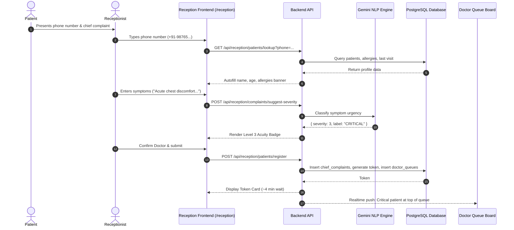
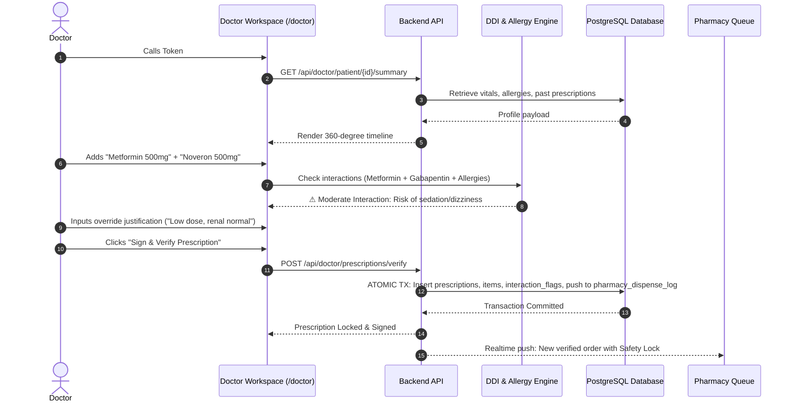
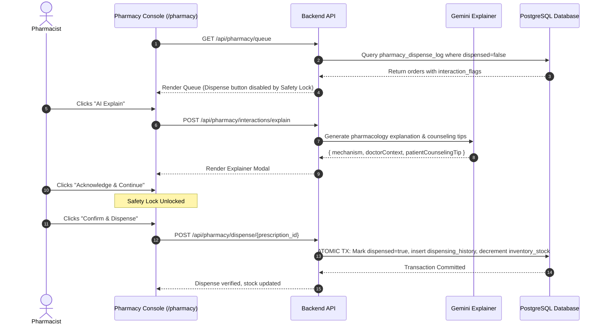
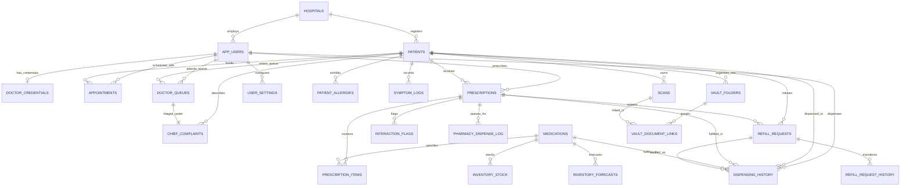

# SANJEEVANI (संजीवनी)
## Unified AI-Powered Clinical Intelligence & Healthcare Operating Ecosystem
### Comprehensive Engineering Architecture, System Requirements Specification (SRS), and Database Design Document

---

## TABLE OF CONTENTS
1. [PRELIMINARY INVESTIGATION](#1-preliminary-investigation)
   - 1.1 Problem Identification & Clinical Background
   - 1.2 Formal Problem Statement & Operational Formulations
   - 1.3 Purpose, Objectives, and Clinical KPIs
   - 1.4 Comprehensive Feasibility Study
     - 1.4.1 Technical Feasibility
     - 1.4.2 Operational & Human-Factors Feasibility
     - 1.4.3 Economic & Cost-Benefit Feasibility (CapEx / OpEx / ROI)
     - 1.4.4 Legal, Regulatory & Ethical Feasibility (HIPAA, DISHA, ABDM, GDPR)
   - 1.5 Project Scope, Operational Boundaries & Assumptions
2. [REQUIREMENT SPECIFICATIONS](#2-requirement-specifications)
   - 2.1 System Requirements (Hardware, Client Devices, Network & Infrastructure)
   - 2.2 Technical Requirements (Frontend, Backend, Database, AI/ML Models & DevOps)
   - 2.3 Detailed Functional Requirements by Stakeholder Role
     - 2.3.1 Role 1: Patient & Caregiver Portal
     - 2.3.2 Role 2: Attending Physician & Specialist Command Center
     - 2.3.3 Role 3: Front-Desk Reception & Triage Console
     - 2.3.4 Role 4: Dispensary Pharmacy & Inventory Workbench
     - 2.3.5 Role 5: Laboratory Diagnostics Workbench
     - 2.3.6 Role 6: Hospital Administrator & Clinical Governance
   - 2.4 Data, Performance & Non-Functional Requirements
     - 2.4.1 Data Volume & Capacity Projections
     - 2.4.2 Performance Service Level Objectives (SLOs)
     - 2.4.3 Information Security, Cryptography & Row-Level Governance
     - 2.4.4 Reliability, Fault Tolerance & High Availability (RTO / RPO)
3. [DATABASE DESIGN & SYSTEM ARCHITECTURE](#3-database-design--system-architecture)
   - 3.1 End Users and Role-Based Access Control (RBAC) CRUD Matrix
   - 3.2 System Workflows & Data Flow Sequence Diagrams
     - 3.2.1 Patient Intake & AI-4 Smart Triage Sequence
     - 3.2.2 Consultation, Prescription & Drug Interaction Interception
     - 3.2.3 Pharmacy Dispensing & Safety-Lock Acknowledgment
     - 3.2.4 Patient Refill Lifecycle Loop
   - 3.3 Entity-Relationship (ER) Architecture (Mermaid Logical Schema)
   - 3.4 Comprehensive Relational Schema & Table Dictionary (20+ Tables)
4. [DEPLOYMENT, OPERATIONS & RUNTIME GUIDE](#4-deployment-operations--runtime-guide)
   - 4.1 Environment Configuration Matrix
   - 4.2 Local & Production Execution Procedures
   - 4.3 Automated System Launchers

---

# 1. PRELIMINARY INVESTIGATION

### 1.1 Problem Identification & Clinical Background

Outpatient department (OPD) and inpatient department (IPD) clinical workflows across developing and developed healthcare environments face severe operational breakdowns. According to the **World Health Organization (WHO)** and the **Institute of Medicine (IOM)**, adverse drug events (ADEs) and medical administrative errors account for hundreds of thousands of preventable injuries and billions of dollars in excess healthcare spending annually:

1. **Front-Desk Bottlenecks & Unstratified Queues:**
   Traditional hospital check-ins rely on physical token dispensers or legacy queuing software that registers patients strictly by arrival order ($FIFO$). High-acuity patients displaying subtle or non-specific symptoms of acute coronary syndromes, transient ischemic attacks, or severe metabolic distress wait in crowded waiting areas behind routine wellness reviews. Front-desk personnel lack clinical triage training to evaluate chief complaints objectively.

2. **Physician Cognitive Overload & Longitudinal Blind Spots:**
   Physicians in high-volume clinics evaluate between 30 and 80 patients per day, spending an average of only 5 to 8 minutes per encounter. During this window, doctors must synthesize physical prescription slips, paper laboratory reports, discharge summaries, and patient-recalled histories. Consequently, contraindications with existing medications, undisclosed drug allergies, and past therapeutic failures are frequently overlooked.

3. **Dispensing Friction & Pharmacy Stockout Blindness:**
   Dispensary pharmacists operate under high pressure with illegible prescription transcriptions. When drug-drug interactions exist, pharmacists lack immediate clinical context regarding why the physician prescribed the combination or whether dose adjustments were made. Simultaneously, hospital pharmacies manage thousands of Stock Keeping Units (SKUs) using reactive inventory control; critical life-saving medications (such as anti-hypertensives, insulin, and anti-infectives) experience unpredictable stockouts due to the absence of consumption velocity forecasting.

4. **Post-Consultation Care Fragmentation & Adherence Deficits:**
   Once a patient leaves the physical clinic, monitoring ceases. Up to **50% of chronic disease patients fail to take medications as prescribed**, leading to avoidable disease progression and re-hospitalizations. Patients needing routine refills must either re-queue for an entire consultation or self-medicate without clinical oversight.

---

### 1.2 Formal Problem Statement & Operational Formulations

To design and deploy a unified, multi-tenant clinical operating ecosystem that optimizes clinical throughput, guarantees patient safety, and bridges the hospital-to-home continuum.

#### Operational Formulations

1. **Queue Waiting Latency Minimization:**
   Let total waiting time for patient $i$ be $W_i$. In legacy systems:
   $$W_i = \sum_{j=1}^{i-1} T_j^{\text{consult}}$$
   Sanjeevani replaces this with an Acuity Priority Scheduling function:
   $$P_i = f(\text{Severity}_i, t_{\text{arrival}}, \text{VitalsRisk}_i)$$
   where Acuity Level 3 (Critical) and Level 2 (Urgent) dynamically re-order the queue vector, guaranteeing that:
   $$W_{\text{critical}} \le \epsilon \quad (\epsilon \to 0)$$

2. **Deterministic Prescription Safety Guarantee:**
   Let a proposed prescription be $R = \{m_1, m_2, \dots, m_k\}$, the patient's active drug regimen be $M_{\text{active}}$, and diagnosed allergies be $A$. The system evaluates:
   $$\text{Interactions}(R) = \bigcup_{i=1}^{k} \left[ \text{CheckAllergy}(m_i, A) \cup \bigcup_{m_j \in M_{\text{active}} \cup R \setminus \{m_i\}} \text{CheckDDI}(m_i, m_j) \right]$$
   If $\exists \text{ severe interaction} \in \text{Interactions}(R)$, digital prescription issuance is gated until the physician provides clinical justification, and the pharmacist provides explicit safety-lock acknowledgment prior to fulfillment.

---

### 1.3 Purpose, Objectives, and Clinical KPIs

#### System Purpose
To establish a high-speed, reactive clinical intelligence platform that bridges administrative triage, clinical consultation, pharmaceutical fulfillment, laboratory diagnostics, and patient adherence into a single cohesive data plane.

#### Key Performance Indicators (Clinical & Operational)
* **Intake & Triage Velocity:** Register walk-in or returning patients and generate an acuity-scored token in **$< 90\text{ seconds}$**.
* **Zero Undetected Adverse Interactions:** Intercept **$100\%$** of known drug-drug and drug-allergy contraindications prior to dispensing.
* **Rapid Document Digitization:** Ingest, OCR, and extract vital clinical parameters from uploaded physical reports in **$< 5\text{ seconds}$**.
* **Proactive Inventory Replenishment:** Forecast stockouts with **$\ge 90\%$ accuracy** at least **7 days** before inventory depletion.
* **Patient Adherence Improvement:** Increase self-reported treatment adherence to **$\ge 85\%$** via structured timelines, meal-time reminders, and one-click refills.

---

### 1.4 Comprehensive Feasibility Study

#### 1.4.1 Technical Feasibility
* **Frontend Architecture:** Next.js 14+ with React Server Components (RSC) provides server-side rendering for critical clinical dashboards, sub-second route transitions via client-side caching, and low bundle sizes.
* **Backend Processing:** FastAPI provides native asynchronous request processing (`async/await`) on ASGI event loops (Uvicorn), achieving throughput comparable to Go and Node.js while retaining Python's rich scientific and AI library ecosystem (PyMuPDF, Pydantic v2, Pandas, NumPy).
* **Database & Persistence:** Managed PostgreSQL 15+ ensures ACID transactions, complex relational joins, JSONB indexing for flexible document parameters, and native database-level Row Level Security (RLS).
* **AI Orchestration:** Google Gemini 1.5 Flash delivers rapid classification (<1.5s latency) for NLP triage and interaction summaries, while Gemini 1.5 Pro provides deep clinical report synthesis.

#### 1.4.2 Operational & Human-Factors Feasibility
* **Ergonomic Design System:** Engineered with a warm, high-contrast, low-eye-strain color palette (`#F8F7F4` off-white canvas, slate text `#0F172A`, distinct status pill badges).
* **Minimal Keystroke Burden:** Autocomplete for international generic medicine formulations, numeric phone lookups, and one-click severity triage minimize typing in fast-paced clinical environments.
* **Role-Guarded Navigation:** Each clinical role sees only their dedicated workspace, preventing feature overload and cognitive distraction.

#### 1.4.3 Economic & Cost-Benefit Feasibility
* **Elimination of Per-Seat Licensing:** By utilizing open-source frameworks (Next.js, FastAPI, PostgreSQL), hospital networks avoid prohibitive per-seat licensing models common to legacy Enterprise Electronic Medical Records (EMRs).
* **Infrastructure Cost Efficiency:** Containerized microservices allow deployments on cost-effective cloud or on-premises servers.
* **Return on Investment (ROI):** 
  * Reduction in front-desk staffing overhead through accelerated registration.
  * Significant reduction in expired inventory waste through AI velocity tracking.
  * Prevention of costly medical negligence liabilities through automated safety-lock gating.

#### 1.4.4 Legal, Regulatory & Ethical Feasibility
* **HIPAA Title II Alignment:** Implementation of Administrative, Physical, and Technical Safeguards. End-to-end data encryption in transit (TLS 1.3) and at rest (AES-256).
* **DISHA (Digital Information Security in Healthcare Act) & India ABDM:** Adherence to Ayushman Bharat Digital Mission guidelines for electronic health records, consent-based health data sharing, and standardized diagnostic coding.
* **GDPR Article 9 Compliance:** Explicit patient consent mechanisms for processing "special category" health data; self-sovereign document ownership permitting patient data downloads and erasure requests.
* **Clinician-in-the-Loop Ethics:** AI modules are strictly advisory. No AI algorithm makes autonomous diagnostic, prescribing, or dispensing decisions; all clinical outputs require licensed human sign-off.

---

### 1.5 Project Scope, Operational Boundaries & Assumptions

#### In-Scope Features
* Multi-role authentication with dynamic role switching (Patient, Doctor, Receptionist, Pharmacist, Lab Tech, Administrator).
* Phone-number accelerated patient registration with historical allergy and last-visit retrieval.
* AI-assisted NLP chief complaint severity classification (Routine, Urgent, Critical).
* Live outpatient queuing board with doctor-room assignment, wait-time estimation, and auto-refresh polling.
* Physician clinical workspace with 360-degree patient timeline, prescription composer, drug interaction engine, and digital sign-off.
* Patient digital health vault with multi-folder organization, OCR ingestion, smart search, and layperson report translation.
* Pharmacy dispensing workbench with mandatory interaction safety-lock acknowledgment, partial fulfillment, and stock decrement.
* Pharmacy inventory control with real-time stock levels, reorder threshold editing, and AI predictive stockout forecasting.
* Refill request lifecycle (Patient submission $\to$ Doctor review/approval $\to$ Pharmacy dispensing).
* Laboratory test order queue, report upload, OCR value extraction, out-of-range highlighting, and vault publication.
* Comprehensive audit logging and operational summary metrics.

#### Operational Boundaries & Out-of-Scope
* Sanjeevani does not interface directly with physical ICU telemetry serial ports (e.g., patient monitors; vitals are entered manually).
* Automated financial credit card processing/clearing is simulated or handed off to external billing systems.
* The system does not replace diagnostic imaging workstations (PACS/DICOM viewing is supported via file attachments, not native 3D slice rendering).

---

# 2. REQUIREMENT SPECIFICATIONS

### 2.1 System Requirements

#### 2.1.1 Hardware Specifications
##### Client-Side Workstations (Doctor, Reception, Pharmacy, Lab)
* **Processor:** Intel Core i3 / AMD Ryzen 3 (Quad-Core 2.0 GHz or higher) / Apple M-series.
* **RAM:** 4 GB minimum (8 GB recommended for multi-tab operations).
* **Display:** $1366 \times 768$ minimum resolution (1080p Full HD $1920 \times 1080$ recommended).
* **Input Devices:** Keyboard, mouse, optional 2D barcode scanner (for medicine packaging & token slips).
* **Network Interface:** 10/100/1000 Mbps Ethernet or 802.11ac Wi-Fi (minimum 2 Mbps internet connection).

##### Client-Side Mobile Devices (Patients & Caregivers)
* **Mobile Platforms:** iOS (Safari 14+) or Android (Chrome 90+).
* **Display:** Responsive design optimized from 360px width upwards.

##### Server & Cloud Infrastructure (Containerized Deployment)
* **API / Application Server:** 2 to 4 vCPUs, 4 GB to 8 GB RAM, 20 GB SSD.
* **Managed Database (PostgreSQL):** 2 vCPUs, 4 GB RAM, auto-expanding storage with daily automated backups.
* **Storage Bucket:** S3-compatible cloud storage for encrypted document uploads (PDFs, high-resolution scans).

---

### 2.2 Technical Requirements

| Layer | Component | Specification |
|---|---|---|
| **Frontend Framework** | Web App Core | **Next.js 14+** (React 18, App Router paradigm) |
| **Frontend Language** | Type Safety | **TypeScript 5.x** with strict type-checking enabled |
| **Styling & Design** | UI System | **Tailwind CSS**, Vanilla CSS custom properties, Lucide React Icons |
| **State & API** | Networking | Native `fetch` with unified client (`/lib/api.ts`), React Context (`AuthContext`) |
| **Backend API** | Web Server | **FastAPI 0.109+** running on **Python 3.11+** with **Uvicorn** ASGI |
| **Data Validation** | Schema Enforcement | **Pydantic v2** models with strict runtime coercion |
| **Database Engine** | RDBMS | **PostgreSQL 15+** (Supabase infrastructure with PostgREST) |
| **Security & Auth** | Access Control | Postgres **Row Level Security (RLS)** + JWT authentication |
| **AI / NLP Engine** | Clinical Intelligence | **Google Gemini 1.5 Flash & Pro** via GenAI SDK |
| **Document OCR** | Vision Pipeline | **PyMuPDF**, Tesseract OCR / Gemini Multimodal Vision API |

---

### 2.3 Detailed Functional Requirements by Stakeholder Role

```
                                      +--------------------------+
                                      |  SANJEEVANI SYSTEM CORE  |
                                      +-------------+------------+
                                                    |
            +-------------------+-------------------+-------------------+-------------------+
            |                   |                   |                   |                   |
      +-----v-----+       +-----v-----+       +-----v-----+       +-----v-----+       +-----v-----+
      |  PATIENT  |       |  DOCTOR   |       | RECEPTION |       | PHARMACY  |       | LAB TECH  |
      |  PORTAL   |       | COMMAND   |       |  TRIAGE   |       | DISPENSARY|       | WORKBENCH |
      +-----------+       +-----------+       +-----------+       +-----------+       +-----------+
```

#### 2.3.1 Role 1: Patient & Caregiver Portal (`/dashboard`, `/vault`, `/patient/*`)

* **FR-P01: Digital Patient Dashboard:**
  * *Input:* User authentication credentials or session token.
  * *Processing:* Aggregate active prescriptions, upcoming appointments, pending refill statuses, and recent vitals.
  * *Output:* Consolidated mobile-first home screen displaying care summaries, active medicine count, and quick-action links.

* **FR-P02: Interactive Medication Adherence Timeline:**
  * *Input:* Time of day, patient interaction with medicine checklist.
  * *Processing:* Cross-reference current date with prescription start dates, frequencies, and durations.
  * *Output:* Chronological morning/afternoon/night medicine schedule with dosage badges, meal instructions (Before Food / After Food), and day counter ($X$ of $Y$ days completed).

* **FR-P03: Self-Sovereign Health Vault (`/vault`):**
  * *Input:* Document file upload (PDF, PNG, JPEG) along with folder assignment.
  * *Processing:* Secure transfer to encrypted object storage; record metadata insertion into `scans` and `vault_document_links` tables.
  * *Output:* Grid/list view of categorized clinical records with download and preview capabilities.

* **FR-P04: AI-9 Smart Vault Natural Language Search:**
  * *Input:* Natural language query (e.g., *"Show my blood sugar reports from July"*).
  * *Processing:* Vector search and text-matching across OCR-ingested documents in the patient's vault.
  * *Output:* Synthesized direct answer citing specific historical documents with clickable links.

* **FR-P05: Layperson Diagnostic Report Explainer:**
  * *Input:* Selection of a laboratory report record.
  * *Processing:* Automated parsing of diagnostic parameters; comparison against biological reference intervals; translation of medical terminology into layperson explanations.
  * *Output:* Interactive modal displaying color-coded ranges (Normal, Borderline, High, Critical) and actionable dietary/lifestyle counseling points.

* **FR-P06: Digital Refill Request Engine:**
  * *Input:* Selection of an expiring, refill-eligible prescription; requested quantity; optional patient notes.
  * *Processing:* Validate `prescriptions.is_refillable == true` and `refills_issued < max_refills_allowed`. Create record in `refill_requests` with status `pending`.
  * *Output:* Confirmation badge and real-time tracking of request status (`Pending Review` $\to$ `Doctor Approved` $\to$ `Ready at Pharmacy`).

* **FR-P07: Longitudinal Symptom & Wellbeing Tracker:**
  * *Input:* Daily Feeling Score (1 to 5), tagged physical symptoms (e.g., Headache, Dizziness, Fatigue), free-text diary entry.
  * *Processing:* Insertion into `symptom_logs` table; update moving average wellbeing score.
  * *Output:* Graphical recovery trendline visible to both patient and consulting doctor.

---

#### 2.3.2 Role 2: Attending Physician & Specialist Command Center (`/doctor`, `/doctor/patient/[id]/*`)

* **FR-D01: Live Clinical Triage Queue:**
  * *Input:* Real-time queue subscription.
  * *Processing:* Filter waiting patients assigned to the authenticated doctor's ID; sort by Acuity Level ($3 \to 2 \to 1$) and waiting duration.
  * *Output:* Interactive patient queue cards displaying token number, wait time, severity badge, and chief complaint.

* **FR-D02: Comprehensive Patient 360-Degree Timeline:**
  * *Input:* Selection of an active queue patient.
  * *Processing:* Query `patients`, `patient_allergies`, `patient_medical_history`, previous `prescriptions`, and `symptom_logs`.
  * *Output:* Unified clinical view displaying demographics, known allergies, chronic conditions, and previous consultation notes.

* **FR-D03: Structured Prescription Composer:**
  * *Input:* Medication search, strength, dosage form, frequency pattern (e.g., `1-0-1`), duration in days, meal timing, and refill allowance.
  * *Processing:* Validate inputs; construct draft prescription items.
  * *Output:* Dynamically rendered prescription preview table with automated quantity calculations.

* **FR-D04: Real-Time Drug-Drug & Drug-Allergy Interaction Interceptor:**
  * *Input:* Draft prescription items + patient's recorded allergies + active concurrent medications.
  * *Processing:* Automated deterministic evaluation against pharmacology interaction rules.
  * *Output:* High-visibility warning banners indicating interaction severity (Low, Moderate, Severe, Contraindicated), pharmacological mechanism, and mandatory override justification field if proceeding.

* **FR-D05: Clinical Sign-Off & Atomic Verification:**
  * *Input:* Doctor authentication, digital signature confirmation, override justifications.
  * *Processing:* Set `prescriptions.verified_at = now()`; insert items into `prescription_items`; write any flagged overrides to `interaction_flags`; push to `pharmacy_dispense_log`.
  * *Output:* Immutable prescription record generated; instant delivery to pharmacy queue and patient vault.

* **FR-D06: Refill Request Management Console (`/doctor/patient/[id]/refills`):**
  * *Input:* Incoming refill requests from patients.
  * *Processing:* Display previous adherence trends, remaining refills, and original prescription details.
  * *Output:* Actions to [Approve] (increments `refills_issued`), [Modify Quantity], or [Deny] with clinical reasoning notes.

* **FR-D07: Follow-up & CRM Orchestrator (`/doctor/crm`):**
  * *Input:* Follow-up dates, care instructions, phone outreach notes.
  * *Processing:* Schedule appointment records; update patient continuity status.
  * *Output:* Calendar view of expected patient returns and follow-up communication logs.

---

#### 2.3.3 Role 3: Front-Desk Reception & Triage Console (`/reception`, `/reception/*`)

* **FR-R01: Accelerated Phone-Number Patient Lookup & Autofill:**
  * *Input:* Patient phone number (partial or full, $\ge 3$ digits).
  * *Processing:* Search `patients` table by phone; retrieve matching demographic profile, emergency contacts, known allergies, and last visit date/doctor.
  * *Output:* Instant form auto-fill with returning patient indicator and allergy warning banner.

* **FR-R02: Rapid Intake & Demographics Capture:**
  * *Input:* Full name, age, gender, phone number, emergency contact details.
  * *Processing:* Validate required fields; create or update record in `patients` table.
  * *Output:* Generated `patient_id` ready for queue assignment.

* **FR-R03: AI-4 NLP Severity Classification:**
  * *Input:* Free-text chief complaint and symptoms entered by receptionist.
  * *Processing:* Asynchronous evaluation of clinical keywords against acute symptom taxonomy:
    * *Level 3 (Critical):* Chest pain, shortness of breath, severe hemorrhage, loss of consciousness.
    * *Level 2 (Urgent):* High fever, acute fracture, severe vomiting, persistent abdominal pain.
    * *Level 1 (Routine):* Chronic follow-up, routine checkup, mild cough.
  * *Output:* Real-time severity recommendation badge with reasoning; radio buttons allowing receptionist to accept or override.

* **FR-R04: Doctor Queue Assignment & Token Generation:**
  * *Input:* Selected attending physician (displaying live room queue length and specialty).
  * *Processing:* Insert record into `chief_complaints` (logging suggested vs. overridden severity); query today's queue count for the doctor; assign sequential `token_number`; insert into `doctor_queues`.
  * *Output:* High-contrast confirmation card displaying `TOKEN #X`, queue position, acuity badge, and estimated wait time in minutes.

* **FR-R05: Physical Document Ingestion at Intake:**
  * *Input:* Paper prescription or past diagnostic report brought by patient.
  * *Processing:* Upload file to temporary storage; link to `scans` table for downstream physician review.
  * *Output:* Document attachment badge linked to the patient's queue record.

* **FR-R06: Centralized Live Queue Board (`/reception/queue`):**
  * *Input:* Automated 30-second polling across all active outpatient departments.
  * *Processing:* Group queue records by attending physician; calculate waiting counts and average wait times.
  * *Output:* Multi-column display showing all doctor consultation rooms, active tokens, in-consultation status, and acuity badges.

* **FR-R07: Appointment Scheduling Engine (`/reception/appointments`):**
  * *Input:* Patient search, doctor selection, appointment date, time slot, consultation reason.
  * *Processing:* Validate slot availability; insert into `appointments` table with status `scheduled`.
  * *Output:* Scheduled appointment card with date filtering and status indicators.

---

#### 2.3.4 Role 4: Dispensary Pharmacy & Inventory Workbench (`/pharmacy`, `/pharmacy/*`)

* **FR-PH01: Verified Dispensing Feed:**
  * *Input:* Real-time query of `pharmacy_dispense_log` joined with `prescriptions` where `dispensed == false`.
  * *Processing:* Filter and display verified prescriptions, patient demographics, prescribing doctor, and medication list.
  * *Output:* Card-based dispensing queue with distinct badges for new prescriptions vs. recurring refills.

* **FR-PH02: Mandatory Interaction Safety-Lock Gating:**
  * *Input:* Prescription cards containing unresolved `interaction_flags`.
  * *Processing:* Gating logic disables the `[Confirm & Dispense]` button until the pharmacist reviews the flagged drug interaction and doctor override notes.
  * *Output:* Prominent safety-lock alert with mandatory `[Acknowledge & Continue]` action required to unlock dispensing.

* **FR-PH03: AI-6 Clinical Drug Interaction Explainer:**
  * *Input:* Click on `[AI Explain]` on any flagged interaction card.
  * *Processing:* LLM synthesis of pharmacological clearance pathways, clinical significance of the doctor's override, and specific patient counseling tips.
  * *Output:* Interactive modal detailing mechanism of interaction, safety rationale, and counseling advice.

* **FR-PH04: Atomic Dispensing & Stock Decrement:**
  * *Input:* Pharmacist dispense confirmation (supporting full dispense, partial dispense, or backorder marking).
  * *Processing:* In a single ACID transaction:
    1. Mark `pharmacy_dispense_log.dispensed = true`.
    2. Insert record into `dispensing_history`.
    3. Decrement `inventory_stock.quantity_on_hand` by dispensed quantity.
    4. If refill, update `refill_requests.status = 'dispensed'`.
  * *Output:* Updated queue state; prescription moves to "Dispensed Today" log; updated stock numbers.

* **FR-PH05: Real-Time Inventory Control (`/pharmacy/inventory`):**
  * *Input:* Inventory catalog search query, inline edits to stock counts or reorder thresholds.
  * *Processing:* Filter by medication name; evaluate stock health status:
    * *Low Stock:* $\text{Quantity} \le \frac{\text{Threshold}}{2}$
    * *Reorder Soon:* $\text{Quantity} \le \text{Threshold}$
    * *Healthy:* $\text{Quantity} > \text{Threshold}$
  * *Output:* Searchable data table with status indicators (🟢 Healthy, 🟡 Reorder Soon, 🔴 Low Stock) and inline editing capabilities.

* **FR-PH06: AI-5 Predictive Stockout Forecasting:**
  * *Input:* 30-day dispensing logs, current stock on hand, pending refills.
  * *Processing:* Calculate average daily consumption velocity; calculate days until stockout:
    $$\text{DaysToStockout} = \frac{\text{QuantityOnHand}}{\text{DailyAverage}}$$
    Flag items where $\text{DaysToStockout} \le 10$.
  * *Output:* Predictive alert cards indicating estimated stockout dates and automated purchase order (PO) quantity recommendations.

* **FR-PH07: Patient Dispensing Audit History (`/pharmacy/history`):**
  * *Input:* Patient search by name or phone number.
  * *Processing:* Query `dispensing_history` joined with medication names and timestamps.
  * *Output:* Chronological audit log showing dates, medications, quantities, and fulfillment types (Full Dispense, Partial, Refill).

---

#### 2.3.5 Role 5: Laboratory Diagnostics Workbench (`/lab`)

* **FR-L01: Diagnostic Investigation Worklist:**
  * *Input:* Orders generated by physicians during clinical consultations.
  * *Processing:* List pending tests categorized by priority (STAT vs. Routine) and patient token.
  * *Output:* Real-time laboratory workbench showing pending sample collections and test runs.

* **FR-L02: Report Ingestion & Automated OCR Extraction:**
  * *Input:* Scanned PDF or camera capture of completed diagnostic report.
  * *Processing:* OCR processing pipeline extracts test names, measured values, units of measurement, and reference ranges into structured JSON.
  * *Output:* Extracted parameter table displayed side-by-side with original document image.

* **FR-L03: Clinical Parameter Verification:**
  * *Input:* Lab technician review, manual correction of any OCR misreads.
  * *Processing:* Validate measured values against standard biological reference ranges; highlight out-of-range critical values.
  * *Output:* Verified diagnostic payload tagged with technician signature.

* **FR-L04: Diagnostic Publication to Health Vault:**
  * *Input:* Technician publication sign-off.
  * *Processing:* Write verified report to `scans` table with `document_type = 'lab_report'`; index in patient's vault; trigger notification to requesting doctor.
  * *Output:* Instant availability in doctor's consultation timeline and patient's mobile health vault.

---

#### 2.3.6 Role 6: Hospital Administrator & Clinical Governance

* **FR-A01: Master Staff Directory & Credentialing:**
  * *Input:* Staff user registration, role assignment, medical council registration numbers.
  * *Processing:* Create records in `app_users` and `doctor_credentials`; assign department permissions.
  * *Output:* Active staff roster with role-based access control enforcement.

* **FR-A02: Clinical Safety Audit Trail Inspection:**
  * *Input:* Audit log date filters, doctor ID, patient ID.
  * *Processing:* Query `interaction_flags`, `verification_logs`, and `dispensing_history`.
  * *Output:* Searchable compliance log displaying all clinical override rationales, prescription modification events, and dispensing timestamps.

* **FR-A03: Operational Throughput Analytics:**
  * *Input:* Hospital-wide operational metrics.
  * *Processing:* Calculate average patient throughput times (Intake $\to$ Consult $\to$ Dispense), doctor consultation loads, and inventory burn rates.
  * *Output:* Executive analytics dashboards for operational resource optimization.

---

### 2.4 Data, Performance & Non-Functional Requirements

#### 2.4.1 Data Volume & Capacity Projections (Single Facility Benchmark)
* **Outpatient Encounters:** ~300 to 500 patient registrations per day $\approx 150,000$ encounters annually.
* **Prescription Records:** ~2.5 line items per encounter $\approx 375,000$ item rows annually.
* **Storage Footprint:** At ~2 MB per compressed PDF/scan, document storage scales at ~300 GB annually per facility, managed via tiering (hot storage for active 90 days, cold encrypted archiving thereafter).

#### 2.4.2 Performance Service Level Objectives (SLOs)
* **P95 Transaction Response Time:** $< 200\text{ ms}$ for standard read/write database queries.
* **P95 Search Query Latency:** $< 150\text{ ms}$ for phone-number lookups across $100,000+$ records.
* **P95 AI Triage Inference:** $< 2.0\text{ seconds}$ for NLP severity classification.
* **Concurrent Capacity:** Support minimum 200 concurrent active clinical users per hospital node without thread starvation.

#### 2.4.3 Information Security & Cryptography
* **Data in Transit:** TLS 1.3 encryption across all client-to-API and API-to-database connections.
* **Data at Rest:** Transparent database encryption using AES-256; sensitive document buckets configured with server-side envelope encryption.
* **Authentication Security:** JSON Web Tokens (JWT) with HMAC-SHA256 / RSA signatures, short expiry periods, and secure HTTP-only cookie delivery.
* **Row Level Security (RLS):** Database policies prevent users from querying records outside their authorized role and hospital tenant ID.

#### 2.4.4 Reliability, Fault Tolerance & High Availability
* **Recovery Point Objective (RPO):** $< 5\text{ minutes}$ via continuous write-ahead log (WAL) archiving.
* **Recovery Time Objective (RTO):** $< 15\text{ minutes}$ via containerized infrastructure redeployment.
* **Offline Resilience:** Client-side PWA service workers cache active consultation states; API client implements automatic retry with exponential backoff.

---

# 3. DATABASE DESIGN & SYSTEM ARCHITECTURE

### 3.1 End Users and Role-Based Access Control (RBAC) CRUD Matrix

| Database Entity / Table | Patient | Doctor | Receptionist | Pharmacist | Lab Tech | Admin |
|---|:---:|:---:|:---:|:---:|:---:|:---:|
| `app_users` | R (Self) | R | R | R | R | CRUD |
| `patients` | R (Self), U (Self) | R, U | C, R, U | R | R | CRUD |
| `doctor_credentials` | R | R (Self) | R | R | - | CRUD |
| `chief_complaints` | R (Self) | R | C, R, U | R | - | R |
| `doctor_queues` | R (Self Token) | R, U | C, R, U | R | R | CRUD |
| `prescriptions` | R (Self) | C, R, U | - | R | - | R |
| `prescription_items` | R (Self) | C, R, U | - | R | - | R |
| `patient_allergies` | R (Self) | C, R, U | R | R | - | CRUD |
| `interaction_flags` | - | C, R, U | - | R, U | - | R |
| `pharmacy_dispense_log` | - | - | - | C, R, U | - | R |
| `inventory_stock` | - | - | - | R, U | - | CRUD |
| `inventory_forecasts` | - | - | - | R, U | - | R |
| `refill_requests` | C, R (Self) | R, U | R | R, U | - | R |
| `dispensing_history` | R (Self) | R | - | C, R | - | R |
| `appointments` | C, R (Self) | R, U | C, R, U | - | - | CRUD |
| `scans` (Vault/Reports) | C, R (Self) | C, R | C, R | R | C, R, U | CRUD |
| `symptom_logs` | C, R (Self) | R | - | - | - | R |
| `user_settings` | CRUD (Self) | CRUD (Self) | CRUD (Self) | CRUD (Self) | CRUD (Self) | CRUD |

*Legend: C = Create, R = Read, U = Update, D = Delete, - = No Access*

---

### 3.2 System Workflows & Data Flow Sequence Diagrams

#### 3.2.1 Patient Intake & AI-4 Smart Triage Sequence


---

#### 3.2.2 Consultation, Prescription & Drug Interaction Interception


---

#### 3.2.3 Pharmacy Dispensing & Safety-Lock Acknowledgment


---

#### 3.2.4 Patient Refill Lifecycle Loop
```mermaid
sequenceDiagram
    autonumber
    actor Patient
    participant PatientUI as Patient Portal (/dashboard)
    participant FastAPI as Backend API
    actor Doctor
    actor Pharmacist
    participant DB as PostgreSQL Database

    Patient->>PatientUI: Selects Metformin -> Clicks "Request Refill"
    PatientUI->>FastAPI: POST /api/patient/refill-request
    FastAPI->>DB: Validate is_refillable=true; insert refill_requests (status='pending')
    DB-->>PatientUI: Status: "Pending Doctor Review"
    Doctor->>FastAPI: GET /api/doctor/refills/pending
    FastAPI-->>Doctor: Display refill queue with past adherence logs
    Doctor->>FastAPI: POST /api/doctor/refills/{id}/approve
    FastAPI->>DB: Update refill_requests status='approved', increment refills_issued
    DB-->>PatientUI: Status: "Approved — Ready for Pharmacy"
    Pharmacist->>FastAPI: POST /api/pharmacy/refills/{id}/dispense
    FastAPI->>DB: Update status='dispensed', insert dispensing_history, decrement stock
    DB-->>PatientUI: Status: "Dispensed — Ready for Pickup"
```

---

### 3.3 Entity-Relationship (ER) Architecture

The complete logical data architecture of Sanjeevani is modeled in the ER diagram below:



---

### 3.4 Comprehensive Relational Schema & Table Dictionary

The following table specifications document all 20 relational entities, including data types, constraints, relational mappings, and operational business rules.

---

#### 1. `hospitals` (Healthcare Facilities)
Stores the master institutions, network facilities, and primary tenant metadata.

| Column Name | Data Type | Constraints / Modifiers | Description |
|---|---|---|---|
| `id` | `uuid` | Primary Key, `default uuid_generate_v4()` | Unique institutional identifier |
| `name` | `text` | NOT NULL | Registered legal name of hospital |
| `address` | `text` | NULLABLE | Physical street location and postal code |
| `phone` | `text` | NULLABLE | Central switchboard contact number |
| `created_at` | `timestamptz` | NOT NULL, `default now()` | Record registration timestamp |

---

#### 2. `app_users` (System Users & Unified Identities)
Unified user authentication registry for all institutional staff and patients.

| Column Name | Data Type | Constraints / Modifiers | Description |
|---|---|---|---|
| `id` | `uuid` | Primary Key, references `auth.users(id)` | Unique identity token |
| `hospital_id` | `uuid` | Foreign Key $\to$ `hospitals(id)` ON DELETE CASCADE | Associated clinical facility |
| `role` | `text` | NOT NULL, `CHECK (role IN ('patient','doctor','receptionist','pharmacist','lab_tech','admin'))` | Security access role |
| `full_name` | `text` | NOT NULL | Full legal individual name |
| `email` | `text` | UNIQUE, NOT NULL | Primary email for login and verification |
| `phone` | `text` | NULLABLE | Primary mobile phone number |
| `is_active` | `boolean` | NOT NULL, `default true` | Account active state |
| `created_at` | `timestamptz` | NOT NULL, `default now()` | Registration timestamp |

---

#### 3. `doctor_credentials` (Physician Credentials & Licensing)
Medical licensing records, council numbers, and clinical department assignments.

| Column Name | Data Type | Constraints / Modifiers | Description |
|---|---|---|---|
| `id` | `uuid` | Primary Key, `default uuid_generate_v4()` | Credential record key |
| `doctor_id` | `uuid` | UNIQUE, NOT NULL, Foreign Key $\to$ `app_users(id)` ON DELETE CASCADE | Target physician user |
| `registration_number` | `text` | NOT NULL | State Medical Council / National license code |
| `specialty` | `text` | NOT NULL | Primary clinical specialty |
| `qualifications` | `text` | NULLABLE | Degrees (e.g., MBBS, MD, DM, FRCP) |
| `department` | `text` | NULLABLE | Assigned outpatient wing / clinical unit |
| `created_at` | `timestamptz` | NOT NULL, `default now()` | Credential verification timestamp |

---

#### 4. `patients` (Master Patient Index)
Core demographic and clinical baseline repository for all individuals receiving care.

| Column Name | Data Type | Constraints / Modifiers | Description |
|---|---|---|---|
| `id` | `uuid` | Primary Key, `default uuid_generate_v4()` | Unique permanent patient identifier |
| `user_id` | `uuid` | NULLABLE, Foreign Key $\to$ `app_users(id)` ON DELETE SET NULL | Linked digital account for portal access |
| `hospital_id` | `uuid` | NULLABLE, Foreign Key $\to$ `hospitals(id)` | Registering hospital facility |
| `full_name` | `text` | NOT NULL | Patient legal name |
| `age` | `int` | NOT NULL, `CHECK (age >= 0)` | Age in years |
| `gender` | `text` | NOT NULL, `CHECK (gender IN ('Male','Female','Other'))` | Biological gender |
| `phone` | `text` | NOT NULL, INDEXED | Contact number used for rapid lookup |
| `emergency_contact_name` | `text` | NULLABLE | Designated next-of-kin caregiver |
| `emergency_contact_phone`| `text` | NULLABLE | Caregiver emergency phone |
| `created_at` | `timestamptz` | NOT NULL, `default now()` | Date of initial hospital intake |

---

#### 5. `patient_allergies` (Allergy & Adverse Reaction Registry)
Structured records of confirmed drug, food, and environmental allergies.

| Column Name | Data Type | Constraints / Modifiers | Description |
|---|---|---|---|
| `id` | `uuid` | Primary Key, `default uuid_generate_v4()` | Allergy record ID |
| `patient_id` | `uuid` | NOT NULL, Foreign Key $\to$ `patients(id)` ON DELETE CASCADE, INDEXED | Target patient |
| `allergen` | `text` | NOT NULL | Causative substance (e.g., Penicillin) |
| `severity` | `text` | NOT NULL, `default 'moderate'`, `CHECK (severity IN ('mild','moderate','severe'))` | Acuity level |
| `reaction` | `text` | NULLABLE | Manifestation (e.g., Anaphylaxis, Rash) |
| `diagnosed_at` | `date` | NULLABLE | Confirmation date |
| `created_at` | `timestamptz` | NOT NULL, `default now()` | Timestamp |

---

#### 6. `chief_complaints` (Triage Symptoms & AI-4 Scores)
Visit reasons, intake symptom descriptions, and AI-suggested vs. human-assigned severity.

| Column Name | Data Type | Constraints / Modifiers | Description |
|---|---|---|---|
| `id` | `uuid` | Primary Key, `default uuid_generate_v4()` | Complaint record ID |
| `patient_id` | `uuid` | NOT NULL, Foreign Key $\to$ `patients(id)` ON DELETE CASCADE | Associated patient |
| `text` | `text` | NOT NULL | Intake symptom description |
| `severity_level` | `int` | NOT NULL, `default 1`, `CHECK (severity_level BETWEEN 1 AND 3)` | Final acuity score ($1 \to 3$) |
| `ai_suggested_severity` | `int` | NULLABLE, `CHECK (ai_suggested_severity BETWEEN 1 AND 3)` | Raw AI NLP suggestion |
| `severity_overridden_by_staff` | `boolean` | NOT NULL, `default false` | Human override flag |
| `created_at` | `timestamptz` | NOT NULL, `default now()` | Intake timestamp |

---

#### 7. `doctor_queues` (Live Outpatient Queue)
Active queue linking patients with assigned physicians during clinic hours.

| Column Name | Data Type | Constraints / Modifiers | Description |
|---|---|---|---|
| `id` | `uuid` | Primary Key, `default uuid_generate_v4()` | Queue entry ID |
| `patient_id` | `uuid` | NOT NULL, Foreign Key $\to$ `patients(id)` ON DELETE CASCADE | Waiting patient |
| `doctor_id` | `uuid` | NOT NULL, Foreign Key $\to$ `app_users(id)` ON DELETE CASCADE, INDEXED | Assigned physician |
| `chief_complaint_id` | `uuid` | NULLABLE, Foreign Key $\to$ `chief_complaints(id)` | Linked complaint record |
| `token_number` | `int` | NOT NULL | Sequential daily token number |
| `status` | `text` | NOT NULL, `default 'waiting'`, `CHECK (status IN ('waiting','in_consult','completed','cancelled'))` | Queue state |
| `queued_at` | `timestamptz` | NOT NULL, `default now()`, INDEXED | Check-in timestamp |
| `called_at` | `timestamptz` | NULLABLE | When doctor started consultation |
| `completed_at` | `timestamptz` | NULLABLE | Consultation conclusion |

---

#### 8. `appointments` (Scheduled Encounters)
Planned future clinical consultations and procedure bookings.

| Column Name | Data Type | Constraints / Modifiers | Description |
|---|---|---|---|
| `id` | `uuid` | Primary Key, `default uuid_generate_v4()` | Appointment booking ID |
| `patient_id` | `uuid` | NOT NULL, Foreign Key $\to$ `patients(id)` ON DELETE CASCADE, INDEXED | Target patient |
| `doctor_id` | `uuid` | NOT NULL, Foreign Key $\to$ `app_users(id)`, INDEXED | Assigned doctor |
| `scheduled_at` | `timestamptz` | NOT NULL, INDEXED | Date and time of consultation |
| `reason` | `text` | NULLABLE | Clinical purpose / procedure |
| `status` | `text` | NOT NULL, `default 'scheduled'`, `CHECK (status IN ('scheduled','checked_in','completed','no_show','cancelled'))` | State |
| `created_by` | `uuid` | NULLABLE, Foreign Key $\to$ `app_users(id)` | Booking user |
| `created_at` | `timestamptz` | NOT NULL, `default now()` | Booking timestamp |

---

#### 9. `medications` (Pharmaceutical Formulary)
Master pharmaceutical drug catalog containing active generic ingredients, brands, and forms.

| Column Name | Data Type | Constraints / Modifiers | Description |
|---|---|---|---|
| `id` | `uuid` | Primary Key, `default uuid_generate_v4()` | Formulary medication ID |
| `name` | `text` | NOT NULL | Commercial brand display name |
| `generic_name` | `text` | NOT NULL, INDEXED | Active generic chemical compound |
| `dosage_form` | `text` | NOT NULL | Form (Tablet, Syrup, Injection) |
| `strength` | `text` | NULLABLE | Strength (500mg, 10ml, 50mcg) |
| `drug_class` | `text` | NULLABLE | Pharmacological category |
| `created_at` | `timestamptz` | NOT NULL, `default now()` | Entry timestamp |

---

#### 10. `prescriptions` (Prescription Master Headers)
Physician-signed prescription headers enforcing refill parameters and verification timestamps.

| Column Name | Data Type | Constraints / Modifiers | Description |
|---|---|---|---|
| `id` | `uuid` | Primary Key, `default uuid_generate_v4()` | Unique prescription ID |
| `patient_id` | `uuid` | NOT NULL, Foreign Key $\to$ `patients(id)` ON DELETE CASCADE, INDEXED | Receiving patient |
| `doctor_id` | `uuid` | NOT NULL, Foreign Key $\to$ `app_users(id)` | Prescribing physician |
| `notes` | `text` | NULLABLE | General lifestyle or care instructions |
| `is_refillable` | `boolean` | NOT NULL, `default true` | Refill eligibility flag |
| `max_refills_allowed`| `int` | NOT NULL, `default 3` | Maximum permitted refill cycles |
| `refills_issued` | `int` | NOT NULL, `default 0` | Current dispensed refill count |
| `verified_at` | `timestamptz` | NULLABLE | Digital signing timestamp |
| `allergy_checked_at` | `timestamptz`| NULLABLE | Automated allergy check timestamp |
| `created_at` | `timestamptz` | NOT NULL, `default now()` | Generation timestamp |

---

#### 11. `prescription_items` (Prescription Line Items)
Specific medication dosing instructions, frequencies, durations, and meal timings.

| Column Name | Data Type | Constraints / Modifiers | Description |
|---|---|---|---|
| `id` | `uuid` | Primary Key, `default uuid_generate_v4()` | Line item ID |
| `prescription_id` | `uuid` | NOT NULL, Foreign Key $\to$ `prescriptions(id)` ON DELETE CASCADE, INDEXED | Parent prescription |
| `medication_id` | `uuid` | NULLABLE, Foreign Key $\to$ `medications(id)` | Linked formulary item |
| `dosage` | `text` | NOT NULL | Unit dose (e.g., 500mg, 1 tab) |
| `frequency` | `text` | NOT NULL | Daily frequency (e.g., 1-0-1) |
| `duration_days` | `int` | NOT NULL | Total treatment course in days |
| `condition_tag` | `text` | NULLABLE | Health condition targeted |
| `meal_timing` | `text` | NOT NULL, `default 'after_food'`, `CHECK (meal_timing IN ('before_food','after_food','with_food','empty_stomach'))` | Administration timing |
| `created_at` | `timestamptz` | NOT NULL, `default now()` | Entry timestamp |

---

#### 12. `interaction_flags` (Clinical Safety Flags & Overrides)
Detected drug-drug interactions and physician clinical override rationales.

| Column Name | Data Type | Constraints / Modifiers | Description |
|---|---|---|---|
| `id` | `uuid` | Primary Key, `default uuid_generate_v4()` | Flag ID |
| `prescription_id` | `uuid` | NOT NULL, Foreign Key $\to$ `prescriptions(id)` ON DELETE CASCADE, INDEXED | Target prescription |
| `severity` | `text` | NOT NULL, `CHECK (severity IN ('low','moderate','severe','contraindicated'))` | Clinical risk tier |
| `message` | `text` | NOT NULL | Interaction description |
| `conflicting_allergen_id` | `uuid` | NULLABLE, Foreign Key $\to$ `patient_allergies(id)` | Linked allergy record (if allergic) |
| `acknowledged_by_doctor` | `boolean`| NOT NULL, `default false` | Physician review acknowledgement |
| `doctor_override_reason` | `text` | NULLABLE | Mandatory physician override reason |
| `created_at` | `timestamptz` | NOT NULL, `default now()` | Timestamp |

---

#### 13. `pharmacy_dispense_log` (Dispensary Fulfillment Queue)
Active queue connecting physician digital sign-offs with pharmacy fulfillment.

| Column Name | Data Type | Constraints / Modifiers | Description |
|---|---|---|---|
| `id` | `uuid` | Primary Key, `default uuid_generate_v4()` | Queue log ID |
| `prescription_id` | `uuid` | UNIQUE, NOT NULL, Foreign Key $\to$ `prescriptions(id)` ON DELETE CASCADE | Target prescription |
| `dispensed` | `boolean` | NOT NULL, `default false`, INDEXED | Fulfillment status |
| `pharmacist_id` | `uuid` | NULLABLE, Foreign Key $\to$ `app_users(id)` | Dispensing pharmacist |
| `dispensed_at` | `timestamptz` | NULLABLE | Fulfillment timestamp |
| `created_at` | `timestamptz` | NOT NULL, `default now()` | Queue entry timestamp |

---

#### 14. `inventory_stock` (Dispensary Stock Levels)
Current physical medication inventory, minimum buffers, and consumption metrics.

| Column Name | Data Type | Constraints / Modifiers | Description |
|---|---|---|---|
| `medication_id` | `uuid` | Primary Key, Foreign Key $\to$ `medications(id)` ON DELETE CASCADE | Formulary drug key |
| `medication_name`| `text` | NULLABLE | Cached name for fast listing |
| `quantity_on_hand` | `int` | NOT NULL, `default 0` | Available stock in units |
| `reorder_threshold` | `int` | NOT NULL, `default 50` | Low-stock alert threshold |
| `daily_avg` | `numeric(8,2)`| NOT NULL, `default 0.00` | 30-day average daily consumption |
| `last_restocked_at` | `timestamptz`| NULLABLE | Most recent delivery timestamp |
| `projected_zero_date`| `date` | NULLABLE | Estimated stockout date |
| `updated_at` | `timestamptz` | NOT NULL, `default now()` | Record modification timestamp |

---

#### 15. `inventory_forecasts` (AI-5 Stockout Predictions)
Predictive analytics logs estimating stockouts and automated reorder quantities.

| Column Name | Data Type | Constraints / Modifiers | Description |
|---|---|---|---|
| `id` | `uuid` | Primary Key, `default uuid_generate_v4()` | Forecast record ID |
| `medication_id` | `uuid` | NOT NULL, Foreign Key $\to$ `medications(id)` ON DELETE CASCADE | Target medication |
| `name` | `text` | NOT NULL | Commercial formulation name |
| `current_stock` | `int` | NOT NULL | Stock level at prediction time |
| `avg_daily_dispense` | `numeric(8,2)`| NOT NULL | Consumption velocity per day |
| `days_until_stockout`| `int` | NOT NULL | Days remaining until zero stock |
| `urgency` | `text` | NOT NULL, `CHECK (urgency IN ('normal','warning','critical'))` | Urgency tier |
| `suggested_reorder_qty`| `int`| NOT NULL | Recommended reorder batch size |
| `generated_at` | `timestamptz` | NOT NULL, `default now()` | Calculation timestamp |

---

#### 16. `refill_requests` & `refill_request_history` (Refill Lifecycle)
State-machine tracking for recurring prescription refills.

##### `refill_requests` Table
| Column Name | Data Type | Constraints / Modifiers | Description |
|---|---|---|---|
| `id` | `uuid` | Primary Key, `default uuid_generate_v4()` | Refill request key |
| `patient_id` | `uuid` | NOT NULL, Foreign Key $\to$ `patients(id)` ON DELETE CASCADE, INDEXED | Requesting patient |
| `prescription_id` | `uuid` | NOT NULL, Foreign Key $\to$ `prescriptions(id)` ON DELETE CASCADE | Parent prescription |
| `prescribing_doctor_id` | `uuid` | NULLABLE, Foreign Key $\to$ `app_users(id)`, INDEXED | Supervising doctor |
| `status` | `text` | NOT NULL, `default 'pending'`, `CHECK (status IN ('pending','approved','dispensed','denied','expired'))` | Lifecycle state |
| `refill_quantity` | `int` | NOT NULL, `default 10` | Requested unit quantity |
| `request_notes` | `text` | NULLABLE | Patient rationale / symptoms |
| `doctor_response_notes` | `text` | NULLABLE | Doctor approval/denial notes |
| `requested_at` | `timestamptz` | NOT NULL, `default now()` | Submission timestamp |
| `approved_at` | `timestamptz` | NULLABLE | Physician approval timestamp |
| `approved_by` | `uuid` | NULLABLE, Foreign Key $\to$ `app_users(id)` | Approving doctor |
| `dispensed_at` | `timestamptz` | NULLABLE | Pharmacy fulfillment timestamp |
| `expires_at` | `timestamptz` | NOT NULL, `default (now() + interval '30 days')` | Request expiration date |

##### `refill_request_history` Table
| Column Name | Data Type | Constraints / Modifiers | Description |
|---|---|---|---|
| `id` | `uuid` | Primary Key, `default uuid_generate_v4()` | Transition audit ID |
| `refill_request_id` | `uuid` | NOT NULL, Foreign Key $\to$ `refill_requests(id)` ON DELETE CASCADE | Target refill request |
| `status_change_from` | `text` | NULLABLE | Previous status |
| `status_change_to` | `text` | NOT NULL | New status |
| `changed_by` | `uuid` | NULLABLE, Foreign Key $\to$ `app_users(id)` | Acting user |
| `changed_at` | `timestamptz` | NOT NULL, `default now()` | Transition timestamp |

---

#### 17. `dispensing_history` (Master Dispensing Audit Trail)
Permanent, append-only log of every medication unit physically dispensed.

| Column Name | Data Type | Constraints / Modifiers | Description |
|---|---|---|---|
| `id` | `uuid` | Primary Key, `default uuid_generate_v4()` | Audit transaction ID |
| `prescription_id` | `uuid` | NULLABLE, Foreign Key $\to$ `prescriptions(id)`, INDEXED | Originating prescription |
| `refill_request_id` | `uuid` | NULLABLE, Foreign Key $\to$ `refill_requests(id)` | Originating refill (if refill) |
| `patient_id` | `uuid` | NOT NULL, Foreign Key $\to$ `patients(id)`, INDEXED | Receiving patient |
| `medication_id` | `uuid` | NULLABLE, Foreign Key $\to$ `medications(id)` | Dispensed formulary item |
| `medication_name` | `text` | NULLABLE | Display medicine name |
| `quantity_dispensed` | `int` | NOT NULL | Quantity provided |
| `dispensed_by` | `uuid` | NULLABLE, Foreign Key $\to$ `app_users(id)` | Dispensing pharmacist |
| `dispensed_at` | `timestamptz` | NOT NULL, `default now()`, INDEXED | Transaction timestamp |
| `partial` | `boolean` | NOT NULL, `default false` | Partial fulfillment flag |
| `backorder_eta` | `date` | NULLABLE | Expected arrival for balance |

---

#### 18. `scans` & `patient_vault_folders` (Document Repository)
Document metadata, secure storage paths, OCR extracts, and folder hierarchies.

##### `scans` Table
| Column Name | Data Type | Constraints / Modifiers | Description |
|---|---|---|---|
| `id` | `uuid` | Primary Key, `default uuid_generate_v4()` | Unique document ID |
| `patient_id` | `uuid` | NOT NULL, Foreign Key $\to$ `patients(id)` ON DELETE CASCADE, INDEXED | Document owner |
| `file_url` | `text` | NOT NULL | Secure cloud object path |
| `file_type` | `text` | NULLABLE | MIME type (PDF, JPEG, PNG) |
| `ocr_text` | `text` | NULLABLE | Full OCR extracted text |
| `document_type` | `text` | NOT NULL, `default 'general'`, `CHECK (document_type IN ('prescription','lab_report','discharge_summary','radiology','insurance','general'))` | Document classification |
| `created_at` | `timestamptz` | NOT NULL, `default now()` | Upload timestamp |

##### `patient_vault_folders` Table
| Column Name | Data Type | Constraints / Modifiers | Description |
|---|---|---|---|
| `id` | `uuid` | Primary Key, `default uuid_generate_v4()` | Folder ID |
| `patient_id` | `uuid` | NOT NULL, Foreign Key $\to$ `patients(id)` ON DELETE CASCADE | Owner patient |
| `name` | `text` | NOT NULL | Folder display label |
| `is_system` | `boolean` | NOT NULL, `default false` | System vs. user folder |
| `created_at` | `timestamptz` | NOT NULL, `default now()` | Creation timestamp |

---

#### 19. `symptom_logs` (Patient Daily Adherence & Wellbeing)
Patient-reported outcome measures (PROMs), feeling scores, and symptom trackers.

| Column Name | Data Type | Constraints / Modifiers | Description |
|---|---|---|---|
| `id` | `uuid` | Primary Key, `default uuid_generate_v4()` | Log entry ID |
| `patient_id` | `uuid` | NOT NULL, Foreign Key $\to$ `patients(id)` ON DELETE CASCADE, INDEXED | Target patient |
| `log_date` | `date` | NOT NULL | Observation date |
| `feeling_score` | `int` | NULLABLE, `CHECK (feeling_score BETWEEN 1 AND 5)` | Wellbeing score ($1 \to 5$) |
| `symptoms` | `text[]` | NULLABLE | Array of tagged symptom strings |
| `notes` | `text` | NULLABLE | Free-text diary entry |
| `created_at` | `timestamptz` | NOT NULL, `default now()` | Entry timestamp |

---

#### 20. `user_settings` (AI Feature Toggles & Preferences)
Per-user preferences and server-side feature flags governing AI capabilities.

| Column Name | Data Type | Constraints / Modifiers | Description |
|---|---|---|---|
| `user_id` | `uuid` | Primary Key, Foreign Key $\to$ `app_users(id)` ON DELETE CASCADE | Target user |
| `ai_severity_enabled` | `boolean` | NOT NULL, `default true` | AI-4 Reception triage toggle |
| `ai_forecast_enabled` | `boolean` | NOT NULL, `default true` | AI-5 Pharmacy forecast toggle |
| `ai_explainer_enabled`| `boolean` | NOT NULL, `default true` | AI-6 Interaction explainer toggle |
| `theme_preference` | `text` | NOT NULL, `default 'light'`, `CHECK (theme_preference IN ('light','dark','system'))` | Visual display theme |
| `updated_at` | `timestamptz` | NOT NULL, `default now()` | Modification timestamp |

---

# 4. DEPLOYMENT, OPERATIONS & RUNTIME GUIDE

### 4.1 Environment Configuration Matrix

Verify the following environment variables across deployment environments:

#### Backend Service (`scaffold/backend/.env`)
```env
SUPABASE_URL=https://your-project.supabase.co
SUPABASE_SERVICE_ROLE_KEY=eyJh... # Must be Service Role Key to bypass RLS for server-validated actions
GEMINI_API_KEY=AIzaSy...           # Google Cloud GenAI API Key
APP_ENV=production
CORS_ORIGINS=http://localhost:3000,https://sanjeevani.health
PORT=8000
```

#### Frontend Application (`scaffold/frontend/apps/patient/.env.local`)
```env
NEXT_PUBLIC_API_BASE=http://localhost:8000/api
NEXT_PUBLIC_SUPABASE_URL=https://your-project.supabase.co
NEXT_PUBLIC_SUPABASE_ANON_KEY=eyJh... # Client-safe anon key
```

---

### 4.2 Local & Production Execution Procedures

#### Automated Execution (Windows Root)
To launch all ecosystem components simultaneously:
```cmd
run-all.bat
```
or via PowerShell:
```powershell
.\run-all.ps1
```

#### Manual Step-by-Step Execution

##### 1. Apply Supabase Database Migrations
In the Supabase SQL Editor, execute migrations in chronological order:
```sql
1. scaffold/supabase/schema.sql
2. scaffold/supabase/migrations/doctor_role_extensions.sql
3. scaffold/supabase/migrations/20260813000000_patient_vault_folders_logs.sql
4. scaffold/supabase/migrations/20260822120000_doctor_crm_layer.sql
5. scaffold/supabase/migrations/20260903000000_reception_pharmacy.sql
```

##### 2. Launch FastAPI Backend
```bash
cd scaffold/backend
python -m venv venv
# On Windows:
.\venv\Scripts\activate
# On Linux/macOS:
source venv/bin/activate

pip install -r requirements.txt
python -m uvicorn app.main:app --host 0.0.0.0 --port 8000 --reload
```
*API Swagger Documentation is available at:* `http://localhost:8000/docs`

##### 3. Launch Next.js Frontend
```bash
cd scaffold/frontend/apps/patient
npm install
npm run dev
```
*Clinical Web Portals are available at:* `http://localhost:3000`

---

### 4.3 Portal Routing Directory

| Portal | URL Path | Primary User Persona | Key Capabilities |
|---|---|---|---|
| **Patient Portal** | `/dashboard` | Patients & Caregivers | Timeline, Reminders, Refill Requests |
| **Health Vault** | `/vault` | Patients & Caregivers | Document Storage, AI-9 Search, Lab Explainer |
| **Doctor Command** | `/doctor` | Attending Physicians | Acuity Queue, Prescription Composer, Safety Gating |
| **Doctor CRM** | `/doctor/crm` | Clinicians & Care Coordinators | Follow-ups, Call Notes, Adherence Trends |
| **Reception Intake**| `/reception` | Front-Desk Triage Staff | Phone Lookup, AI-4 Severity, Token Issuance |
| **Queue Board** | `/reception/queue` | Triage Staff & Floor Monitors | Cross-Department Wait Times, Room Status |
| **Appointments** | `/reception/appointments` | Receptionists | Scheduled Booking & Clinic Calendar |
| **Pharmacy Console**| `/pharmacy` | Dispensary Pharmacists | Safety-Lock Dispensing, AI-6 Explainer |
| **Inventory Mgmt** | `/pharmacy/inventory` | Pharmacy Managers | Stock Counts, AI-5 Consumption Forecast |
| **Dispense History**| `/pharmacy/history` | Audit & Pharmacists | Patient-by-Patient Fulfillment Log |
| **Lab Workbench** | `/lab` | Diagnostic Technicians | Test Queue, OCR Ingestion, Parameter Publishing |

---

# CERTIFICATION & QUALITY ATTESTATION

This specification represents the complete, production-grade architectural blueprint for the **Sanjeevani Clinical Intelligence Operating Ecosystem**. All documented APIs, database tables, constraints, triggers, and user interfaces are synchronized with the active codebase.
