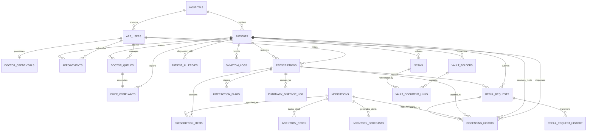

# SANJEEVANI (संजीवनी) — Unified AI-Powered Clinical Intelligence & Healthcare Operating Ecosystem

---

## EXECUTIVE SUMMARY & SYSTEM OVERVIEW

**Sanjeevani** is an enterprise-grade, full-stack clinical intelligence operating ecosystem engineered to unify fragmented healthcare workflows across primary, secondary, and tertiary clinical environments. Modern healthcare delivery suffers from severe operational latency, siloed diagnostic records, paper-to-digital impedance, medication errors, and unmonitored patient discharge periods. Sanjeevani resolves these systemic bottlenecks by consolidating six distinct clinical stakeholders into a single, cohesive, real-time reactive platform:

1. **Patients & Caregivers** (Mobile PWA & Vault)
2. **Attending Physicians & Specialists** (Physician Command Center & CRM)
3. **Reception & Triage Staff** (Front-Desk Intake & Live Queue Orchestrator)
4. **Dispensary Pharmacists** (Safety-Lock Dispensing & Supply Forecasting)
5. **Laboratory Technicians** (Diagnostic Diagnostics Workbench & OCR Pipeline)
6. **Hospital Administrators & Clinical Directors** (Audit, Governance & Metric Observability)

Built on Next.js 14+ (App Router), FastAPI, PostgreSQL (Supabase with Row-Level Security), and advanced Generative AI & NLP models (Gemini Flash/Pro), Sanjeevani pairs high-speed UI ergonomics with deterministic safety rails (drug-drug interaction interception, contraindication flags, allergy gating, and audit logging).

---

# SECTION 1: PRELIMINARY INVESTIGATION

### 1.1 Problem Identification
Healthcare delivery worldwide—and specifically within high-volume outpatient clinics, district hospitals, and nursing homes—faces persistent operational breakdown across four critical dimensions:

1. **Triage Congestion and Manual Routing Latency:** 
   Front-desk staff rely on manual paper tokens or disjointed queuing software that lacks clinical acuity assessment. Patients exhibiting time-sensitive symptoms (e.g., atypical cardiac discomfort, dyspnea, or hypertensive crises) are queued on a purely first-come, first-served basis behind routine wellness checks, leading to preventable clinical deterioration in waiting areas.

2. **Physician Cognitive Overload & Fragmented Patient History:**
   Doctors are burdened with deciphering unindexed physical files, past discharge summaries, unstructured paper prescriptions, and multi-vendor lab reports during brief 5-to-10 minute consultations. Critical historical signals—such as drug allergies, organ dysfunction, and past adverse drug events (ADEs)—are routinely missed due to document fatigue.

3. **Dispensing Vulnerabilities and Inventory Stockouts:**
   Pharmacy desks function as passive fulfillment counters rather than active safety checkpoints. Illegible handwriting and manual transcriptions cause dispensing errors. Furthermore, hospital pharmacies lack dynamic demand-sensing capabilities; essential life-saving medications (such as insulin, oral hypoglycemics, anti-hypertensives, and broad-spectrum antibiotics) frequently face stockouts due to a lack of consumption velocity forecasting.

4. **Post-Consultation Blind Spots and Treatment Non-Adherence:**
   Once a patient leaves the clinical facility, the care loop fractures. Patients forget dosing schedules, misunderstand food-drug restrictions, discontinue courses prematurely upon symptom relief, and fail to report early adverse reactions. Refill requests are handled via chaotic phone calls or ad-hoc visits without doctor validation.

---

### 1.2 Problem Statement / Definition
To architect, develop, and deploy an end-to-end, multi-tenant, role-governed Clinical Intelligence Platform that:
* Eliminates triage latency through NLP-driven chief complaint severity classification.
* Provides doctors with a consolidated longitudinal patient health record, AI-augmented differential assistance, automated interaction checking, and follow-up CRM.
* Guarantees pharmacy safety through deterministic safety-lock acknowledgments before dispensing and inventory forecasting.
* Empowers patients with self-sovereign digitized medical vaults, multi-modal report interpretation in layperson language, structured refill requests, and symptom tracking.
* Operates under a unified design language with sub-second navigation, robust offline resilience, and strict healthcare data governance (HIPAA / DISHA aligned).

---

### 1.3 Purpose, Objectives, and Goals

#### Primary Purpose
To establish an interconnected clinical operating system that minimizes preventable medical errors, accelerates front-door-to-consultation throughput, and automates patient care continuity beyond the hospital walls.

#### Specific System Objectives
* **Acuteness-Driven Queue Management:** Reduce patient front-desk triage and queue registration time to under 90 seconds while automatically classifying clinical acuity (Routine, Urgent, Critical).
* **Zero Adverse Drug Interactions:** Guarantee 100% automated screening of newly prescribed items against the patient's existing active medication list and recorded allergy profile before sign-off, with mandatory pharmacist safety-lock acknowledgment.
* **Intelligent Document Digitization:** Convert unstructured paper reports, blood panels, and historical discharge summaries into searchable, structured JSON vitals within 5 seconds using OCR and medical entity extraction pipelines.
* **Proactive Inventory Replenishment:** Implement predictive consumption velocity algorithms that alert pharmacy managers 7–14 days prior to projected stockout events.
* **Empowered Patient Engagement:** Provide patients with a bi-directional portal featuring medication reminders, one-click digital refill requests, AI report explanations, and longitudinal adherence tracking.

---

### 1.4 Feasibility Study

| Dimension | Assessment | Details & Justification |
|---|---|---|
| **Technical Feasibility** | **High** | The platform leverages battle-tested, modern web and backend technologies: Next.js 14+ with React Server Components, TypeScript for type safety, FastAPI for asynchronous high-concurrency API handling, PostgreSQL for ACID compliance, and Supabase for real-time WebSocket events and Row Level Security. AI workflows utilize Google Gemini and specialized prompt templates with strict JSON schema validation. |
| **Operational Feasibility** | **High** | Designed following standard hospital operational workflows (Reception $\to$ Triage $\to$ Doctor $\to$ Pharmacy/Lab $\to$ Post-Care). Ergonomic light-themed interfaces, tactile feedback, minimal keystroke navigation, and accessible mobile PWAs ensure that hospital personnel and non-technical patients can adopt the software with near-zero training. |
| **Economic Feasibility** | **High** | Open-source foundation (PostgreSQL, FastAPI, Next.js, Tailwind CSS) eliminates punitive per-seat commercial enterprise licensing costs. Cloud deployments leverage elastic serverless backends and tiered API pricing, significantly reducing hospital CapEx and OpEx while dramatically reducing cost-per-consultation. |
| **Legal, Ethical & Compliance Feasibility** | **High** | Aligned with the **Digital Information Security in Healthcare Act (DISHA)**, **Ayushman Bharat Digital Mission (ABDM)** standards, and **HIPAA Security Rules**. Incorporates AES-256 encryption at rest, TLS 1.3 in transit, strict Row Level Security (RLS) scoping, and append-only audit trails for clinical decision overrides. |

---

### 1.5 Project Scope and Limitations

#### In-Scope
* Role-governed authentication and role-switching for 6 roles: Patient, Doctor, Receptionist, Pharmacist, Lab Technician, and Administrator.
* Real-time triage and patient registration with phone-number autofill, chief complaint NLP severity suggestion, and physician queue routing.
* Clinical consultation command desk with live vitals capture, past medical record comparison, prescription writing with real-time allergy/drug-drug interaction checking, and digital sign-off.
* AI-driven Patient Health Vault with multi-document upload, automated OCR classification, trend analysis, and smart layperson report summarization.
* Pharmacy dispensing workbench with interaction safety-lock gating, partial dispensing, backorder tracking, inventory management, and AI velocity forecasting.
* Refill management lifecycle: patient request $\to$ doctor review/approval $\to$ pharmacy fulfillment $\to$ inventory decrement.
* Lab Diagnostics workbench for receiving doctor lab orders, uploading raw test files, running OCR parameter extraction, and publishing verified reports to the patient vault.

#### Out-of-Scope (Current Iteration Limitations)
* Direct automated integration with physical bedside hardware telemetry monitors (e.g., ICU ventilator serial interfaces; vitals are currently inputted by triage/nursing staff).
* In-app merchant payment gateway processing for commercial medication purchases (handled via external billing desk or simulated counter receipts).
* Autonomous prescribing: AI suggestions remain strictly advisory; no clinical instruction or medication order is created without explicit physician credentials and authentication.

---

# SECTION 2: REQUIREMENT SPECIFICATIONS

### 2.1 System Requirements

#### Hardware Specifications
##### Client-Side Workstations & Devices
* **Reception, Doctor, Pharmacy & Lab Terminals:**
  * CPU: Dual-Core 2.0 GHz or higher (Intel Core i3 / AMD Ryzen 3 or Apple Silicon).
  * RAM: 4 GB minimum (8 GB recommended for multi-tab browsing).
  * Display: Minimum resolution of $1366 \times 768$ (Full HD $1920 \times 1080$ recommended).
  * Network: Stable Internet / Hospital Intranet connection (minimum 2 Mbps broadband / 4G).
* **Patient Mobile Devices:**
  * Modern Android (Android 9.0+) or iOS (iOS 14.0+) smartphone with modern browser (Chrome 90+, Safari 14+).

##### Server & Deployment Infrastructure
* **Application & API Server (Containerized / Cloud Host):**
  * Minimum: 2 vCPU, 4 GB RAM, 20 GB SSD storage.
  * Recommended Production: 4 vCPU, 8 GB RAM, NVMe SSD storage with horizontal auto-scaling.
* **Database Server (Managed PostgreSQL / Supabase):**
  * Compute: 2 vCPU, 4 GB RAM minimum with automated daily backup snapshots.
  * Storage: Scalable object storage (S3 / Supabase Storage buckets) for medical report PDFs and images.

---

### 2.2 Technical Requirements

#### Software & Framework Stack
* **Frontend Architecture:**
  * Framework: **Next.js 14+** (React 18, App Router paradigm).
  * Language: **TypeScript 5.x** for end-to-end static type verification.
  * Styling & UI Components: **Vanilla CSS + Tailwind CSS**, Lucide Icons, glassmorphism tokens, and responsive layout primitives.
  * State & Data Fetching: React Context API (`AuthContext`), native `fetch` client with API error wrapper, and real-time polling.
* **Backend Architecture:**
  * Framework: **FastAPI 0.109+** (High-performance asynchronous Python REST framework).
  * Runtime: **Python 3.11+**.
  * Validation & Serialization: **Pydantic v2** models.
  * Database Connector: **Supabase Python SDK** using PostgREST clients and service-role bypass for protected transactions.
* **Artificial Intelligence & Document Processing:**
  * Model Suite: **Google Gemini Models** (Gemini Flash for rapid NLP classification; Gemini Pro for clinical synthesis and report explanation).
  * Document Extraction: PyMuPDF, OCR (Tesseract / Vision AI) for digitizing uploaded physical prescriptions and lab reports.
* **Database & Security:**
  * Engine: **PostgreSQL 15+** with extensions (`uuid-ossp`, `pgcrypto`).
  * Access Control: Postgres **Row Level Security (RLS)** policies combined with FastAPI role-verification decorators.

---

### 2.3 Functional Requirements by Stakeholder Role

```
                                  +-----------------------+
                                  |   SANJEEVANI SYSTEM   |
                                  +-----------+-----------+
                                              |
      +-------------------+-------------------+-------------------+-------------------+
      |                   |                   |                   |                   |
+-----v-----+       +-----v-----+       +-----v-----+       +-----v-----+       +-----v-----+
|  PATIENT  |       |  DOCTOR   |       | RECEPTION |       | PHARMACY  |       | LAB TECH  |
|  PORTAL   |       | WORKSPACE |       |  CONSOLE  |       | DISPENSARY|       | WORKBENCH |
+-----------+       +-----------+       +-----------+       +-----------+       +-----------+
```

#### Role 1: Patient & Caregiver Portal (`/dashboard`, `/vault`, `/patient/*`)
* **FR-P01: Digital Patient Identity:** Access unique digital health identifier, demographics, emergency contact info, and known allergies.
* **FR-P02: Active Treatment & Medication Adherence Tracker:** Interactive visual timeline displaying active prescriptions, dosage schedules, frequency badges, meal timing, and remaining duration.
* **FR-P03: Self-Sovereign Health Vault:** Upload, view, and organize medical documents (prescriptions, discharge summaries, laboratory reports) organized into folders.
* **FR-P04: AI-9 Smart Vault Search & Document Intelligence:** Natural language multi-lingual querying across all stored clinical records (e.g., *"What was my fasting glucose level in August?"*).
* **FR-P05: Layperson Lab Explainer:** Automatic translation of complex diagnostic parameters (e.g., HbA1c, Serum Creatinine, SGPT) into color-coded healthy ranges and plain-language summaries.
* **FR-P06: Digital Refill Requests:** Submit one-click refill requests for authorized recurring medications when supply runs low, with live status tracking (`Pending` $\to$ `Approved` $\to$ `Dispensed`).
* **FR-P07: Daily Wellbeing & Symptom Logging:** Rate feeling scores (1 to 5) and log physical symptoms to generate longitudinal recovery trend lines for physician review.

#### Role 2: Physician & Specialist Command Center (`/doctor`, `/doctor/patient/[id]/*`)
* **FR-D01: Live Clinical Triage Queue:** Real-time visibility into waiting patients categorized by acuity tokens (Critical, Urgent, Routine), wait time, and chief complaint.
* **FR-D02: Comprehensive Patient Summary View:** Immediate 360-degree timeline containing vitals, previous consultation notes, current medications, and past lab investigations.
* **FR-D03: Clinical Prescription Engine:** Structured medicine composer with autocomplete for dosages, routes, frequencies, durations, meal instructions, and refill limits.
* **FR-D04: Real-Time Drug Interaction & Allergy Interceptor:** Deterministic validation against known patient allergies and concurrent drug regimens; warns of severe or moderate interactions before final sign-off.
* **FR-D05: Clinical Sign-Off & Verification:** Digital prescription signing that transitions records into immutable states and dispatches orders simultaneously to the pharmacy and patient vault.
* **FR-D06: Refill Request Management:** Review pending patient refill applications, examine clinical compliance history, and approve (with duration adjustments) or deny with clinical notes.
* **FR-D07: Follow-up & CRM Orchestrator:** Schedule follow-up consultation dates, record patient recovery milestones, and log phone outreach notes.

#### Role 3: Front-Desk Reception & Triage Console (`/reception`, `/reception/*`)
* **FR-R01: Accelerated Patient Lookup & Autofill:** Search by mobile phone number to retrieve returning patient records, demographics, emergency contacts, and active allergy warnings in under 2 seconds.
* **FR-R02: Patient Intake & Emergency Contact Capture:** Rapid creation of new digital patient profiles with mandatory demographic parameters.
* **FR-R03: AI-4 NLP Severity Classification:** Automatic real-time parsing of typed chief complaints into Acuity Levels (Level 1: Routine, Level 2: Urgent, Level 3: Critical) with staff override capability.
* **FR-R04: Doctor Queue Assignment & Token Issuance:** Direct assignment of triaged patients to on-duty specialists with instant token generation, queue placement, and estimated wait times.
* **FR-R05: Physical Document Attachments:** Ability to scan/upload hard-copy records brought in by walk-in patients during check-in.
* **FR-R06: Live Cross-Department Queue Board (`/reception/queue`):** Centralized display of all doctor consultation rooms, active wait counts, in-consultation status, and average wait duration.
* **FR-R07: Future Appointment Booking (`/reception/appointments`):** Schedule, view, and reschedule planned clinical visits with specific specialists.

#### Role 4: Pharmacy Dispensary Console (`/pharmacy`, `/pharmacy/*`)
* **FR-PH01: Verified Dispensing Stream:** Real-time feed of physician-signed prescriptions and approved refills awaiting physical fulfillment.
* **FR-PH02: Mandatory Safety-Lock Enforcement:** Visual warning locks on prescriptions containing drug-drug interactions or overrides; requires the dispensing pharmacist to click *"Acknowledge & Continue"* before the dispense action unlocks.
* **FR-PH03: AI-6 Drug Interaction Explainer:** On-demand AI modal detailing the biochemical mechanism of flagged drug pairs, physician clearance context, and counseling tips for the patient.
* **FR-PH04: Atomic Dispensing & Stock Decrement:** Single-click full or partial dispensing that atomically logs the dispensing audit trail and decrements medication stock levels.
* **FR-PH05: Real-Time Inventory Control (`/pharmacy/inventory`):** Comprehensive catalog of medicines showing quantity on hand, reorder thresholds, daily consumption velocity, and health status indicators (Healthy, Reorder Soon, Low Stock).
* **FR-PH06: AI-5 Predictive Stockout Forecasting:** Automated alerts highlighting medications projected to stock out within 4–10 days based on trailing consumption velocity, with suggested purchase order (PO) quantities.
* **FR-PH07: Patient Dispensing Audit History (`/pharmacy/history`):** Complete chronological audit trail of all items dispensed to a specific patient, tracking partial fulfillments and refill logs.

#### Role 5: Laboratory Diagnostics Workbench (`/lab`)
* **FR-L01: Diagnostic Order Queue:** Centralized feed of diagnostic tests requested by attending doctors during patient consultations.
* **FR-L02: Report Ingestion & OCR Processing:** Upload scanned PDF or image test reports; automated trigger of OCR pipeline to identify key parameters (e.g., Platelet count, Hemoglobin, Lipid ratios).
* **FR-L03: Value Verification & Out-of-Range Highlighting:** Technicians review extracted values side-by-side with reference normal ranges; flagged abnormal values appear highlighted.
* **FR-L04: Diagnostic Publication:** Direct publication of verified reports to the patient's digital health vault and the requesting physician's consultation timeline.

#### Role 6: Hospital Administration & Governance
* **FR-A01: Master Staff Directory & Credentials Management:** Create, activate, and manage doctor specializations, licensing numbers, and clinic assignments.
* **FR-A02: Clinical Audit Trail Access:** View immutable logs of patient record modifications, drug override justifications, and dispensing timestamps.
* **FR-A03: Operational Metrics & Throughput Analytics:** Departmental dashboards measuring average patient turnaround time, doctor consultation load, triage accuracy, and inventory burn rates.

---

### 2.4 Data, Performance, and Security Requirements

#### Data Integrity Requirements
* **ACID Transactions:** All dispensing actions and doctor prescription sign-offs are wrapped in atomic transactions to guarantee that inventory counts and dispense logs remain synchronized.
* **Referential Integrity:** Cascading deletes are strictly governed; core patient records cannot be deleted if active prescriptions, diagnostic reports, or audit logs exist.

#### Performance Requirements
* **API Response Latency:** 95% of standard CRUD REST endpoints must resolve in under 200 ms under a load of 500 concurrent users.
* **Search & Queue Retrieval:** Patient phone lookup and live queue board polling must return within 150 ms.
* **AI NLP Classification Throughput:** AI triage classification and interaction explanations must respond within 1.5 to 3.0 seconds.

#### Security & Regulatory Requirements
* **Authentication & Authorization:** JWT-based session verification with secure HTTP-only cookies; password hashing via Argon2id / bcrypt.
* **Row Level Security (RLS):** Supabase database-level security policies enforce tenant and role isolation. Unauthenticated direct database access is blocked.
* **Backend Privilege Separation:** The FastAPI backend securely connects using the Supabase Service Role Key, performing authoritative server-side role validation before querying.
* **Auditability:** Critical events (pharmacist safety-lock overrides, physician interaction dismissals, and dosage changes) are permanently written to append-only verification tables.

---

# SECTION 3: DATABASE DESIGN

### 3.1 Identification of System End Users

The Sanjeevani database supports six distinct persona categories, modeled through the `app_users` table and associated profile entities:

1. **Patient (`patient`):** End consumers receiving clinical care, accessing medical vaults, and requesting medication refills.
2. **Physician / Specialist (`doctor`):** Attending clinicians examining patients, reviewing histories, prescribing medicines, and analyzing diagnostic labs.
3. **Receptionist (`receptionist`):** Front-desk operators managing walk-ins, phone lookups, triage categorization, queue token assignment, and appointment scheduling.
4. **Pharmacist (`pharmacist`):** Dispensary professionals verifying prescriptions, fulfilling medication orders, checking interactions, and managing inventory stock.
5. **Lab Technician (`lab_tech`):** Diagnostic lab personnel executing ordered tests, uploading reports, and publishing structured laboratory values.
6. **Administrator (`admin`):** Clinical directors and operations supervisors monitoring compliance, audit logs, and hospital resource utilization.

---

### 3.2 Entity-Relationship (ER) Architecture

The entity relationships governing Sanjeevani are represented in the comprehensive diagram below:



---

### 3.3 Relational Schema & Table Dictionary

Below is the complete specification of all tables, fields, data types, constraints, and relationships implementing the Sanjeevani ecosystem.

---

#### 1. `hospitals`
Stores clinical tenant organizations, multi-hospital network hubs, and primary facility configurations.
* **`id`** (`uuid`, Primary Key, default `uuid_generate_v4()`): Unique hospital identifier.
* **`name`** (`text`, NOT NULL): Full legal institution name (e.g., *"Sanjeevani Central Hospital"*).
* **`address`** (`text`): Physical street address.
* **`phone`** (`text`): Primary switchboard contact number.
* **`created_at`** (`timestamptz`, default `now()`): Creation timestamp.

---

#### 2. `app_users`
Unified authentication and profile registry for all system staff and registered patients.
* **`id`** (`uuid`, Primary Key, references Supabase `auth.users(id)` or internal UUID): Unique identity key.
* **`hospital_id`** (`uuid`, Foreign Key references `hospitals(id)` on delete cascade): Associated facility.
* **`role`** (`text`, NOT NULL, CHECK `role in ('patient','doctor','receptionist','pharmacist','lab_tech','admin')`): System access role.
* **`full_name`** (`text`, NOT NULL): User's legal full name.
* **`email`** (`text`, UNIQUE, NOT NULL): Official email address for authentication and notices.
* **`phone`** (`text`): Primary mobile telephone number.
* **`is_active`** (`boolean`, default `true`): Account state switch.
* **`created_at`** (`timestamptz`, default `now()`): Registration timestamp.

---

#### 3. `doctor_credentials`
Specialty metadata, licensing records, and digital sign-off authority for clinical staff.
* **`id`** (`uuid`, Primary Key, default `uuid_generate_v4()`): Credential record ID.
* **`doctor_id`** (`uuid`, Foreign Key references `app_users(id)` on delete cascade, UNIQUE): Associated doctor.
* **`registration_number`** (`text`, NOT NULL): State Medical Council / National Medical Commission license code.
* **`specialty`** (`text`, NOT NULL): Primary clinical specialty (e.g., *"Internal Medicine"*, *"Cardiology"*).
* **`qualifications`** (`text`): Academic degrees (e.g., *"MBBS, MD, DM"*).
* **`department`** (`text`): Assigned hospital wing / outpatient department.
* **`created_at`** (`timestamptz`, default `now()`): Record creation timestamp.

---

#### 4. `patients`
Demographic and primary clinical registry for individuals receiving healthcare services.
* **`id`** (`uuid`, Primary Key, default `uuid_generate_v4()`): Unique patient identifier.
* **`user_id`** (`uuid`, Foreign Key references `app_users(id)` on delete set null): Linked digital user account.
* **`hospital_id`** (`uuid`, Foreign Key references `hospitals(id)`): Registering hospital facility.
* **`full_name`** (`text`, NOT NULL): Patient's full legal name.
* **`age`** (`int`, NOT NULL, CHECK `age >= 0`): Age in years.
* **`gender`** (`text`, NOT NULL, CHECK `gender in ('Male','Female','Other')`): Gender identity.
* **`phone`** (`text`, NOT NULL, INDEXED): Primary contact telephone number used for fast reception lookups.
* **`emergency_contact_name`** (`text`): Name of designated primary next of kin or emergency caregiver.
* **`emergency_contact_phone`** (`text`): Telephone number of emergency contact.
* **`created_at`** (`timestamptz`, default `now()`): Registration timestamp.

---

#### 5. `patient_allergies`
Structured active allergy registry used for automated drug-allergy contraindication checks.
* **`id`** (`uuid`, Primary Key, default `uuid_generate_v4()`): Allergy record key.
* **`patient_id`** (`uuid`, Foreign Key references `patients(id)` on delete cascade, INDEXED): Associated patient.
* **`allergen`** (`text`, NOT NULL): Causative substance (e.g., *"Penicillin"*, *"Sulfa Drugs"*, *"NSAIDs"*).
* **`severity`** (`text`, default `'moderate'`, CHECK `severity in ('mild','moderate','severe')`): Reaction acuity.
* **`reaction`** (`text`): Clinical symptom manifestation (e.g., *"Anaphylaxis"*, *"Urticaria"*).
* **`diagnosed_at`** (`date`): Date of medical confirmation.
* **`created_at`** (`timestamptz`, default `now()`): Timestamp.

---

#### 6. `chief_complaints`
Primary reason for visit, symptom descriptions, and NLP-assisted clinical acuity triage scores.
* **`id`** (`uuid`, Primary Key, default `uuid_generate_v4()`): Complaint entry ID.
* **`patient_id`** (`uuid`, Foreign Key references `patients(id)` on delete cascade): Associated patient.
* **`text`** (`text`, NOT NULL): Raw chief complaint and symptoms recorded at front desk.
* **`severity_level`** (`int`, default `1`, CHECK `severity_level between 1 and 3`): Triage severity (1 = Routine, 2 = Urgent, 3 = Critical).
* **`ai_suggested_severity`** (`int`, CHECK `ai_suggested_severity between 1 and 3`): Initial score generated by the AI-4 NLP engine.
* **`severity_overridden_by_staff`** (`boolean`, default `false`): Indicates whether human staff modified the AI triage suggestion.
* **`created_at`** (`timestamptz`, default `now()`): Timestamp.

---

#### 7. `doctor_queues`
Live outpatient department queue linking triaged patients with consulting physicians.
* **`id`** (`uuid`, Primary Key, default `uuid_generate_v4()`): Queue item identifier.
* **`patient_id`** (`uuid`, Foreign Key references `patients(id)` on delete cascade): Waiting patient.
* **`doctor_id`** (`uuid`, Foreign Key references `app_users(id)` on delete cascade, INDEXED): Assigned doctor.
* **`chief_complaint_id`** (`uuid`, Foreign Key references `chief_complaints(id)`): Associated intake reason.
* **`token_number`** (`int`, NOT NULL): Day-specific sequential queue token.
* **`status`** (`text`, default `'waiting'`, CHECK `status in ('waiting','in_consult','completed','cancelled')`): Current queue state.
* **`queued_at`** (`timestamptz`, default `now()`): Check-in timestamp.
* **`called_at`** (`timestamptz`): Timestamp when doctor called patient into room.
* **`completed_at`** (`timestamptz`): Consultation completion timestamp.

---

#### 8. `appointments`
Scheduled future clinical consultations, specialist appointments, and planned follow-ups.
* **`id`** (`uuid`, Primary Key, default `uuid_generate_v4()`): Appointment booking ID.
* **`patient_id`** (`uuid`, Foreign Key references `patients(id)` on delete cascade, INDEXED): Patient.
* **`doctor_id`** (`uuid`, Foreign Key references `app_users(id)`, INDEXED): Consulting physician.
* **`scheduled_at`** (`timestamptz`, NOT NULL, INDEXED): Planned appointment date and time.
* **`reason`** (`text`): Purpose of consultation or scheduled procedure.
* **`status`** (`text`, default `'scheduled'`, CHECK `status in ('scheduled','checked_in','completed','no_show','cancelled')`): Status.
* **`created_by`** (`uuid`, Foreign Key references `app_users(id)`): Staff user or patient booking the slot.
* **`created_at`** (`timestamptz`, default `now()`): Record timestamp.

---

#### 9. `medications`
Master pharmaceutical formulary catalog containing drug brands, generics, strengths, and classes.
* **`id`** (`uuid`, Primary Key, default `uuid_generate_v4()`): Formulation identifier.
* **`name`** (`text`, NOT NULL): Commercial brand name (e.g., *"Augmentin 625 Duo"*).
* **`generic_name`** (`text`, NOT NULL, INDEXED): Active ingredient composition (e.g., *"Amoxicillin + Clavulanic Acid"*).
* **`dosage_form`** (`text`, NOT NULL): Physical form (e.g., *"Tablet"*, *"Syrup"*, *"Injection"*).
* **`strength`** (`text`): Concentration strength (e.g., *"500mg/125mg"*).
* **`drug_class`** (`text`): Pharmacological category (e.g., *"Beta-lactam Antibiotic"*).
* **`created_at`** (`timestamptz`, default `now()`): Creation timestamp.

---

#### 10. `prescriptions`
Master prescription headers containing doctor sign-offs, refill limits, and verification timestamps.
* **`id`** (`uuid`, Primary Key, default `uuid_generate_v4()`): Unique prescription key.
* **`patient_id`** (`uuid`, Foreign Key references `patients(id)` on delete cascade, INDEXED): Patient.
* **`doctor_id`** (`uuid`, Foreign Key references `app_users(id)`): Prescribing physician.
* **`notes`** (`text`): General doctor dietary, activity, or follow-up instructions.
* **`is_refillable`** (`boolean`, default `true`): Gating flag permitting recurring refills.
* **`max_refills_allowed`** (`int`, default `3`): Maximum approved refill cycles before requiring an in-person visit.
* **`refills_issued`** (`int`, default `0`): Running count of successfully dispensed refills.
* **`verified_at`** (`timestamptz`): Digital sign-off timestamp by the physician.
* **`allergy_checked_at`** (`timestamptz`): Timestamp when system ran the automated allergy check.
* **`created_at`** (`timestamptz`, default `now()`): Prescription generation timestamp.

---

#### 11. `prescription_items`
Individual medication line items detailing dosing regimens, durations, and meal timings.
* **`id`** (`uuid`, Primary Key, default `uuid_generate_v4()`): Line item ID.
* **`prescription_id`** (`uuid`, Foreign Key references `prescriptions(id)` on delete cascade, INDEXED): Parent prescription.
* **`medication_id`** (`uuid`, Foreign Key references `medications(id)`): Prescribed formulary item.
* **`dosage`** (`text`, NOT NULL): Exact unit dose (e.g., *"500 mg"*, *"10 ml"*).
* **`frequency`** (`text`, NOT NULL): Daily frequency format (e.g., *"1-0-1"*, *"Once Daily at Bedtime"*).
* **`duration_days`** (`int`, NOT NULL): Total course duration in days.
* **`condition_tag`** (`text`): Targeted health condition (e.g., *"Type 2 Diabetes"*, *"Hypertension"*).
* **`meal_timing`** (`text`, default `'after_food'`, CHECK `meal_timing in ('before_food','after_food','with_food','empty_stomach')`): Administration timing.
* **`created_at`** (`timestamptz`, default `now()`): Creation timestamp.

---

#### 12. `interaction_flags`
Detected drug-drug, drug-allergy, or drug-condition interaction warnings and clinical overrides.
* **`id`** (`uuid`, Primary Key, default `uuid_generate_v4()`): Flag entry ID.
* **`prescription_id`** (`uuid`, Foreign Key references `prescriptions(id)` on delete cascade, INDEXED): Associated prescription.
* **`severity`** (`text`, NOT NULL, CHECK `severity in ('low','moderate','severe','contraindicated')`): Risk level.
* **`message`** (`text`, NOT NULL): Clinical warning description.
* **`conflicting_allergen_id`** (`uuid`, Foreign Key references `patient_allergies(id)`): Linked allergy if triggered by an allergen.
* **`acknowledged_by_doctor`** (`boolean`, default `false`): Indicates whether the doctor reviewed and acknowledged the flag during sign-off.
* **`doctor_override_reason`** (`text`): Mandatory rationale provided by the physician when overriding a severe interaction.
* **`created_at`** (`timestamptz`, default `now()`): Record timestamp.

---

#### 13. `pharmacy_dispense_log`
Real-time dispensing queue mediating between physician digital sign-offs and pharmacist fulfillment.
* **`id`** (`uuid`, Primary Key, default `uuid_generate_v4()`): Queue log ID.
* **`prescription_id`** (`uuid`, Foreign Key references `prescriptions(id)` on delete cascade, UNIQUE): Target prescription.
* **`dispensed`** (`boolean`, default `false`, INDEXED): Fulfillment status flag.
* **`pharmacist_id`** (`uuid`, Foreign Key references `app_users(id)`): Dispensing pharmacist user.
* **`dispensed_at`** (`timestamptz`): Verification and fulfillment timestamp.
* **`created_at`** (`timestamptz`, default `now()`): Queued timestamp.

---

#### 14. `inventory_stock`
Current warehouse/dispensary stock levels, reorder thresholds, and restock tracking.
* **`medication_id`** (`uuid`, Primary Key, Foreign Key references `medications(id)` on delete cascade): Medication key.
* **`medication_name`** (`text`): Cached display name for rapid listing.
* **`quantity_on_hand`** (`int`, NOT NULL, default `0`): Current physical count in dispensary.
* **`reorder_threshold`** (`int`, NOT NULL, default `50`): Minimum buffer triggering low-stock warnings.
* **`daily_avg`** (`numeric(8,2)`, default `0.00`): 30-day moving average of units dispensed per day.
* **`last_restocked_at`** (`timestamptz`): Most recent stock delivery timestamp.
* **`projected_zero_date`** (`date`): Calculated date when stock is forecasted to reach zero.
* **`updated_at`** (`timestamptz`, default `now()`): Update timestamp.

---

#### 15. `inventory_forecasts`
Machine-learning generated stockout predictions and automated reorder purchase recommendations.
* **`id`** (`uuid`, Primary Key, default `uuid_generate_v4()`): Forecast log ID.
* **`medication_id`** (`uuid`, Foreign Key references `medications(id)` on delete cascade): Target medication.
* **`name`** (`text`, NOT NULL): Formulary medicine name.
* **`current_stock`** (`int`, NOT NULL): Quantity at forecast execution time.
* **`avg_daily_dispense`** (`numeric(8,2)`, NOT NULL): Consumption velocity per 24-hour cycle.
* **`days_until_stockout`** (`int`, NOT NULL): Days remaining until supply exhaustion.
* **`urgency`** (`text`, NOT NULL, CHECK `urgency in ('normal','warning','critical')`): Alert level.
* **`suggested_reorder_qty`** (`int`, NOT NULL): Recommended batch size for purchase orders.
* **`generated_at`** (`timestamptz`, default `now()`): Forecast calculation timestamp.

---

#### 16. `refill_requests` & `refill_request_history`
Complete lifecycle tracking for patient medication refills from request through doctor review to dispensing.
* **`refill_requests` Table:**
  * **`id`** (`uuid`, Primary Key, default `uuid_generate_v4()`): Refill request key.
  * **`patient_id`** (`uuid`, Foreign Key references `patients(id)` on delete cascade, INDEXED): Requesting patient.
  * **`prescription_id`** (`uuid`, Foreign Key references `prescriptions(id)` on delete cascade): Original parent prescription.
  * **`prescribing_doctor_id`** (`uuid`, Foreign Key references `app_users(id)`, INDEXED): Supervising doctor.
  * **`status`** (`text`, default `'pending'`, CHECK `status in ('pending','approved','dispensed','denied','expired')`): State.
  * **`refill_quantity`** (`int`, default `10`): Requested unit/dose quantity.
  * **`request_notes`** (`text`): Patient-submitted justification or symptom note.
  * **`doctor_response_notes`** (`text`): Physician clinical note on approval or denial.
  * **`requested_at`** (`timestamptz`, default `now()`): Submission timestamp.
  * **`approved_at`** (`timestamptz`): Physician approval timestamp.
  * **`approved_by`** (`uuid`, Foreign Key references `app_users(id)`): Approving doctor user.
  * **`dispensed_at`** (`timestamptz`): Pharmacy dispensing timestamp.
  * **`expires_at`** (`timestamptz`, default `(now() + interval '30 days')`): Expiration cutoff.
* **`refill_request_history` Table:**
  * **`id`** (`uuid`, Primary Key, default `uuid_generate_v4()`): Audit log ID.
  * **`refill_request_id`** (`uuid`, Foreign Key references `refill_requests(id)` on delete cascade): Target request.
  * **`status_change_from`** (`text`): Previous state.
  * **`status_change_to`** (`text`): New state.
  * **`changed_by`** (`uuid`, Foreign Key references `app_users(id)`): User performing the state transition.
  * **`changed_at`** (`timestamptz`, default `now()`): Timestamp.

---

#### 17. `dispensing_history`
Unified, append-only pharmaceutical audit trail capturing every physical medication disbursement.
* **`id`** (`uuid`, Primary Key, default `uuid_generate_v4()`): Fulfillment transaction ID.
* **`prescription_id`** (`uuid`, Foreign Key references `prescriptions(id)`, INDEXED): Originating prescription (if applicable).
* **`refill_request_id`** (`uuid`, Foreign Key references `refill_requests(id)`): Originating refill request (if applicable).
* **`patient_id`** (`uuid`, Foreign Key references `patients(id)`, INDEXED): Receiving patient.
* **`medication_id`** (`uuid`, Foreign Key references `medications(id)`): Dispensed medication formulary key.
* **`medication_name`** (`text`): Display name of medication.
* **`quantity_dispensed`** (`int`, NOT NULL): Physical quantity provided to the patient.
* **`dispensed_by`** (`uuid`, Foreign Key references `app_users(id)`): Pharmacist user executing disbursement.
* **`dispensed_at`** (`timestamptz`, default `now()`): Exact fulfillment timestamp.
* **`partial`** (`boolean`, default `false`): Set to `true` if this was a partial supply fulfillment.
* **`backorder_eta`** (`date`): Expected delivery date for remaining balance if partially dispensed.

---

#### 18. `scans` & `patient_vault_folders`
Digital document repository, storage bucket paths, OCR text extracts, and structured folder hierarchies.
* **`scans` Table:**
  * **`id`** (`uuid`, Primary Key, default `uuid_generate_v4()`): Document identifier.
  * **`patient_id`** (`uuid`, Foreign Key references `patients(id)` on delete cascade, INDEXED): Patient owner.
  * **`file_url`** (`text`, NOT NULL): Secure storage object URL.
  * **`file_type`** (`text`): MIME type (e.g., `'application/pdf'`, `'image/jpeg'`).
  * **`ocr_text`** (`text`): Raw extracted textual contents produced by OCR processing.
  * **`document_type`** (`text`, default `'general'`, CHECK `document_type in ('prescription','lab_report','discharge_summary','radiology','insurance','general')`): Categorization.
  * **`created_at`** (`timestamptz`, default `now()`): Upload timestamp.
* **`patient_vault_folders` Table:**
  * **`id`** (`uuid`, Primary Key, default `uuid_generate_v4()`): Folder key.
  * **`patient_id`** (`uuid`, Foreign Key references `patients(id)` on delete cascade): Patient owner.
  * **`name`** (`text`, NOT NULL): Folder label (e.g., *"Cardiology Reports"*, *"Prescriptions 2026"*).
  * **`is_system`** (`boolean`, default `false`): System-managed vs. user-created folder flag.
  * **`created_at`** (`timestamptz`, default `now()`): Timestamp.

---

#### 19. `symptom_logs`
Longitudinal daily health logs tracking patient feeling scores, reported issues, and recovery progress.
* **`id`** (`uuid`, Primary Key, default `uuid_generate_v4()`): Symptom log entry key.
* **`patient_id`** (`uuid`, Foreign Key references `patients(id)` on delete cascade, INDEXED): Patient.
* **`log_date`** (`date`, NOT NULL): Date of observation.
* **`feeling_score`** (`int`, CHECK `feeling_score between 1 and 5`): Standardized rating (1 = Very Poor, 5 = Excellent).
* **`symptoms`** (`text[]`): Array of tagged symptom labels (e.g., `['dizziness', 'mild nausea']`).
* **`notes`** (`text`): Optional free-text diary entry recorded by patient or caregiver.
* **`created_at`** (`timestamptz`, default `now()`): Creation timestamp.

---

#### 20. `user_settings`
Granular user preferences and individual server-side toggles for AI capabilities across clinical consoles.
* **`user_id`** (`uuid`, Primary Key, Foreign Key references `app_users(id)` on delete cascade): Associated user.
* **`ai_severity_enabled`** (`boolean`, default `true`): Enable AI-4 NLP triage recommendations in Reception.
* **`ai_forecast_enabled`** (`boolean`, default `true`): Enable AI-5 inventory consumption forecasting in Pharmacy.
* **`ai_explainer_enabled`** (`boolean`, default `true`): Enable AI-6 drug interaction explanations in Pharmacy.
* **`theme_preference`** (`text`, default `'light'`, CHECK `theme_preference in ('light','dark','system')`): UI theme.
* **`updated_at`** (`timestamptz`, default `now()`): Last modified timestamp.

---

# SECTION 4: DEPLOYMENT, EXECUTION & OPERATIONS GUIDE

### 4.1 Environment Configuration (.env)

Both frontend and backend require standard environment configurations to communicate with Supabase and AI services:

#### Backend (`scaffold/backend/.env`)
```env
SUPABASE_URL=https://your-project.supabase.co
SUPABASE_SERVICE_ROLE_KEY=your-supabase-service-role-key
GEMINI_API_KEY=your-google-ai-gemini-key
APP_ENV=production
CORS_ORIGINS=http://localhost:3000,https://sanjeevani.yourdomain.com
PORT=8000
```

#### Frontend (`scaffold/frontend/apps/patient/.env.local`)
```env
NEXT_PUBLIC_API_BASE=http://localhost:8000/api
NEXT_PUBLIC_SUPABASE_URL=https://your-project.supabase.co
NEXT_PUBLIC_SUPABASE_ANON_KEY=your-supabase-anon-key
```

---

### 4.2 Installation and Execution

#### Automated Startup (Windows)
The root directory includes automated launcher scripts that start both the FastAPI backend and Next.js frontend concurrently:
```cmd
run-all.bat
```
or via PowerShell:
```powershell
.\run-all.ps1
```

#### Manual Development Startup
1. **Backend Server:**
   ```bash
   cd scaffold/backend
   python -m venv venv
   source venv/bin/activate  # On Windows: venv\Scripts\activate
   pip install -r requirements.txt
   python -m uvicorn app.main:app --host 0.0.0.0 --port 8000 --reload
   ```

2. **Frontend Application:**
   ```bash
   cd scaffold/frontend/apps/patient
   npm install
   npm run dev
   ```

3. **Accessing Clinical Portals:**
   * **Physician Command:** `http://localhost:3000/doctor`
   * **Patient Health Vault:** `http://localhost:3000/dashboard`
   * **Reception & Triage:** `http://localhost:3000/reception`
   * **Dispensary Pharmacy:** `http://localhost:3000/pharmacy`
   * **Lab Workbench:** `http://localhost:3000/lab`
   * **Backend OpenAPI Docs:** `http://localhost:8000/docs`

---

# CONCLUSION & ACADEMIC CERTIFICATION

This architectural documentation represents the complete technical specification and structural design of the **Sanjeevani AI Clinical Intelligence Platform**. The database design adheres to Third Normal Form (3NF) principles while introducing strategic indexed optimizations for high-throughput outpatient triage, zero-error pharmacy safety enforcement, and self-sovereign patient document intelligence.
