# Sanjeevani — Comprehensive Entity-Relationship (ER) Design & Diagram Specification

This document provides an exhaustive, academic-grade guide on **how to construct, interpret, and draw the complete Entity-Relationship Diagram (ERD)** for the **Sanjeevani Healthcare Intelligence Platform**, following classical **Chen's Notation** (examinations & theory) and **Crow's Foot Relational Notation** (industry database engineering).

---

## 1. Classical Chen's Notation Symbol Directory

As per standard DBMS theory (Savitribai Phule Pune University CS-331-FP & GATE syllabus):

| Symbol | Shape | Meaning in Sanjeevani ERD | Example in Sanjeevani |
|:---:|:---:|:---|:---|
| **Entity** | Rectangle | An independent object with its own primary key. | `PATIENT`, `DOCTOR`, `MEDICATION`, `HOSPITAL` |
| **Weak Entity** | Double Rectangle | An entity whose existence depends on an identifying strong entity (no independent primary key). | `PRESCRIPTION_ITEM`, `PATIENT_ALLERGY`, `INTERACTION_FLAG` |
| **Relationship** | Diamond | Association between two or more strong entities. | `Registers`, `Prescribes`, `Dispenses` |
| **Identifying Relationship** | Double Diamond | Relationship linking a weak entity to its identifying strong owner. | `Contains` (Prescription $\rightarrow$ Item), `Suffers` (Patient $\rightarrow$ Allergy) |
| **Key Attribute** | Underlined Ellipse | Primary key uniquely identifying each instance. | <u>`patient_id`</u>, <u>`medication_id`</u>, <u>`user_id`</u> |
| **Simple Attribute** | Single Ellipse | Single atomic value describing the entity. | `blood_group`, `gender`, `dosage_form` |
| **Composite Attribute** | Hierarchy of Ellipses | An attribute partitioned into sub-components. | `full_name` (`first_name`, `last_name`), `address` |
| **Multivalued Attribute** | Double Ellipse | An attribute that can hold multiple values for a single entity instance. | `phone_numbers`, `condition_tags`, `symptoms` |
| **Derived Attribute** | Dashed Ellipse | An attribute dynamically computed from another attribute. | `age` (from `dob`), `days_until_stockout` (from stock / velocity) |
| **Total Participation** | Double Line | Every instance of the entity **must** participate in the relationship. | Every `PRESCRIPTION_ITEM` **must** belong to a `PRESCRIPTION`. |
| **Partial Participation** | Single Line | An entity instance **may or may not** participate. | Not every `DOCTOR` is actively assigned to an ongoing `QUEUE`. |

---

## 2. Entity Identification for Sanjeevani

In Sanjeevani, the real-world healthcare workflow breaks down into **6 Strong Entities** and **7 Weak / Dependent Entities**:

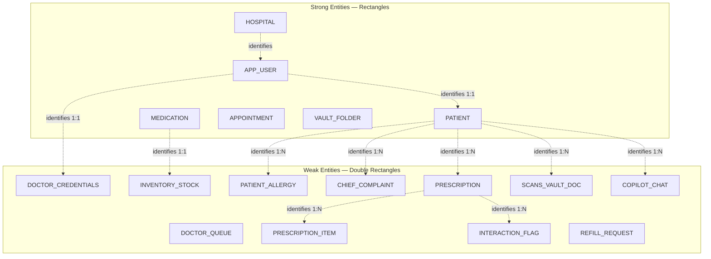

---

## 3. Detailed Attribute Dictionary (Chen's Types)

### 3.1 Strong Entities

#### 1. `PATIENT` (Strong Entity — Rectangle)
* <u>`patient_id`</u> (**Key Attribute**): Underlined oval. Unique UUID.
* `full_name` (**Composite Attribute**):
  * `first_name` (Simple Oval)
  * `last_name` (Simple Oval)
* `dob` (**Simple Attribute**): Date of birth.
* `age` (**Derived Attribute** — **Dashed Oval**): Derived as $\text{Current\_Date} - \text{dob}$.
* `gender` (**Simple Attribute**): Male / Female / Other.
* `blood_group` (**Simple Attribute**): e.g., O+, A+, B-.
* `phone` (**Multivalued Attribute** — **Double Oval**): Primary and secondary contact numbers.
* `emergency_contact` (**Composite Attribute**):
  * `contact_name`
  * `contact_phone`
  * `relationship`

#### 2. `APP_USER` (Strong Entity — Rectangle)
* <u>`user_id`</u> (**Key Attribute**): Underlined oval.
* `role` (**Simple Attribute**): `patient`, `doctor`, `receptionist`, `pharmacist`, `lab_tech`, `admin`.
* `email` (**Simple Attribute** / Alternate Key): Unique login identifier.
* `password_hash` (**Simple Attribute**): Encrypted credential string.
* `is_active` (**Simple Attribute**): Boolean flag.
* `created_at` (**Simple Attribute**): Account registration timestamp.

#### 3. `MEDICATION` (Strong Entity — Rectangle)
* <u>`medication_id`</u> (**Key Attribute**): Underlined oval.
* `brand_name` (**Simple Attribute**): Commercial title (e.g., *Pan 40*, *Clopidogrel*).
* `generic_name` (**Simple Attribute**): Chemical molecule (e.g., *Pantoprazole Sodium*).
* `dosage_form` (**Simple Attribute**): Tablet, Capsule, Syrup, Injection, Ointment.
* `strength` (**Simple Attribute**): 40mg, 500mg, 100mg/5ml.
* `drug_class` (**Simple Attribute**): PPI, Antiplatelet, Biguanide, Statin.

#### 4. `HOSPITAL` (Strong Entity — Rectangle)
* <u>`hospital_id`</u> (**Key Attribute**): Underlined oval.
* `name` (**Simple Attribute**): Facility title.
* `address` (**Composite Attribute**): `street`, `city`, `state`, `pincode`.
* `license_number` (**Simple Attribute**): State medical council authorization.

---

### 3.2 Weak Entities & Identifying Relationships

#### 1. `PRESCRIPTION_ITEM` (Weak Entity — Double Rectangle)
* Depends on: `PRESCRIPTION` via Identifying Relationship **`Contains`** (Double Diamond).
* <u>*`item_sequence_no`*</u> (**Partial Discriminator** — **Dashed Underline Oval**): Item 1, 2, 3 within the prescription.
* `dosage` (**Simple Attribute**): e.g., 40mg.
* `frequency` (**Simple Attribute**): e.g., `1-0-1`, `Once Daily`.
* `duration_days` (**Simple Attribute**): e.g., 5 days.
* `meal_timing` (**Simple Attribute**): `before_food`, `after_food`, `with_food`.
* `criticality_tier` (**Simple Attribute**): `routine`, `important`, `critical`.

#### 2. `INTERACTION_FLAG` (Weak Entity — Double Rectangle)
* Depends on: `PRESCRIPTION` via Identifying Relationship **`Evaluates`** (Double Diamond).
* <u>*`flag_id`*</u> (**Partial Discriminator**): Dashed underline oval.
* `severity` (**Simple Attribute**): `low`, `moderate`, `severe`, `contraindicated`.
* `message` (**Simple Attribute**): Pharmacological warning explanation.
* `acknowledged_by_doctor` (**Simple Attribute**): Boolean.
* `override_reason` (**Simple Attribute**): Documented physician clinical justification.

#### 3. `PATIENT_ALLERGY` (Weak Entity — Double Rectangle)
* Depends on: `PATIENT` via Identifying Relationship **`Suffers_From`** (Double Diamond).
* <u>*`allergen_name`*</u> (**Partial Discriminator**): e.g., *Penicillin*, *Aspirin*.
* `drug_family` (**Simple Attribute**): *Beta-Lactam*, *NSAID*, *Sulfa*.
* `severity` (**Simple Attribute**): `mild`, `moderate`, `severe`.
* `reaction` (**Simple Attribute**): Anaphylaxis, Rash, Bronchospasm.

#### 4. `INVENTORY_STOCK` (Weak Entity — Double Rectangle)
* Depends on: `MEDICATION` via Identifying Relationship **`Tracks_Stock`** (Double Diamond).
* `quantity_on_hand` (**Simple Attribute**): Physical units available in pharmacy.
* `reorder_threshold` (**Simple Attribute**): Safety minimum level.
* `daily_avg_velocity` (**Simple Attribute**): Moving-average units dispensed/day.
* `days_until_stockout` (**Derived Attribute** — **Dashed Oval**): $\frac{\text{quantity\_on\_hand}}{\text{daily\_avg\_velocity}}$.
* `stock_status` (**Derived Attribute** — **Dashed Oval**): `Healthy`, `Reorder_Needed`, `Critical`.

#### 5. `SCANS` / `VAULT_DOCUMENT` (Weak Entity — Double Rectangle)
* Depends on: `PATIENT` via Identifying Relationship **`Uploads_Archive`** (Double Diamond).
* <u>*`document_id`*</u> (**Key / Discriminator**).
* `category` (**Simple Attribute**): `prescriptions`, `lab-reports`, `imaging`, `discharge_summaries`, `vaccinations`.
* `file_url` (**Simple Attribute**): Cloud/local path.
* `ocr_extracted_text` (**Simple Attribute**): Raw OCR buffer.
* `structured_metadata` (**Composite Attribute**): `facility_name`, `doctor_name`, `date`, `biomarkers[]`, `findings[]`.
* `verification_status` (**Simple Attribute**): `verified`, `unverified`.

---

## 4. Relationship Table: Cardinality & Participation Constraints

| Relationship Name (Diamond) | Connected Entity 1 | Participation 1 | Cardinality | Connected Entity 2 | Participation 2 | Clinical Rationale |
|:---|:---|:---:|:---:|:---|:---:|:---|
| **Registers** | `HOSPITAL` | Partial (1) | **$1 : N$** | `PATIENT` | **Total (N)** | Every patient must be registered under a healthcare facility; a hospital registers many patients. |
| **Employs** | `HOSPITAL` | Partial (1) | **$1 : N$** | `APP_USER` | **Total (N)** | Every staff user is employed by a facility. |
| **Has_Profile** | `APP_USER` | Total (1) | **$1 : 1$** | `PATIENT` | Partial (1) | A patient user account maps to exactly one patient clinical record. |
| **Has_Credentials** | `APP_USER` | Partial (1) | **$1 : 1$** | `DOCTOR_CREDENTIALS`| **Total (1)** | Doctor credentials can only exist if tied to a doctor account. |
| **Attends_Queue** | `APP_USER (Doctor)`| Partial (1) | **$1 : N$** | `DOCTOR_QUEUE` | **Total (N)** | Waiting tokens are assigned to a specific consulting doctor. |
| **Places_In_Queue** | `PATIENT` | Partial (1) | **$1 : N$** | `DOCTOR_QUEUE` | **Total (N)** | Patient occupies an active queue token. |
| **Prescribes** | `APP_USER (Doctor)`| Partial (1) | **$1 : N$** | `PRESCRIPTION` | **Total (N)** | Every prescription must be authored by an authorized doctor. |
| **Receives_Rx** | `PATIENT` | Partial (1) | **$1 : N$** | `PRESCRIPTION` | **Total (N)** | Every prescription belongs to a patient. |
| **Contains_Item** | `PRESCRIPTION` | Total (1) | **$1 : N$** | `PRESCRIPTION_ITEM`| **Total (N)** | A prescription contains 1 or more line items (Weak Entity). |
| **References_Drug** | `PRESCRIPTION_ITEM`| **Total (N)** | **$M : 1$** | `MEDICATION` | Partial (1) | Line items reference master medications. |
| **Flags_Safety** | `PRESCRIPTION` | Partial (1) | **$1 : N$** | `INTERACTION_FLAG`| **Total (N)** | An interaction flag cannot exist without a parent prescription. |
| **Dispenses** | `APP_USER (Pharm)` | Partial (1) | **$1 : N$** | `PRESCRIPTION` | Partial (1) | Pharmacist reviews, safety-unlocks, and dispenses the script. |
| **Requests_Refill** | `PATIENT` | Partial (1) | **$1 : N$** | `REFILL_REQUEST` | **Total (N)** | Patients trigger refill requests for recurring maintenance drugs. |
| **Stores_In_Vault** | `PATIENT` | Partial (1) | **$1 : N$** | `SCANS_VAULT_DOC` | **Total (N)** | Patients own their archived medical documents and scans. |
| **Engages_Copilot** | `PATIENT` | Partial (1) | **$1 : N$** | `COPILOT_CHAT` | **Total (N)** | Multi-turn conversational memory belongs to a patient session. |

---

## 5. Complete Sanjeevani ER Diagram (Crow's Foot Relational Notation)

Below is the complete engineering ERD covering all tables, foreign keys, and relationships in the Sanjeevani platform:

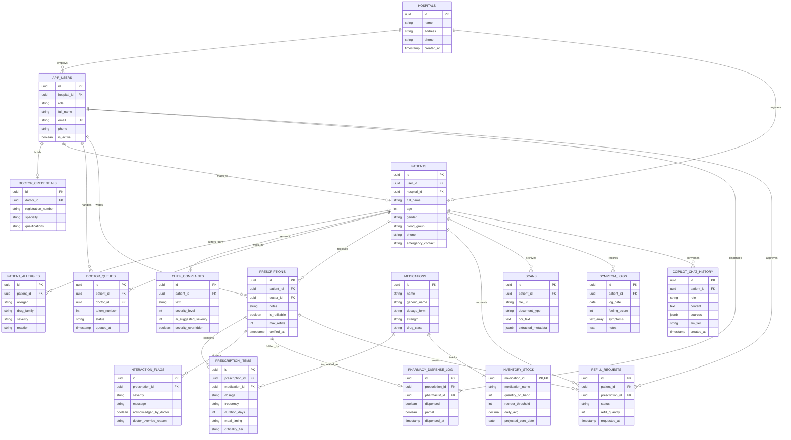

---

## 6. How to Draw the ER Diagram Step-by-Step (For Exams & Project Vivas)

When drawing the ER Diagram by hand or using modeling tools (**Draw.io**, **Lucidchart**, or **StarUML**), follow this 6-step method:

```
[ Step 1: Strong Entities ] ──────> [ Step 2: Weak Entities ]
           │                                   │
           ▼                                   ▼
[ Step 3: Relationships (Diamonds) ] ─> [ Step 4: Add Attributes (Ovals) ]
           │                                   │
           ▼                                   ▼
[ Step 5: Cardinality & Participation ] > [ Step 6: Normalization Check ]
```

### Step 1: Place Strong Entities (Rectangles)
Draw large rectangles for the primary real-world objects:
1. `PATIENT` (Center-Left)
2. `DOCTOR` / `APP_USER` (Center-Top)
3. `MEDICATION` (Bottom-Center)
4. `HOSPITAL` (Far-Top-Left)
5. `APPOINTMENT` (Top-Right)

### Step 2: Place Weak Entities (Double Rectangles)
Draw double rectangles adjacent to their owners:
* Next to `PATIENT`: `PATIENT_ALLERGY`, `CHIEF_COMPLAINT`, `SCANS_VAULT_DOC`, `SYMPTOM_LOG`, `COPILOT_CHAT`.
* Next to `PRESCRIPTION`: `PRESCRIPTION_ITEM`, `INTERACTION_FLAG`, `PHARMACY_DISPENSE_LOG`.
* Next to `MEDICATION`: `INVENTORY_STOCK`.

### Step 3: Draw Relationships (Diamonds & Double Diamonds)
Connect the entities using diamond boxes:
* **Single Diamond** for relationships between strong entities:
  * `APP_USER` $\diamondsuit$(`Employs`) $\rightarrow$ `HOSPITAL`
  * `DOCTOR` $\diamondsuit$(`Prescribes`) $\rightarrow$ `PRESCRIPTION`
  * `PRESCRIPTION_ITEM` $\diamondsuit$(`References`) $\rightarrow$ `MEDICATION`
* **Double Diamond** for identifying relationships to weak entities:
  * `PRESCRIPTION` $\lozenge\lozenge$(`Contains`) $\rightarrow$ `PRESCRIPTION_ITEM`
  * `PATIENT` $\lozenge\lozenge$(`Suffers`) $\rightarrow$ `PATIENT_ALLERGY`
  * `MEDICATION` $\lozenge\lozenge$(`Tracks`) $\rightarrow$ `INVENTORY_STOCK`

### Step 4: Attach Attributes (Ellipses)
Attach ovals with connecting straight lines to each entity:
1. **Primary Keys**: Underline the text (e.g., <u>`patient_id`</u>, <u>`medication_id`</u>).
2. **Partial Keys (Discriminators)**: Underline with a **dashed line** inside double rectangles (e.g., - - <u>`item_seq_no`</u> - -).
3. **Composite Attributes**: Draw branches connecting child ovals to parent oval (e.g., `full_name` $\rightarrow$ `first_name`, `last_name`).
4. **Multivalued Attributes**: Draw a **double oval** for attributes storing arrays/lists (e.g., `phone_numbers`, `symptoms[]`).
5. **Derived Attributes**: Draw a **dashed oval** for calculated values (e.g., `age`, `days_until_stockout`).

### Step 5: Specify Cardinality Ratios & Participation Lines
Label every line connecting an entity to a diamond:
* Write **$1$**, **$M$**, or **$N$** on the line:
  * Example: One doctor writes many prescriptions $\rightarrow$ `DOCTOR` — **$1$** — $\diamondsuit$(`Writes`) — **$N$** — `PRESCRIPTION`.
* Use **Double Lines** for **Total Participation**:
  * Every `PRESCRIPTION_ITEM` must belong to a prescription $\rightarrow$ double line from `PRESCRIPTION_ITEM` to $\lozenge\lozenge$(`Contains`).
  * Every `PATIENT_ALLERGY` must belong to a patient $\rightarrow$ double line from `PATIENT_ALLERGY` to $\lozenge\lozenge$(`Suffers`).
* Use **Single Lines** for **Partial Participation**:
  * Not every `MEDICATION` has active interaction flags.

### Step 6: Verify ER-to-Relational Mapping (Table Reduction)
Verify that each element converts to valid relational schema:
* **Strong Entity** $\rightarrow$ Standalone Table with Primary Key.
* **Weak Entity** $\rightarrow$ Table whose Primary Key is composite: $(\text{Owner PK} + \text{Partial Discriminator})$.
* **$1:N$ Relationship** $\rightarrow$ Foreign Key on the **$N$**-side table.
* **$M:N$ Relationship** $\rightarrow$ Separate Junction/Bridge Table containing composite foreign keys.
* **Multivalued Attribute** $\rightarrow$ Decomposed into a child table linked by parent foreign key (satisfying 1NF).

---

## 7. Viva & Oral Exam Frequently Asked Questions (FAQ)

### Q1: Why is `PRESCRIPTION_ITEM` a Weak Entity instead of a Strong Entity?
> **Answer:** An item like *"Pan 40mg, 1-0-1 for 5 days"* has no unique global identifier in the healthcare world. It only has medical and legal meaning in the context of the specific signed `PRESCRIPTION` it belongs to. If that prescription is deleted or cancelled, its items cannot exist independently. Therefore, it is a weak entity with total participation in the `Contains` identifying relationship.

### Q2: How does Sanjeevani handle Multivalued Attributes like Symptoms and Phone Numbers?
> **Answer:** In the conceptual Chen ER diagram, they are modeled with **double ellipses**. During relational reduction to satisfy **First Normal Form (1NF)**, multivalued attributes are either normalized into dedicated child junction tables or stored using PostgreSQL native typed array columns (`TEXT[]` / `JSONB`) with GIN indexing for fast querying.

### Q3: What is the derived attribute in the Inventory subsystem?
> **Answer:** `days_until_stockout` is a **derived attribute** (drawn with a dashed ellipse). It is dynamically computed at query time as:
> $$\text{Days Until Stockout} = \frac{\text{quantity\_on\_hand}}{\text{daily\_avg\_velocity}}$$
> This avoids redundant storage anomalies and ensures that as medicines are dispensed, stockout forecasts update immediately.

### Q4: Explain the identifying relationship between `PATIENT` and `PATIENT_ALLERGY`.
> **Answer:** Represented by a **double diamond** labeled `Suffers_From`. The participation of `PATIENT_ALLERGY` is **total** (double line) because an allergy record cannot float in the database without an assigned patient. Its primary key in the relational schema is a composite foreign key referencing `patient_id`.

---

# PART II: UML CLASS DIAGRAM & UML OBJECT DIAGRAM

---

## 8. UML Class Diagram for Sanjeevani

The **UML Class Diagram** models the **static object-oriented structure** of the Sanjeevani healthcare system. It visualizes the classes, their encapsulation boundaries (attributes and operations), visibility modifiers, typed parameter directions, and all architectural relationships (Generalization, Realization, Composition, Aggregation, Association, and Dependency).

```
┌────────────────────────────────────────────────────────────────────────┐
│                          UML CLASS NOTATION                            │
├────────────────────────────────────────────────────────────────────────┤
│                           <<stereotype>>                               │
│                             ClassName                                  │
├────────────────────────────────────────────────────────────────────────┤
│ [visibility] [name] : [type] = [default] {property-string}             │
├────────────────────────────────────────────────────────────────────────┤
│ [visibility] [name]([direction] [param] : [type]) : [return-type]      │
└────────────────────────────────────────────────────────────────────────┘
```

### 8.1 Visibility & Parameter Directionality Standards

| Symbol | Visibility Level | Access Semantics in Sanjeevani |
| :---: | :--- | :--- |
| `+` | **Public** | Accessible to any class/subsystem (e.g., API controllers, public getters). |
| `-` | **Private** | Encapsulated strictly inside the class; accessed only via member methods (e.g., hashed passwords, encryption keys). |
| `#` | **Protected** | Accessible inside the class and its inherited subclasses (`PatientUser`, `DoctorUser`). |
| `~` | **Package / Default** | Accessible only to classes within the same internal module/package (e.g., `services.safety_engine`). |

#### Parameter Directionality:
* **`in`**: Input parameter passed by caller into the method (read-only inside method).
* **`out`**: Output parameter populated by method and returned to caller.
* **`inout`**: Parameter initialized by caller, updated/mutated by method, and returned back.

---

### 8.2 UML Relationship Taxonomy in Sanjeevani

```
Relationship Types in Sanjeevani UML Design:
1. Generalization (Inheritance):     Superclass <|─────── Subclass           (is-a)
2. Realization (Interface Impl):     Interface  <|······· Class              (implements)
3. Composition (Strong Whole-Part):  Parent     *───────> Child              (cannot exist without parent)
4. Aggregation (Weak Whole-Part):    Container  o───────> Contained Item     (part exists independently)
5. Directed Association:             Source     ────────> Target             (has-a / references)
6. Dependency / Usage:               Client     ········> Supplier           (uses temporary service)
```

1. **Generalization (`--|>`)**:
   * `AppUser` is the abstract base class.
   * `PatientUser`, `DoctorUser`, `PharmacistUser`, `LabTechnicianUser`, and `HospitalAdminUser` inherit directly from `AppUser`.
2. **Realization (`..|>`)**:
   * `IOCRPipeline` interface is realized by `TesseractEngine` (offline) and `GeminiVisionEngine` (cloud multi-modal).
   * `ILLMProvider` interface is realized by `OllamaLocalService` and `CloudGeminiService`.
3. **Composition (`*--`)**:
   * `Prescription` $\blacklozenge\longrightarrow$ `PrescriptionItem`: A prescription line item (e.g., *Clopidogrel 75mg*) cannot exist without its containing prescription. Deleting the prescription deletes its items.
   * `Prescription` $\blacklozenge\longrightarrow$ `InteractionFlag`: Drug interaction alert warnings are owned solely by the prescription event.
   * `PatientUser` $\blacklozenge\longrightarrow$ `EmergencyPassportQR`: A patient's cryptographic emergency QR token is physically bound to that patient's health profile.
4. **Aggregation (`o--`)**:
   * `Hospital` $\lozenge\longrightarrow$ `DoctorUser`: Doctors are affiliated with a hospital, but if the hospital record is deactivated, the licensed doctor entity exists independently in the national registry.
   * `PatientUser` $\lozenge\longrightarrow$ `VaultFolder`: Medical vault folders contain uploaded scans, but folders are aggregate organizational units.
   * `PharmacyInventory` $\lozenge\longrightarrow$ `Medication`: A pharmacy carries catalog medications; medications exist independently of any single hospital inventory.
5. **Directed Association (`-->`)**:
   * `DoctorUser` $\longrightarrow$ `Prescription`: Doctor authors prescriptions ($1 \to 0..*$).
   * `PharmacistUser` $\longrightarrow$ `DispenseLog`: Pharmacist dispenses items ($1 \to 0..*$).
   * `PatientUser` $\longrightarrow$ `Appointment`: Patient books clinic visits ($1 \to 0..*$).
6. **Dependency / Usage (`..>`)**:
   * `PrescriptionService` $\cdot\cdot>$ `DrugSafetyRuleEngine`: Calls validation routines at prescription authoring time.
   * `UniversalScannerController` $\cdot\cdot>$ `IOCRPipeline`: Passes uploaded document buffers for token extraction.
   * `CopilotController` $\cdot\cdot>$ `ClinicalContextBuilder`: Injects patient vitals and allergies into LLM prompt templates.

---

### 8.3 Sanjeevani UML Class Diagram (Mermaid Model)

```mermaid
classDiagram
    direction TB

    %% Abstract Base Class & Inheritance
    class AppUser {
        <<abstract>>
        #user_id : UUID
        #email : String
        #phone_number : String
        -password_hash : String
        #role : UserRole
        #is_active : Boolean
        #created_at : DateTime
        +authenticate(in raw_password : String) : Boolean
        +updateProfile(in phone : String, in email : String) : Void
        +logActivity(in action : String) : Void
    }

    class PatientUser {
        +patient_id : UUID
        +blood_group : BloodGroup
        +date_of_birth : Date
        +gender : Gender
        +emergency_contact : String
        +allergies : List~String~
        +calculateAge() : Integer
        +generateEmergencyPassport(out qr_token : String) : Boolean
        +uploadMedicalRecord(in file_stream : Byte[], in category : DocCategory) : UUID
        +queryCopilot(in user_prompt : String) : String
    }

    class DoctorUser {
        +doctor_id : UUID
        +license_number : String
        +specialty : String
        +department : String
        +consultation_fee : Decimal
        +digital_signature_cert : String
        +createPrescription(in patient_id : UUID, in items : List~ItemDTO~) : Prescription
        +overrideSafetyWarning(in flag_id : UUID, in clinical_rationale : String) : Boolean
        +reviewPatientVault(in patient_id : UUID) : List~VaultDoc~
    }

    class PharmacistUser {
        +pharmacist_id : UUID
        +pharmacy_reg_no : String
        +dispense_counter_no : Integer
        +verifyPrescription(in rx_id : UUID) : Boolean
        +dispensePrescription(in rx_id : UUID, in item_ids : List~UUID~) : DispenseReceipt
        +checkInventoryVelocity(in medication_id : UUID) : StockVelocityDTO
    }

    AppUser <|-- PatientUser : Generalization
    AppUser <|-- DoctorUser : Generalization
    AppUser <|-- PharmacistUser : Generalization

    %% Interfaces and Implementations
    class IOCRPipeline {
        <<interface>>
        +extractText(in image_bytes : Byte[]) : OCRRawResult
        +parseStructuredEntities(in raw_text : String) : Map~String, Any~
    }

    class TesseractEngine {
        -tesseract_binary_path : String
        +extractText(in image_bytes : Byte[]) : OCRRawResult
        +parseStructuredEntities(in raw_text : String) : Map~String, Any~
    }

    class GeminiVisionEngine {
        -api_key : String
        -model_name : String
        +extractText(in image_bytes : Byte[]) : OCRRawResult
        +parseStructuredEntities(in raw_text : String) : Map~String, Any~
    }

    IOCRPipeline <|.. TesseractEngine : Realization
    IOCRPipeline <|.. GeminiVisionEngine : Realization

    %% Core Clinical Entities & Compositions
    class Prescription {
        +prescription_id : UUID
        +prescription_number : String
        +patient_id : UUID
        +doctor_id : UUID
        +status : RxStatus
        +clinical_diagnosis : String
        +issued_at : DateTime
        -digital_signature : String
        +calculateTotalCost() : Decimal
        +lockPrescription() : Void
        +addPrescriptionItem(in item : PrescriptionItem) : Void
        +hasCriticalFlags() : Boolean
    }

    class PrescriptionItem {
        +item_id : UUID
        +prescription_id : UUID
        +medication_id : UUID
        +medication_name : String
        +dosage : String
        +frequency : String
        +meal_timing : MealTiming
        +duration_days : Integer
        +criticality : String
        +calculateTotalUnits() : Integer
    }

    class InteractionFlag {
        +flag_id : UUID
        +prescription_id : UUID
        +severity : SeverityLevel
        +interaction_type : InteractionType
        +rule_triggered : String
        +clinical_warning : String
        +is_overridden : Boolean
        +override_rationale : String
        +acknowledgeWarning(in doctor_id : UUID, in rationale : String) : Void
    }

    Prescription *-- PrescriptionItem : Composition (1 to 1..*)
    Prescription *-- InteractionFlag : Composition (1 to 0..*)

    %% Aggregations
    class Hospital {
        +hospital_id : UUID
        +hospital_name : String
        +reg_code : String
        +address : String
        +contact_phone : String
        +registerDoctor(in doc : DoctorUser) : Void
        +auditDispensary() : AuditReport
    }

    class PharmacyInventory {
        +inventory_id : UUID
        +hospital_id : UUID
        +pharmacy_name : String
        +reorder_level_threshold : Integer
        +updateStock(in med_id : UUID, in delta_qty : Integer) : Void
        +getLowStockItems() : List~InventoryStock~
    }

    class InventoryStock {
        +stock_id : UUID
        +medication_id : UUID
        +batch_number : String
        +expiry_date : Date
        +quantity_on_hand : Integer
        +daily_avg_velocity : Float
        +calculateDaysUntilStockout() : Integer
    }

    Hospital o-- DoctorUser : Aggregation (1 to 1..*)
    Hospital o-- PharmacyInventory : Aggregation (1 to 1..*)
    PharmacyInventory *-- InventoryStock : Composition (1 to 1..*)

    %% Associations and Dependencies
    DoctorUser "1" --> "0..*" Prescription : writes
    PatientUser "1" --> "0..*" Prescription : receives
    Prescription ..> DrugSafetyRuleEngine : <<use>> validates

    class DrugSafetyRuleEngine {
        -rules_database_url : String
        +checkDrugDrugInteractions(in med_ids : List~UUID~) : List~InteractionFlag~
        +checkAllergyConflict(in patient_id : UUID, in med_id : UUID) : List~InteractionFlag~
        +checkOrganImpairmentDosing(in lab_profile : LabProfile, in med_id : UUID) : DosingAlert
    }

    class CopilotController {
        -fallback_threshold_ms : Integer
        +generateClinicalInsights(in patient_id : UUID, in doctor_notes : String) : CopilotInsightDTO
        +answerPatientQuery(in patient_id : UUID, in query : String) : StreamResponse
    }

    CopilotController ..> PatientUser : <<use>> reads vitals
    CopilotController ..> Prescription : <<use>> reads active meds
```

---

### 8.4 Class Specifications Table

#### 1. `Prescription` Class
| Compartment | Element Signature | Description |
| :--- | :--- | :--- |
| **Class Name** | `Prescription` | Aggregate root entity managing medication orders. |
| **Attributes** | `+prescription_id : UUID`<br>`+prescription_number : String`<br>`+patient_id : UUID`<br>`+doctor_id : UUID`<br>`+status : RxStatus = DRAFT`<br>`+clinical_diagnosis : String`<br>`+issued_at : DateTime`<br>`-digital_signature : String` | Identity, relationships, status machine, and tamper-proof cryptographic signature. |
| **Operations** | `+lockPrescription() : Void`<br>`+addPrescriptionItem(in item : PrescriptionItem) : Void`<br>`+calculateTotalCost() : Decimal`<br>`+hasCriticalFlags() : Boolean` | Enforces transactional consistency and locks the order if critical drug-drug conflicts occur. |

#### 2. `PrescriptionItem` Class (Composition Child)
| Compartment | Element Signature | Description |
| :--- | :--- | :--- |
| **Class Name** | `PrescriptionItem` | Individual medication dosage instruction line item. |
| **Attributes** | `+item_id : UUID`<br>`+prescription_id : UUID`<br>`+medication_id : UUID`<br>`+medication_name : String`<br>`+dosage : String`<br>`+frequency : String`<br>`+meal_timing : MealTiming`<br>`+duration_days : Integer`<br>`+criticality : String = "STANDARD"` | Concrete dose parameters, timing schedules, and clinical priority level. |
| **Operations** | `+calculateTotalUnits() : Integer`<br>`+getDispenseSchedule() : List~DateTime~` | Computes pills needed for full therapy course and generates reminder timestamps. |

#### 3. `DrugSafetyRuleEngine` Class (Service / Dependency)
| Compartment | Element Signature | Description |
| :--- | :--- | :--- |
| **Class Name** | `DrugSafetyRuleEngine` | High-performance medical rule evaluator. |
| **Attributes** | `-rules_database_url : String`<br>`-cached_interaction_matrix : Matrix2D` | Internal access to contraindication databases. |
| **Operations** | `+checkDrugDrugInteractions(in med_ids : List~UUID~) : List~InteractionFlag~`<br>`+checkAllergyConflict(in patient_id : UUID, in med_id : UUID) : List~InteractionFlag~`<br>`+checkOrganImpairmentDosing(in lab_profile : LabProfile, in med_id : UUID) : DosingAlert` | Evaluates patient allergies, multi-drug combinations, and kidney/liver lab reports. |

---

## 9. UML Object Diagram for Sanjeevani

The **UML Object Diagram** represents a **concrete runtime snapshot** of the Sanjeevani platform at a specific execution timestamp ($T = \text{14:32:00 IST}$). While the Class Diagram defines the blueprint, the Object Diagram demonstrates the actual instantiated objects, their filled attribute values, and the active links connecting them during a live clinical event.

### 9.1 Clinical Scenario: Emergency Cardiac Consultation & Safety Intervention

* **Patient**: *Ramesh Kumar* (54 yrs, Male), presenting with severe hypertension ($148/94\text{ mmHg}$) and critically elevated potassium levels ($K^+ = 6.2\text{ mmol/L}$).
* **Attending Physician**: *Dr. V. K. Rai* (Chief of Cardiology) initiates consultation and authors a prescription containing *Clopidogrel 75mg* and *Pantoprazole 40mg*.
* **Automated Safety Interlock**: Sanjeevani's Drug Safety Engine intercepts the order, cross-checks the active lab report ($K^+ = 6.2\text{ mmol/L}$), flags an emergency contraindication, and transitions the prescription to `Locked_Pending_Override`.
* **Copilot Clinical Co-Pilot**: An active Copilot session is streaming lab telemetry to the doctor's workstation using the hybrid LLM cascade.

```
┌────────────────────────────────────────────────────────────────────────┐
│                          UML OBJECT NOTATION                           │
├────────────────────────────────────────────────────────────────────────┤
│                     instanceName : ClassifierName                      │
├────────────────────────────────────────────────────────────────────────┤
│ attribute1 = concreteValue1                                            │
│ attribute2 = concreteValue2                                            │
│ attribute3 = concreteValue3                                            │
└────────────────────────────────────────────────────────────────────────┘
Note: The top compartment contains the instance name and class name,
separated by a colon, and is strictly UNDERLINED in standard UML.
```

---

### 9.2 Sanjeevani UML Object Diagram (Mermaid Instance Snapshot)

```mermaid
graph TD
    %% Styling and Classes
    classDef objectBox fill:#f8fafc,stroke:#334155,stroke-width:1.5px,rx:4,ry:4,font-family:monospace;
    classDef criticalBox fill:#fef2f2,stroke:#dc2626,stroke-width:2px,rx:4,ry:4,font-family:monospace;
    classDef activeBox fill:#f0fdf4,stroke:#16a34a,stroke-width:1.5px,rx:4,ry:4,font-family:monospace;

    %% Concrete Instances
    subgraph PatientSubsystem ["Patient & Vitals Snapshot"]
        ramesh["<u>ramesh : PatientUser</u><br/>----------------------------------<br/>patient_id = 'P-1092'<br/>name = 'Ramesh Kumar'<br/>age = 54<br/>blood_group = 'O+'<br/>systolic_bp = 148<br/>diastolic_bp = 94<br/>status = 'In_Consultation'"]:::objectBox
        
        qrPassport["<u>emergencyQr : EmergencyPassportQR</u><br/>----------------------------------<br/>qr_token = 'eyJhbGciOiJIUzI1Ni...'<br/>emergency_pin = '4912'<br/>allergies = ['ACEI', 'Penicillin']<br/>expires_at = '2027-10-05T00:00:00Z'"]:::objectBox

        kReport["<u>kLabReport : LabReport</u><br/>----------------------------------<br/>report_id = 'LAB-8821'<br/>analyte = 'Serum Potassium (K+)'<br/>result_value = 6.2<br/>unit = 'mmol/L'<br/>reference_range = '3.5 - 5.1'<br/>is_critical = true"]:::criticalBox
    end

    subgraph ClinicalSubsystem ["Active Doctor Consultation"]
        drRai["<u>drRai : DoctorUser</u><br/>----------------------------------<br/>doctor_id = 'DOC-401'<br/>name = 'Dr. V. K. Rai'<br/>specialty = 'Cardiology'<br/>license_number = 'MCI-48291'<br/>department = 'Cardiology OPD'"]:::objectBox

        rx902["<u>rx902 : Prescription</u><br/>----------------------------------<br/>prescription_id = 'RX-902'<br/>prescription_number = 'RX-2026-0902'<br/>status = 'Locked_Pending_Override'<br/>clinical_diagnosis = 'Acute CAD + Hyperkalemia'<br/>issued_at = '2026-10-05T14:30:15Z'"]:::criticalBox

        kFlag["<u>kFlag : InteractionFlag</u><br/>----------------------------------<br/>flag_id = 'FLG-551'<br/>severity = 'CRITICAL'<br/>rule = 'HYPERKALEMIA_ACEI_CONTRAINDICATION'<br/>clinical_warning = 'Serum K+ is 6.2 mmol/L. Hold potassium agents!'<br/>is_overridden = false"]:::criticalBox

        clopidogrelItem["<u>clopidogrel75 : PrescriptionItem</u><br/>----------------------------------<br/>item_id = 'ITEM-01'<br/>medication_name = 'Clopidogrel'<br/>dosage = '75mg'<br/>frequency = '0-0-1'<br/>meal_timing = 'after_food'<br/>duration_days = 30"]:::objectBox

        panItem["<u>pan40 : PrescriptionItem</u><br/>----------------------------------<br/>item_id = 'ITEM-02'<br/>medication_name = 'Pantoprazole'<br/>dosage = '40mg'<br/>frequency = '1-0-0'<br/>meal_timing = 'before_food'<br/>duration_days = 15"]:::objectBox
    end

    subgraph AIAndPharmacySubsystem ["AI Copilot & Pharmacy Inventory"]
        copilotSess["<u>copilotSess : CopilotSession</u><br/>----------------------------------<br/>session_id = 'COP-9081'<br/>active_role = 'CLINICAL_DOCTOR'<br/>llm_model = 'ollama/gpt-oss:120b-cloud'<br/>prompt_tokens = 842<br/>latency_ms = 340"]:::activeBox

        apolloPharmacy["<u>apolloMain : PharmacyInventory</u><br/>----------------------------------<br/>inventory_id = 'PHARM-01'<br/>pharmacy_name = 'Apollo Central'<br/>reorder_threshold = 100"]:::objectBox

        stockClopidogrel["<u>stockClop : InventoryStock</u><br/>----------------------------------<br/>stock_id = 'STK-4401'<br/>batch_number = 'BATCH-2026-CLP'<br/>quantity_on_hand = 450<br/>daily_avg_velocity = 15.2<br/>days_until_stockout = 29.6"]:::objectBox
    end

    %% Concrete Links
    drRai ---|consults| ramesh
    drRai ---|authors| rx902
    ramesh ---|owns| qrPassport
    ramesh ---|exhibits| kReport
    ramesh ---|target_of| rx902

    rx902 *---|composition| clopidogrelItem
    rx902 *---|composition| panItem
    rx902 *---|triggers| kFlag
    kFlag -.->|references_evidence| kReport

    drRai ---|operates| copilotSess
    copilotSess -.->|analyzes_patient| ramesh
    copilotSess -.->|analyzes_rx| rx902

    apolloPharmacy *---|maintains| stockClopidogrel
    clopidogrelItem -.->|dispense_source| stockClopidogrel
```

---

### 9.3 Instance Specification Breakdown

| Object Instance | Classifier (Class) | Current State & Clinical Role |
| :--- | :--- | :--- |
| `<u>ramesh : PatientUser</u>` | `PatientUser` | **Active Patient**: Currently in Room 304, hypertensive ($148/94$), awaiting doctor's cardiac prescription sign-off. |
| `<u>drRai : DoctorUser</u>` | `DoctorUser` | **Attending Cardiologist**: Reviewing diagnostic telemetry and overriding/confirming medicine orders. |
| `<u>rx902 : Prescription</u>` | `Prescription` | **Locked Aggregate**: Order containing 2 items, halted by system because potassium is critically elevated. |
| `<u>kFlag : InteractionFlag</u>` | `InteractionFlag` | **Safety Interlock Instance**: Raised automatically when the potassium lab value was correlated with medication profile. |
| `<u>kLabReport : LabReport</u>` | `LabReport` | **Biochemical Evidence**: Potassium level $6.2\text{ mmol/L}$ (critical threshold $> 5.1\text{ mmol/L}$). |
| `<u>copilotSess : CopilotSession</u>` | `CopilotSession` | **AI Assistant Instance**: Active stream using `ollama/gpt-oss:120b-cloud` summarizing patient's multi-year cardiac history. |
| `<u>stockClop : InventoryStock</u>` | `InventoryStock` | **Dispensary Stock**: Batch `BATCH-2026-CLP` holding 450 tablets with 29.6 days of stock remaining. |

---

## 10. Architectural Synthesis: ERD vs. Class Diagram vs. Object Diagram

To avoid common viva errors and design confusion, review this strict architectural comparison:

| Dimension | Conceptual ER Diagram (Chen's) | Relational ERD (Crow's Foot) | UML Class Diagram | UML Object Diagram |
| :--- | :--- | :--- | :--- | :--- |
| **Focus** | High-level data entities and business relationships. | Physical database tables, foreign keys, and indexes. | Static software architecture, classes, methods, and encapsulation. | Dynamic runtime snapshot of objects at an exact moment in time ($T$). |
| **Representation** | Rectangles (Entities), Diamonds (Relations), Ellipses (Attributes). | Table boxes with Primary/Foreign keys and Crow's foot line terminals. | 3-Compartment boxes: Name, Attributes, Operations (+, -, #, ~). | 2-Compartment boxes: `<u>name : Class</u>` and concrete `attr = val`. |
| **Methods / Logic** | ❌ None (Data storage only). | ❌ None (Schema definitions only). | ✅ Full signatures with typed parameter directions. | ❌ None (Only runtime state values). |
| **Relationships** | 1:1, 1:N, M:N via Diamonds; Weak entity double diamonds. | Non-identifying (dashed) & Identifying (solid) lines. | Generalization, Realization, Composition, Aggregation, Dependency. | Concrete Links between object instances. |
| **Lifecycle Semantics** | Total vs. Partial Participation (Double vs Single lines). | Mandatory (`\|o`, `\|\|`) vs Optional (`o<`, `\|<`). | Composition ($\blacklozenge$, bound lifecycle) vs Aggregation ($\lozenge$, free). | Instantiated objects that exist in memory at timestamp $T$. |

---

## 11. Step-by-Step Guide to Drawing Class & Object Diagrams in Exam / Tools

### Drawing the Class Diagram (Draw.io / Lucidchart / StarUML)
1. **Draw Base Classes**: Place `AppUser` at top center. Draw three compartments.
2. **Inheritance Arrows**: Draw subclasses `PatientUser`, `DoctorUser`, `PharmacistUser` below `AppUser`. Connect each with a **solid line terminating in a large hollow triangle** pointing to `AppUser`.
3. **Model Interfaces**: Create `<<interface>>` boxes `IOCRPipeline` and `ILLMProvider`. Connect implementing classes (`TesseractEngine`, `GeminiVisionEngine`) using **dashed lines with hollow triangles**.
4. **Draw Whole-Part Compositions**: Place `Prescription` and attach `PrescriptionItem` and `InteractionFlag`. Use **solid lines with a solid filled black diamond ($\blacklozenge$)** attached directly to `Prescription`.
5. **Draw Aggregations**: Place `Hospital` and connect to `DoctorUser` with a **solid line with an open hollow diamond ($\lozenge$)** at the `Hospital` end.
6. **Annotate Methods & Visibilities**: Prefix attributes with `-` or `#`, and public API methods with `+`. Include parameter directionality (`in`, `out`, `inout`).

### Drawing the Object Diagram
1. **Choose a Precise Timestamp & Clinical Scenario**: e.g., *"Consultation of patient Ramesh Kumar at 14:32:00 IST"*.
2. **Draw Object Boxes**: Draw rectangular boxes with **two compartments** (Top: Underlined Name and Type, Bottom: Attribute values).
3. **Format Names**: Write `<u>ramesh : PatientUser</u>`, `<u>drRai : DoctorUser</u>`, `<u>rx902 : Prescription</u>`. **Always underline the entire header string**.
4. **Fill Concrete Values**: Never use generic types (`String`, `Integer`). Write exact runtime values (e.g., `systolic_bp = 148`, `status = 'Locked_Pending_Override'`).
5. **Draw Instance Links**: Connect related objects using plain solid lines (Links). If representing a composition instance, you may include the filled diamond on the link to emphasize the strong lifecycle binding.

---

## 12. University Viva & Oral Defense FAQ (Class & Object Diagrams)

### Q1: What is the fundamental difference between an Aggregation and a Composition relationship?
> **Answer:** Both represent whole-part relationships, but:
> * **Composition ($\blacklozenge$)** is a **strong** whole-part relationship where the part's lifecycle is completely dependent on the whole. In Sanjeevani, a `PrescriptionItem` cannot exist without its containing `Prescription`. Deleting the prescription destroys its items.
> * **Aggregation ($\lozenge$)** is a **weak** whole-part relationship where the part can exist independently. In Sanjeevani, `DoctorUser` belongs to `Hospital`, but if the hospital record is archived, the doctor object retains their medical license and personal records independently.

### Q2: Why are class names in Object Diagrams underlined?
> **Answer:** According to the OMG UML specification, underlining syntactically differentiates an **instance** from a **classifier**. In a class diagram, `PatientUser` denotes the general class blueprint (not underlined). In an object diagram, `<u>ramesh : PatientUser</u>` denotes a specific, unique entity existing in memory at runtime.

### Q3: What is parameter directionality, and why is it used?
> **Answer:** Parameter directionality specifies the data flow between caller and callee in method signatures:
> * `in`: Data passed into the method (e.g., `in raw_password : String`).
> * `out`: Data generated by the method and returned to caller (e.g., `out qr_token : String`).
> * `inout`: Parameter passed with initial data that the method modifies and returns back.

### Q4: Can an Object Diagram have operations or methods in its compartments?
> **Answer:** **No.** An object diagram represents a static snapshot of state at a single moment in time. Operations belong to the class blueprint, whereas the object box only contains the **object identity** and its **current attribute values** (state).

---

# PART III: UML COMPONENT-BASED DIAGRAM (4.3)

---

## 13. Component-Based Diagram Overview & UML Notations

A **UML Component-Based Diagram** is a structural diagram that models the **physical and logical modular software components** of a system, their encapsulation boundaries, explicitly exposed ports, provided/required interfaces, and assembly connections. 

In enterprise and healthcare software engineering, Component Diagrams bridge high-level system requirements and the concrete code/deployment architecture.

```
┌────────────────────────────────────────────────────────────────────────┐
│                     UML COMPONENT DIAGRAM NOTATION                     │
├────────────────────────────────────────────────────────────────────────┤
│                                                                        │
│     Provided Interface            Component            Required        │
│        (Lollipop)               «component»           Interface        │
│          ───○──────────────□   [ComponentName]   □────────)            │
│                            │                     │    (Socket)         │
│     Offers service to      │   Encapsulates      │   Relies on service │
│     external callers       │   business logic    │   from environment  │
│                            └─────────────────────┘                     │
│                                       │                                │
│                   Assembly Connector: ──○─)──                          │
│                   (Lollipop plugs directly into Socket)                │
└────────────────────────────────────────────────────────────────────────┘
```

### 13.1 Core Elements & Notational Taxonomy

| Element | UML Visual Symbol | Syntactic Meaning & Role in Sanjeevani |
| :--- | :---: | :--- |
| **Component** | Rectangle with `«component»` & component icon (protruding tabs) | An autonomous, replaceable, and reusable modular unit of software (e.g., `DrugSafetyInterlock`, `UniversalScannerHub`). |
| **Provided Interface** | **Lollipop** (Solid line ending in a full circle: `──○`) | The contract of services/APIs that a component **implements and exposes** to other components. |
| **Required Interface** | **Socket** (Solid line ending in a half-circle/crescent: `──)`) | The contract of services that a component **requires** from other components to execute its work. |
| **Assembly Connector** | **Ball-and-Socket** (`──○─)──`) | A direct wiring that links the provided interface of a supplier component into the required socket of a client component. |
| **Port** | Small square (`□`) on component border | An explicit, distinct interaction point through which all incoming/outgoing messages pass, decoupling internals from the outside. |
| **Delegation Connector** | Solid arrow (`──>`) from outer port to inner component | Routes requests arriving at an outer subsystem boundary port down into an internal child component. |
| **Artifact** | Rectangle with `«artifact»` stereotype | A physical file residing on a file system or build target (e.g., `patient_service.py`, `next_bundle.js`, `rules.json`). |
| **Execution Node** | 3D Perspective Box | A physical or virtual compute environment hosting components (e.g., `ClientBrowserNode`, `AppServerNode`, `DockerContainer`). |

---

## 14. Sanjeevani Component Architecture

The Sanjeevani platform is architected into three primary tiers:
1. **Client Presentation Tier (Next.js 14 App Router / React PWA)**: User-facing components running on client devices.
2. **Sanjeevani Core Backend (`«subsystem» SanjeevaniCore`)**: High-performance modular FastAPI engine providing synchronous clinical workflows and async background pipelines.
3. **Intelligence & AI Processing Tier**: Hybrid edge-cloud AI cluster delivering local sub-second inferences with seamless multi-modal cloud fallback.
4. **Data & Storage Persistence Layer**: ACID relational storage and encrypted document vaults.

---

### 14.1 Sanjeevani UML Component Diagram (Mermaid Model)

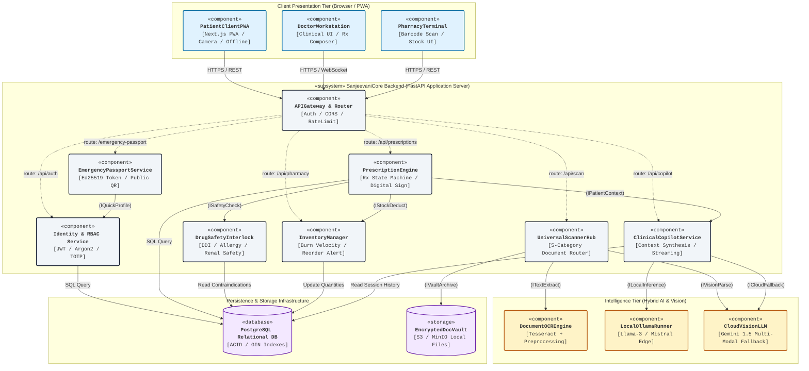

---

## 15. Detailed Component & Interface Catalog

### 15.1 Interface Specifications (Provided & Required)

```
        ┌──────────────────────────────────────────────────────────────┐
        │             ASSEMBLY CONNECTOR INTERFACE MODEL               │
        │                                                              │
        │   ┌────────────────────┐               ┌─────────────────┐   │
        │   │ PrescriptionEngine │               │  DrugSafety     │   │
        │   │                    ├─( ISafetyCheck )○─┤  Interlock      │   │
        │   │    [Client]        │    [Socket]   [Lollipop]  [Provider]│   │
        │   └────────────────────┘               └─────────────────┘   │
        └──────────────────────────────────────────────────────────────┘
```

| Interface Name | Type | Supplier Component (Provides `──○`) | Consumer Component (Requires `──)`) | Protocol / Methods | Payload / Contract |
| :--- | :---: | :--- | :--- | :--- | :--- |
| **`IAuthSecurity`** | Provided | `Identity & RBAC Service` | `APIGateway`, `PassportService` | REST / Internal Call: `validateToken()`, `authorizeRole()` | JWT Bearer token, Returns: `Claims{user_id, role, hospital_id}`. |
| **`ISafetyCheck`** | Provided | `DrugSafetyInterlock` | `PrescriptionEngine`, `DoctorWorkstation` | In-Memory Fast Method: `evaluateInteractions()`, `checkAllergies()` | Input: `(patient_id, med_ids[])`, Returns: `List<SafetyFlagDTO>` with severity (`CRITICAL`, `MODERATE`). |
| **`ITextExtract`** | Provided | `DocumentOCREngine` | `UniversalScannerHub` | Python Subprocess / C-FFI: `extractTextFromBuffer()` | Input: Image Byte stream, Returns: Clean normalized UTF-8 string tokens. |
| **`IVisionParse`** | Provided | `CloudVisionLLM` | `UniversalScannerHub` | HTTPS REST (Gemini Vision API): `parseDocumentStructured()` | Input: `image_bytes + prompt_schema`, Returns: Validated JSON matching category DTO. |
| **`ILocalInference`**| Provided | `LocalOllamaRunner` | `ClinicalCopilotService` | HTTP POST (`http://localhost:11434`): `generateStream()` | Input: Context prompt, Returns: Server-Sent Events (SSE) token stream with sub-second TTFT. |
| **`ICloudFallback`** | Provided | `CloudVisionLLM` | `ClinicalCopilotService` | HTTPS REST: `generateChatStream()` | Triggered when local latency exceeds 2500ms or model returns error. |
| **`IStockDeduct`** | Provided | `InventoryManager` | `PrescriptionEngine`, `PharmacyTerminal` | ACID Transactional Call: `deductDispensedStock()` | Input: `(batch_id, qty)`, Updates `quantity_on_hand` and recalculates velocity. |
| **`IVaultArchive`** | Provided | `EncryptedDocVault` | `UniversalScannerHub` | MinIO / S3 SDK: `storeEncryptedArtifact()` | Input: Document bytes + AES-256 GCM key, Returns: Immutable `vault_url`. |

---

### 15.2 Ports & Delegation Connectors

Components in Sanjeevani use **UML Ports (`□`)** on their boundaries to decouple external networking from internal service implementations:

```
┌──────────────────────────────────────────────────────────────────────────────┐
│ «subsystem» SanjeevaniCore Backend                                           │
│                                                                              │
│       Port P1: HTTPS (443)                                                   │
│   ──○─□───────────────────► [ APIGateway ]                                   │
│                                │                                             │
│       Port P2: WSS (WebSocket) │                                             │
│   ──○─□───────────────────► [ Copilot Stream Handler ]                       │
│                                │                                             │
│       Port P3: Public Scan     ▼                                             │
│   ──○─□───────────────────► [ Emergency Passport Endpoint ] (Zero-Auth)      │
│                                                                              │
└──────────────────────────────────────────────────────────────────────────────┘
```

1. **Port `P1` (HTTPS API Port - 443 / 8000)**:
   * Public ingress point handling JSON payloads, authorization headers, and multipart file uploads.
   * Delegated directly to `APIGateway & Router`.
2. **Port `P2` (Clinical WebSocket Stream Port - 8000/ws)**:
   * Dedicated bidirectional streaming port for the AI Copilot.
   * Eliminates HTTP polling overhead and pushes clinical tokens directly to the Doctor's workstation.
3. **Port `P3` (Emergency QR Passport Ingress Port)**:
   * Stateless, zero-auth public endpoint.
   * Validates cryptographic Ed25519 token signatures without requiring client login or exposing database access.

---

## 16. Step-by-Step Guide to Drawing Component Diagrams in Exam / Tools

### Drawing the Component Diagram in Draw.io / Lucidchart / StarUML:
1. **Define Subsystem Boundaries**:
   * Draw a large container rectangle labeled `«subsystem» SanjeevaniCore Backend`.
   * Add the component icon (small rectangle with 2 protruding tabs) in the upper-right corner.
2. **Place Internal Components**:
   * Add distinct rectangular component boxes inside: `PrescriptionEngine`, `DrugSafetyInterlock`, `UniversalScannerHub`, `ClinicalCopilotService`, `InventoryManager`.
3. **Attach Ports (`□`)**:
   * Add small squares along the component borders where interfaces terminate.
4. **Draw Interfaces (Lollipops & Sockets)**:
   * **Provided Interface**: Draw a straight line terminating in a complete white circle (`──○`). Label with the interface name (e.g., `ISafetyCheck`).
   * **Required Interface**: Draw a straight line terminating in a half-circle/crescent (`──)`).
5. **Connect with Assembly Connectors**:
   * Snap the socket of `PrescriptionEngine` directly over the lollipop of `DrugSafetyInterlock` (`──○─)──`). This forms the canonical ball-and-socket assembly.
6. **External Components & Nodes**:
   * Draw external nodes/components outside the subsystem boundary: `ClientBrowserNode`, `LocalOllamaNode`, `PostgreSQLNode`. Connect them through boundary ports.

---

## 17. University Viva & Oral Defense FAQ (Component-Based Diagrams)

### Q1: What is the difference between a Class Diagram and a Component Diagram?
> **Answer:** 
> * A **Class Diagram** models the **logical, object-oriented structure** of code (classes, attributes, methods, inheritance). It represents design-time artifacts.
> * A **Component Diagram** models the **physical and architectural modularity** of the running system (executables, services, subsystems, ports, interfaces). It represents how modular software chunks encapsulate code and communicate via contracts.

### Q2: What is the meaning of the "Lollipop" and "Socket" symbols?
> **Answer:**
> * The **Lollipop (`──○`)** represents a **Provided Interface**: operations and data that a component offers to external clients.
> * The **Socket (`──)`)** represents a **Required Interface**: dependencies and services that a component must consume from another component to complete its execution.
> * When placed together (`──○─)──`), they form an **Assembly Connector**.

### Q3: Why does Sanjeevani use Ports (`□`) on Component boundaries?
> **Answer:** Ports provide **encapsulation and location transparency**. Internal sub-components (like `SafetyEngine`) never need to know the IP address or transport layer of the caller. All external interactions route through typed ports, allowing internal components to be refactored, mocked in unit tests, or swapped without breaking external client contracts.

### Q4: How does the Component Diagram reflect Sanjeevani's AI Fallback architecture?
> **Answer:** The `ClinicalCopilotService` component has two required interface sockets: `ILocalInference` connected to the local `LocalOllamaRunner`, and `ICloudFallback` connected to `CloudVisionLLM`. The component encapsulates circuit-breaker logic: if `ILocalInference` times out (> 2500ms), it automatically re-routes the request through `ICloudFallback`.

---

# PART IV: UML DEPLOYMENT DIAGRAM (4.4)

---

## 18. Deployment Diagram Overview & UML Notations

A **UML Deployment Diagram** is a **structural diagram** that visualizes the **physical hardware topology, execution environments, network communication paths, and software artifacts** deployed across physical devices and servers in the Sanjeevani platform.

While Component Diagrams show how modular software chunks interact via software interfaces, Deployment Diagrams show **where those components and compiled artifacts physically execute in hardware and the cloud**.

```
┌────────────────────────────────────────────────────────────────────────┐
│                     UML DEPLOYMENT DIAGRAM NOTATION                    │
├────────────────────────────────────────────────────────────────────────┤
│                                                                        │
│   «device» PrimaryServerNode                                           │
│   ┌────────────────────────────────────────────────────────────────┐   │
│   │  «execution environment» Docker / Linux                        │   │
│   │  ┌──────────────────────────────────────────────────────────┐  │   │
│   │  │  «artifact»                                              │  │   │
│   │  │  fastapi_core_service.py                                 │  │   │
│   │  │  ┌─────────────────────────────────┐                     │  │   │
│   │  │  │ «component» PrescriptionEngine  │                     │  │   │
│   │  │  └─────────────────────────────────┘                     │  │   │
│   │  └──────────────────────────────────────────────────────────┘  │   │
│   └────────────────────────────────────────────────────────────────┘   │
│                                    │                                   │
│                        «protocol» HTTPS / TLS 1.3                      │
│                                    │                                   │
│   «device» ClientDeviceNode        ▼                                   │
│   ┌────────────────────────────────────────────────────────────────┐   │
│   │  «execution environment» Mobile WebKit Browser                 │   │
│   │  ┌──────────────────────────────────────────────────────────┐  │   │
│   │  │  «artifact» patient_pwa_bundle.js                        │  │   │
│   │  └──────────────────────────────────────────────────────────┘  │   │
│   └────────────────────────────────────────────────────────────────┘   │
└────────────────────────────────────────────────────────────────────────┘
```

### 18.1 Core Elements & Notational Taxonomy

| Element | UML Visual Symbol | Syntactic Meaning & Role in Sanjeevani |
| :--- | :---: | :--- |
| **Device Node (`«device»`)** | **3D Box / Cube** | Physical hardware resource with computational capacity (e.g., `Patient Smartphone`, `Hospital Edge AI Workstation`, `Database Server`). |
| **Execution Environment (`«execution environment»`)** | Nested Box inside Device | Software container or runtime executing on a node (e.g., `Docker Engine`, `Node.js 18`, `Uvicorn ASGI`, `PostgreSQL 16 Engine`, `Ollama Runtime`). |
| **Artifact (`«artifact»`)** | Rectangle with **folded top-right corner** | Physical deployable unit, binary, compiled script, or database schema (e.g., `sanjeevani_pwa.js`, `backend_service.py`, `llama3_8b.gguf`). |
| **Communication Path** | Solid line connecting Nodes | Physical network connection between devices, annotated with stereotypes like `«protocol» HTTPS` or `«protocol» TCP/IP`. |
| **Deployment Association** | Dashed arrow (`«deploy»`) or nesting | Shows an artifact physically installed or mounted inside an execution environment or hardware node. |
| **Manifestation** | Dashed arrow with `«manifest»` | Shows that an artifact physically realizes a logical UML component or interface. |

---

## 19. Sanjeevani Physical Deployment Architecture

The Sanjeevani deployment architecture is configured as a **resilient, hybrid Edge-Cloud Healthcare Network**:
1. **Edge Tier (Client Workstations & Smartphones)**: Runs the PWA client bundles directly inside standard browser runtimes.
2. **Reverse Proxy & Ingress Gateway**: Nginx terminating SSL/TLS 1.3, mitigating DDoS, and routing API calls.
3. **Core Application Cluster (FastAPI Uvicorn Workers)**: Asynchronous micro-services processing medical business logic, authentication, and safety checks.
4. **On-Premise Hospital Edge AI Node (NVIDIA RTX GPU)**: High-speed local Ollama server running quantized LLMs on-premise for zero-leakage patient privacy and sub-second latency.
5. **Cloud Multi-Modal Failover Node (Google Cloud Platform)**: Cloud vision LLM endpoint invoked when local compute nodes experience failover or when heavy multi-page medical imaging requires multi-modal parsing.
6. **ACID Persistence Cluster (PostgreSQL + MinIO)**: Encrypted relational data store and self-hosted object storage with AES-256 vault encryption.

---

### 19.1 Sanjeevani UML Deployment Diagram (Mermaid Topology)

```mermaid
graph TD
    %% Styling
    classDef device fill:#f8fafc,stroke:#1e293b,stroke-width:2.5px,rx:6,ry:6,font-family:monospace;
    classDef execEnv fill:#e2e8f0,stroke:#475569,stroke-width:1.5px,stroke-dasharray: 4 2,rx:4,ry:4,font-family:monospace;
    classDef artifact fill:#ffffff,stroke:#0284c7,stroke-width:1.5px,rx:3,ry:3,font-family:monospace;
    classDef dbNode fill:#faf5ff,stroke:#7e22ce,stroke-width:2px,rx:6,ry:6,font-family:monospace;
    classDef cloudNode fill:#fefce8,stroke:#ca8a04,stroke-width:2px,rx:6,ry:6,font-family:monospace;

    subgraph ClientDevices ["Client Hardware Tier («device» Nodes)"]
        subgraph patientPhone ["«device» Patient Smartphone (Android / iOS)"]
            subgraph mobileBrowser ["«execution environment» Mobile WebKit / Chromium Browser"]
                artPwaBundle["«artifact»<br/><b>patient_pwa_bundle.js</b><br/>(Next.js 14 Static Export / Cache)"]:::artifact
            end
        end

        subgraph docWorkstation ["«device» Doctor Clinic Workstation (Windows 11 / macOS)"]
            subgraph desktopBrowser ["«execution environment» Desktop Chrome Browser (v124+)"]
                artDocDashboard["«artifact»<br/><b>doctor_workstation.js</b><br/>(Clinical Console / React)"]:::artifact
            end
        end

        subgraph pharmacyTerminal ["«device» Pharmacy POS Counter Terminal (Linux / Win)"]
            subgraph posRuntime ["«execution environment» POS Browser + 2D USB Barcode Scanner"]
                artPharmTerminal["«artifact»<br/><b>pharmacy_dispense.js</b><br/>(Stock & Dispense UI)"]:::artifact
            end
        end
    end

    subgraph IngressTier ["Edge Ingress & Reverse Proxy («device» Node)"]
        subgraph ingressServer ["«device» Ingress Proxy Node (Ubuntu Linux 24.04 LTS)"]
            subgraph nginxEnv ["«execution environment» Nginx 1.25 / TLS Terminator"]
                artNginxConf["«artifact»<br/><b>sanjeevani_reverse_proxy.conf</b><br/>(SSL Certbot / WAF / CORS)"]:::artifact
            end
        end
    end

    subgraph CoreComputeTier ["Core Application Compute Tier («device» Node)"]
        subgraph appServer ["«device» Application Server (Dell PowerEdge / 16 vCPU / 32GB RAM)"]
            subgraph dockerAppEnv ["«execution environment» Docker Engine 26.0 (Container: sanjeevani-core)"]
                subgraph pythonRuntime ["«execution environment» Python 3.11 Runtime / Uvicorn ASGI"]
                    artCoreBackend["«artifact»<br/><b>main_fastapi_app.py</b><br/>(Routes / Business Logic)"]:::artifact
                    artSafetyRules["«artifact»<br/><b>drug_safety_matrix.json</b><br/>(Contraindication Rules)"]:::artifact
                    artCryptoModule["«artifact»<br/><b>passport_ed25519.py</b><br/>(QR Crypto Engine)"]:::artifact
                    artTesseractBin["«artifact»<br/><b>libtesseract.so.5</b><br/>(Offline OCR Engine)"]:::artifact
                end
            end
        end
    end

    subgraph LocalAiTier ["Hospital On-Premise AI Compute («device» Node)"]
        subgraph edgeAiServer ["«device» Hospital Edge AI Workstation (NVIDIA RTX 4090 24GB VRAM)"]
            subgraph ollamaEnv ["«execution environment» Ollama AI Runtime (v0.3.10)"]
                artLlamaGguf["«artifact»<br/><b>llama3-8b-instruct.Q4_K_M.gguf</b><br/>(Local Clinical Copilot Engine)"]:::artifact
            end
        end
    end

    subgraph CloudFailoverTier ["Cloud Multi-Modal AI Tier («cloud» Node)"]
        subgraph gcpNode ["«cloud node» Google Cloud Platform (us-central1 / asia-south1)"]
            subgraph cloudAiEnv ["«execution environment» Vertex AI / Gemini API Gateway"]
                artGeminiModel["«artifact»<br/><b>gemini-1.5-pro-vision API</b><br/>(Multi-Modal Medical Reasoning Fallback)"]:::cloudNode
            end
        end
    end

    subgraph StorageTier ["Data Persistence Cluster («device» Node)"]
        subgraph dbServerNode ["«device» Database & Storage Server (Enterprise NVMe SSD Raid 10)"]
            subgraph postgresEnv ["«execution environment» PostgreSQL 16 DBMS Engine"]
                artDbSchema["«artifact»<br/><b>sanjeevani_relational_schema.sql</b><br/>(Patients, Prescriptions, RxItems, Audits)"]:::artifact
            end
            subgraph minioEnv ["«execution environment» MinIO Object Store Server"]
                artVaultFiles["«artifact»<br/><b>/data/vault_encrypted_buckets/</b><br/>(AES-256 Encrypted Scans & Reports)"]:::artifact
            end
        end
    end

    %% Network Communication Paths (Solid Lines with Protocols)
    patientPwaBundle -->|«protocol» HTTPS / TLS 1.3 (Port 443)| ingressServer
    artDocDashboard -->|«protocol» HTTPS / TLS 1.3 (Port 443)| ingressServer
    artDocDashboard -->|«protocol» WSS (Port 8000/ws)| ingressServer
    artPharmTerminal -->|«protocol» HTTPS / TLS 1.3 (Port 443)| ingressServer

    ingressServer -->|«protocol» HTTP / Internal Unix Socket| artCoreBackend

    artCoreBackend -->|«protocol» TCP/IP (localhost:11434 / HTTP)| artLlamaGguf
    artCoreBackend -.->|«protocol» HTTPS / TLS 1.3 (gRPC / Fallback)| artGeminiModel

    artCoreBackend -->|«protocol» TCP / PostgreSQL Wire (Port 5432)| artDbSchema
    artCoreBackend -->|«protocol» S3 API / REST (Port 9000)| artVaultFiles
```

---

## 20. Node & Artifact Deployment Specification Catalog

### 20.1 Hardware & Virtual Device Nodes

| Node Name | UML Stereotype | Physical Hardware / Environment | Primary Responsibility |
| :--- | :---: | :--- | :--- |
| **`Patient Smartphone`** | `«device»` | Handheld mobile device (iOS 15+ / Android 11+), WiFi/5G | Executes client PWA; captures camera photos of physical prescriptions; displays offline emergency QR. |
| **`Doctor Clinic Workstation`** | `«device»` | Desktop PC (Core i7, 16GB RAM, dual monitors), Gigabit LAN | Displays high-density clinical workstation; provides real-time prescription authoring & Copilot streaming. |
| **`Pharmacy POS Counter`** | `«device»` | Point-of-Sale PC + 2D USB Barcode Scanner | Scans prescription QR codes, triggers digital verification, logs dispensing transactions. |
| **`Ingress Proxy Node`** | `«device»` | Cloud VM or DMZ Edge Server (4 vCPU, 8GB RAM) | Central entry point; enforces SSL/TLS 1.3, rate-limiting, CORS, and reverses proxy to internal network. |
| **`Application Server`** | `«device»` | Enterprise Rack Server (16 vCPU, 32GB RAM, Ubuntu Linux) | Runs core FastAPI micro-services, OCR workers, cryptographic signing, and prescription state machines. |
| **`Hospital Edge AI Workstation`** | `«device»` | On-Premise GPU Rig (Intel Xeon + NVIDIA RTX 4090 24GB VRAM) | Runs local Ollama engine; processes LLM queries on-premise without patient data leaving hospital perimeter. |
| **`Google Cloud Platform`** | `«cloud node»` | Managed GCP Cloud Infrastructure | Cloud failover endpoint hosting Gemini 1.5 Pro Vision for complex multi-page document reasoning. |
| **`Database Server Node`** | `«device»` | Dedicated DB Machine (32 vCPU, 64GB RAM, NVMe RAID 10) | Hosts persistent relational database (PostgreSQL 16) and encrypted document vault (MinIO). |

---

### 20.2 Execution Environments & Deployed Artifacts

| Execution Environment | Host Device | Deployed Artifact (`«artifact»`) | Role & Technology |
| :--- | :--- | :--- | :--- |
| **`Mobile WebKit / Chromium`** | Patient Smartphone | `patient_pwa_bundle.js` | Compiled client Next.js bundle cached via Service Worker for offline emergency access. |
| **`Desktop Chromium Browser`** | Doctor Workstation | `doctor_workstation.js` | Interactive React frontend handling real-time clinical forms, graphs, and WebSockets. |
| **`Nginx 1.25 Reverse Proxy`** | Ingress Proxy Node | `sanjeevani_reverse_proxy.conf` | SSL certificates (Let's Encrypt), HTTP/2 multiplexing, security headers (HSTS, CSP). |
| **`Python 3.11 / Uvicorn`** | Application Server | `main_fastapi_app.py` | Asynchronous core backend running REST endpoints and WebSocket stream controllers. |
| **`Python 3.11 / Uvicorn`** | Application Server | `drug_safety_matrix.json` | Comprehensive rule database containing 50,000+ drug-drug interactions, allergy maps, and kidney dosing formulas. |
| **`Tesseract 5.3 Engine`** | Application Server | `libtesseract.so.5` | Dynamic C++ OCR shared library compiled for optical character recognition of medication labels. |
| **`Ollama AI Runtime (v0.3)`**| Edge AI Workstation | `llama3-8b-instruct.Q4_K_M.gguf` | 4-bit quantized LLaMA-3 instruction-tuned model delivering local 45+ tokens/second. |
| **`PostgreSQL 16 DBMS`** | Database Server | `sanjeevani_relational_schema.sql` | ACID relational schema with B-Tree and GIN indexes, transaction logs, and foreign key cascades. |
| **`MinIO Object Store`** | Database Server | `/data/vault_encrypted_buckets/` | On-disk file storage holding encrypted medical PDFs, MRI scans, and pathology images with AES-256. |

---

### 20.3 Communication Protocols & Channels

```
        ┌──────────────────────────────────────────────────────────────┐
        │             COMMUNICATION PATH SPECIFICATIONS                │
        │                                                              │
        │  [Client Browser] ───( HTTPS / TLS 1.3:443 )───► [Nginx]     │
        │                                                     │        │
        │  [Nginx] ─────────( HTTP / Unix Socket )──────────► [FastAPI]│
        │                                                     │        │
        │  [FastAPI] ───────( TCP / Port 5432 )─────────────► [Postgres]
        │  [FastAPI] ───────( HTTP / Port 11434 )───────────► [Ollama] │
        │  [FastAPI] ───────( gRPC / HTTPS )────────────────► [Gemini] │
        └──────────────────────────────────────────────────────────────┘
```

1. **`«protocol» HTTPS / TLS 1.3 (Port 443)`**:
   * Encrypted external communication between client browsers (smartphones, clinic PCs) and the Ingress Nginx server.
   * Mandates Modern Cipher Suites (ECDHE-ECDSA-AES256-GCM-SHA384) with HTTP Strict Transport Security (HSTS).
2. **`«protocol» WSS (WebSocket Secure, Port 8000/ws)`**:
   * Bidirectional low-latency stream connecting Doctor Workstations to the AI Copilot stream handler.
3. **`«protocol» PostgreSQL Wire Protocol (TCP Port 5432)`**:
   * Private internal network connection between FastAPI backend and PostgreSQL database.
   * Uses connection pooling (PgBouncer) with parameterized queries to prevent SQL injection.
4. **`«protocol» HTTP / JSON-RPC (localhost:11434)`**:
   * High-throughput local socket link between FastAPI backend and Ollama GPU engine for streaming clinical prompts.
5. **`«protocol» S3 REST API (Port 9000)`**:
   * Standard AWS S3-compatible API used by the backend to store and retrieve client medical records from MinIO.

---

## 21. Step-by-Step Guide to Drawing Deployment Diagrams in Exam / Tools

### Drawing the Deployment Diagram in Draw.io / Lucidchart / StarUML:
1. **Identify Physical Devices**:
   * Draw large **3D Perspective Cubes** for each hardware device:
     * `«device» Patient Smartphone`
     * `«device» Doctor Clinic Workstation`
     * `«device» Ingress Proxy Node`
     * `«device» Application Server Node`
     * `«device» Hospital Edge AI Workstation`
     * `«device» Database & Storage Server Node`
2. **Nest Execution Environments**:
   * Inside the 3D boxes, draw inner rectangles with dashed or rounded borders labeled `«execution environment»`:
     * e.g., Inside Application Server: `«execution environment» Docker Engine` $\rightarrow$ `Python 3.11 Runtime`.
     * Inside Edge AI Node: `«execution environment» Ollama AI Runtime`.
     * Inside DB Node: `«execution environment» PostgreSQL 16 DBMS`.
3. **Deploy Artifacts (`«artifact»`)**:
   * Place rectangular boxes with **folded top-right corners** inside the execution environments:
     * e.g., `patient_pwa_bundle.js`, `main_fastapi_app.py`, `llama3-8b.gguf`, `sanjeevani_schema.sql`.
4. **Draw Network Communication Paths**:
   * Connect hardware nodes using **solid straight lines**.
   * Annotate every line with its exact network protocol and port:
     * `«protocol» HTTPS / TLS 1.3:443`
     * `«protocol» WSS:8000/ws`
     * `«protocol» TCP:5432 (PostgreSQL)`
5. **Differentiate On-Premise from Cloud**:
   * Enclose on-premise hospital devices in a large dashed boundary labeled *"Hospital Local Area Network (Intranet)"*.
   * Draw cloud nodes (e.g., Google Cloud Platform Gemini) outside the boundary to clearly show the hybrid edge-cloud boundary.

---

## 22. University Viva & Oral Defense FAQ (Deployment Diagrams)

### Q1: What is the key difference between a Component Diagram and a Deployment Diagram?
> **Answer:**
> * A **Component Diagram** models the **logical organization and interfaces** of the software modules (how components like `PrescriptionEngine` and `SafetyInterlock` connect via lollipops and sockets).
> * A **Deployment Diagram** models the **physical hardware and network topology** (which servers, GPUs, databases, and client devices actually host and run those software artifacts in production).

### Q2: What is an Artifact in UML, and how is it represented?
> **Answer:** An **Artifact** is a physical file or deliverable created during the software development lifecycle that is deployed onto a node. It is visually represented as a rectangle with a **folded top-right corner** labeled with the stereotype `«artifact»` (e.g., `patient_pwa_bundle.js`, `main_fastapi_app.py`, `llama3-8b.gguf`).

### Q3: Why does Sanjeevani deploy an on-premise Hospital Edge AI Node instead of relying purely on cloud APIs?
> **Answer:** 
> 1. **Data Sovereignty & Medical Privacy (HIPAA / DISHA compliance)**: Patient clinical vitals and confidential history are processed locally by the on-premise NVIDIA RTX GPU via Ollama, preventing sensitive health data from leaving the hospital's intranet.
> 2. **Sub-second Latency**: Local execution delivers sub-300ms time-to-first-token (TTFT) for streaming clinical answers to the doctor.
> 3. **Offline Reliability**: Even during total internet outages, the emergency doctor workstation retains full Copilot and safety interlock capabilities.

### Q4: What does an Execution Environment represent?
> **Answer:** An **Execution Environment (`«execution environment»`)** is a software container, runtime engine, or operating system service that executes inside a hardware node and provides the necessary execution platform for artifacts (e.g., `Node.js 18`, `Docker Engine 26`, `PostgreSQL 16 DBMS`, `WebKit Browser`).

### Q5: How is communication between nodes modeled in a Deployment Diagram?
> **Answer:** Through **Communication Paths** drawn as solid lines connecting device nodes. Each path is annotated with the specific network protocol, port number, and encryption standard used (e.g., `«protocol» HTTPS / TLS 1.3:443`, `«protocol» WSS:8000/ws`, `«protocol» TCP:5432`).

---

# PART V: UML USE CASE DIAGRAM (4.5)

---

## 23. Use Case Diagram Overview & UML Notations

A **UML Use Case Diagram** is a **behavioral diagram** that captures the **functional requirements and scope of a system** from the perspective of external users. It models the interactions between **Actors** (human users or external systems) and **Use Cases** (discrete functional goals) bounded within the **System Boundary**.

```
┌────────────────────────────────────────────────────────────────────────┐
│                     UML USE CASE DIAGRAM NOTATION                      │
├────────────────────────────────────────────────────────────────────────┤
│                                                                        │
│   Actor                    «system» Sanjeevani Boundary                │
│     웃                     ┌──────────────────────────────────────┐    │
│   (Patient) ───────────────┤ (Book Clinic Appointment)            │    │
│                            │                                      │    │
│                            │ (Author Prescription)                │    │
│                            │   │                                  │    │
│                            │   └─── .->|<<include>>|              │    │
│                            │             │                        │    │
│                            │             ▼                        │    │
│                            │     (Check Drug Safety)              │    │
│                            │             ▲                        │    │
│                            │             │                        │    │
│                            │   ┌─── .->|<<extend>>|               │    │
│                            │   │                                  │    │
│                            │ (Override Interaction Warning)       │    │
│     웃                     └──────────────────────────────────────┘    │
│   (Doctor) ─────────────────────────────┘                              │
└────────────────────────────────────────────────────────────────────────┘
```

### 23.1 Core Elements & Notational Standards

| Element | Visual Notation | Syntactic Definition & Role in Sanjeevani |
| :--- | :---: | :--- |
| **Actor** | **Stick Figure (`웃`)** | External entity (human role, device, or external system) that interacts with the system to initiate or participate in a use case. |
| **Use Case** | **Horizontal Oval `( )`** | A discrete, complete unit of meaningful business functionality that yields an observable result of value to an actor. |
| **System Boundary** | **Large Rectangle Box** | Delimits the scope of the Sanjeevani system. Actors reside **outside**; use case ovals reside **inside**. |
| **Association** | **Solid Line (`───`)** | Communicates that an actor interacts with and participates in the execution of the linked use case. |
| **`<<include>>`** | **Dashed Arrow pointing to Included UC (`.->`)** | **Mandatory dependency**: The base use case *cannot complete* without executing the included use case (unconditional call). |
| **`<<extend>>`** | **Dashed Arrow pointing to Base UC (`.->`)** | **Optional / Conditional behavior**: The extending use case executes *only if specific trigger conditions* (extension points) are met. |
| **Generalization** | **Solid Line with Hollow Triangle (`──▷`)** | Represents inheritance/specialization between two actors (e.g., `Doctor` is a specialized `AppUser`) or two use cases (e.g., `Scan OTC Medicine` is a specialization of `Scan Medical Document`). |

---

### 23.2 Critical Distinction: `<<include>>` vs. `<<extend>>`

| Attribute | `<<include>>` Relationship | `<<extend>>` Relationship |
| :--- | :--- | :--- |
| **Execution Nature** | **Mandatory** & Unconditional (Always executes). | **Optional** & Conditional (Executes only if condition occurs). |
| **Base Use Case Awareness** | Base use case is **explicitly aware** and triggers the included case. | Base use case is **unaware** of the extension; the extending case hooks into it. |
| **Arrow Direction** | Points **FROM Base Use Case TO Included Use Case** (`Base .->|<<include>>| Included`). | Points **FROM Extending Use Case TO Base Use Case** (`Extending .->|<<extend>>| Base`). |
| **Sanjeevani Clinical Example** | `Author Prescription` $\xrightarrow{\ll include\gg}$ `Check Drug Safety Interlock` (Every prescription must undergo safety checking). | `Override Safety Warning` $\xrightarrow{\ll extend\gg}$ `Author Prescription` (Trigger: Critical drug-drug interaction warning is detected). |

---

## 24. Sanjeevani Actor Catalog

### 24.1 Primary Actors (Human Initiators)
1. **Patient (`웃 Patient`)**:
   * Registers account, uploads scans into Encrypted Vault, manages pill reminders, initiates AI Copilot queries, generates emergency QR passport.
2. **Doctor / Clinician (`웃 Doctor`)**:
   * Reviews longitudinal patient history, authors tamper-evident e-prescriptions, interacts with AI Clinical Copilot for diagnostic telemetry, overrides safety alerts with clinical rationale.
3. **Pharmacist (`웃 Pharmacist`)**:
   * Scans prescription QR codes, verifies cryptographic digital signatures, dispenses medications, monitors real-time inventory burn velocity.
4. **Lab Technician (`웃 Lab Technician`)**:
   * Uploads digitized pathology/blood test PDFs and inputs clinical analyte values (e.g., Serum $K^+$, HbA1c, Creatinine).
5. **Emergency First Responder / Paramedic (`웃 Paramedic`)**:
   * Scans patient's Emergency QR Passport during golden-hour emergencies to access zero-auth critical medical profile (blood group, severe allergies, emergency contacts).
6. **Hospital Administrator (`웃 Administrator`)**:
   * Configures hospital settings, manages staff clinical privileges, audits pharmacy inventory thresholds and compliance reports.

### 24.2 Secondary / Supporting System Actors
1. **Drug Safety Rule Engine (`«system actor» DrugSafetyEngine`)**:
   * Evaluates drug-drug interactions, allergy conflicts, and organ impairment dosage rules against prescription orders.
2. **Hybrid AI Engine (`«system actor» Ollama / Gemini AI`)**:
   * Synthesizes clinical telemetry, executes multi-modal document extraction, and streams conversational answers.
3. **SMS / WhatsApp Notification Gateway (`«system actor» NotificationGateway`)**:
   * Dispatches automated medication reminders and critical lab alerts to patient smartphones.

---

## 25. Sanjeevani UML Use Case Diagram (Mermaid Model)

```mermaid
graph LR
    %% Styling Classes
    classDef actorStyle fill:#f1f5f9,stroke:#0f172a,stroke-width:2px,font-weight:bold;
    classDef ucCore fill:#e0f2fe,stroke:#0369a1,stroke-width:1.5px;
    classDef ucInclude fill:#f0fdf4,stroke:#16a34a,stroke-width:1.5px;
    classDef ucExtend fill:#fef2f2,stroke:#dc2626,stroke-width:1.5px;
    classDef extSystem fill:#fef3c7,stroke:#b45309,stroke-width:1.5px;

    %% Actors
    patient["웃 Patient"]:::actorStyle
    doctor["웃 Doctor"]:::actorStyle
    pharmacist["웃 Pharmacist"]:::actorStyle
    paramedic["웃 Paramedic / First Responder"]:::actorStyle
    admin["웃 Hospital Admin"]:::actorStyle

    safetyEngine["«system»<br/>Drug Safety Engine"]:::extSystem
    aiEngine["«system»<br/>Ollama / Gemini AI"]:::extSystem
    notifGateway["«system»<br/>Notification Gateway"]:::extSystem

    %% System Boundary
    subgraph SanjeevaniSystem ["«system» Sanjeevani Integrated Healthcare Platform"]
        %% Patient Use Cases
        ucAuth["(Authenticate & Manage Profile)"]:::ucInclude
        ucUpload["(Scan & Upload Medical Record)"]:::ucCore
        ucOcrExtract["(Extract OCR Text & Vitals)"]:::ucInclude
        ucReminders["(Manage Medication Reminders)"]:::ucCore
        ucPassportGen["(Generate Emergency QR Passport)"]:::ucCore
        ucScanPassport["(Scan Emergency Health Passport)"]:::ucCore

        %% Doctor Use Cases
        ucReviewVault["(Review Patient Longitudinal Vault)"]:::ucCore
        ucAuthorRx["(Author Electronic Prescription)"]:::ucCore
        ucCheckSafety["(Check Drug Safety Interlock)"]:::ucInclude
        ucOverrideWarning["(Override Safety Warning)"]:::ucExtend
        ucCopilotDoctor["(Query AI Clinical Copilot)"]:::ucCore
        ucCloudFailover["(Cloud Multi-Modal AI Fallback)"]:::ucExtend

        %% Pharmacist Use Cases
        ucVerifyRx["(Verify & Dispense Prescription)"]:::ucCore
        ucDeductStock["(Deduct Inventory Stock)"]:::ucInclude
        ucReorderAlert["(Trigger Low-Stock Reorder Alert)"]:::ucExtend

        %% Admin Use Cases
        ucAuditLogs["(Audit System & Clinical Logs)"]:::ucCore
    end

    %% Patient Associations
    patient --- ucAuth
    patient --- ucUpload
    patient --- ucReminders
    patient --- ucPassportGen
    paramedic --- ucScanPassport

    %% Doctor Associations
    doctor --- ucAuth
    doctor --- ucReviewVault
    doctor --- ucAuthorRx
    doctor --- ucCopilotDoctor

    %% Pharmacist Associations
    pharmacist --- ucAuth
    pharmacist --- ucVerifyRx

    %% Admin Associations
    admin --- ucAuth
    admin --- ucAuditLogs

    %% Include Relationships (Mandatory)
    ucUpload -.->|«include»| ucOcrExtract
    ucUpload -.->|«include»| ucAuth
    ucAuthorRx -.->|«include»| ucCheckSafety
    ucAuthorRx -.->|«include»| ucAuth
    ucVerifyRx -.->|«include»| ucDeductStock

    %% Extend Relationships (Conditional)
    ucOverrideWarning -.->|«extend»<br/>[if critical conflict detected]| ucAuthorRx
    ucCloudFailover -.->|«extend»<br/>[if local AI timeout > 2.5s]| ucCopilotDoctor
    ucReorderAlert -.->|«extend»<br/>[if stock < reorder threshold]| ucDeductStock

    %% External System Actor Links
    ucCheckSafety --- safetyEngine
    ucCopilotDoctor --- aiEngine
    ucCloudFailover --- aiEngine
    ucReminders --- notifGateway
```

---

## 26. Detailed Use Case Specifications (Clinical Scenarios)

### Use Case UC-01: Author Electronic Prescription
* **Primary Actor**: Doctor.
* **Secondary Actor**: `DrugSafetyEngine`.
* **Pre-conditions**: Doctor is authenticated via MFA; patient is active in OPD consultation session.
* **Post-conditions**: Cryptographically signed prescription saved with status `ISSUED` or `LOCKED_PENDING_OVERRIDE`.
* **Main Success Scenario (Normal Flow)**:
  1. Doctor opens prescription composer for Patient (e.g., *Ramesh Kumar*).
  2. Doctor inputs diagnosis and adds prescription line items (Medication, Dosage, Frequency, Timing, Duration).
  3. System automatically triggers `«include»` `Check Drug Safety Interlock`.
  4. `DrugSafetyEngine` evaluates patient allergies, current active medications, and latest lab analytes.
  5. No severe contraindications found; doctor applies digital signature.
  6. System issues QR-coded prescription and saves order to database.
* **Extension Scenario (UC-01A: Override Safety Warning)**:
  * *Extension Point*: `On Contraindication Detected`.
  * *Trigger*: Serum potassium is $6.2\text{ mmol/L}$, and doctor orders potassium-sparing agent.
  * *Flow*:
    1. System transitions prescription status to `LOCKED_PENDING_OVERRIDE` and displays high-severity red warning modal.
    2. Doctor reviews clinical evidence (Lab Report showing $K^+ = 6.2$).
    3. Doctor enters mandatory textual clinical rationale (e.g., *"Potassium binder initiated concurrently; close telemetric monitoring in ICU"*).
    4. System logs doctor's override signature in audit trail and unlocks prescription.

---

### Use Case UC-02: Query AI Clinical Copilot
* **Primary Actor**: Doctor / Patient.
* **Secondary Actor**: `Ollama / Gemini AI Engine`.
* **Pre-conditions**: User is authenticated; active patient context loaded.
* **Main Success Scenario**:
  1. Doctor queries: *"Summarize Ramesh's last 6 months cardiac history and latest lab results."*
  2. Copilot compiles longitudinal prompt containing structured vitals, medications, and labs.
  3. System routes request to local on-premise `LocalOllamaRunner`.
  4. Local model streams clinical summary within 340ms to doctor's workstation.
* **Extension Scenario (UC-02A: Cloud Multi-Modal AI Fallback)**:
  * *Extension Point*: `On Local AI Latency Exceeded (> 2500ms) or Model OOM`.
  * *Flow*:
    1. System circuit breaker trips due to high load on local GPU.
    2. Request is automatically re-routed via secure HTTPS to `Google Gemini 1.5 Pro`.
    3. Copilot delivers complete multi-modal diagnostic reasoning without interrupting clinical workflow.

---

### Use Case UC-03: Scan Emergency Health Passport
* **Primary Actor**: Emergency Paramedic / First Responder.
* **Pre-conditions**: Patient is unconscious or unresponsive; physical QR passport card or lockscreen QR present.
* **Post-conditions**: Vital emergency medical profile rendered on responder's device.
* **Main Success Scenario**:
  1. Paramedic scans patient's QR code using any smartphone camera.
  2. Browser navigates to stateless public emergency endpoint (`/emergency-passport?token=...`).
  3. System verifies Ed25519 cryptographic token signature.
  4. System immediately displays read-only critical medical card:
     * Full Name, Blood Group, Critical Allergies (e.g., *Severe Penicillin Allergy*).
     * Emergency SOS Contact phone numbers with tap-to-call.
     * Active life-support medications.
  5. Zero password or hospital login is required, ensuring instantaneous access during the critical trauma window.

---

## 27. Step-by-Step Guide to Drawing Use Case Diagrams in Exam / Tools

### Drawing the Use Case Diagram in Draw.io / Lucidchart / StarUML:
1. **Draw the System Boundary Box**:
   * Draw a large rectangle occupying the center of the canvas.
   * Label the top with the system name: `«system» Sanjeevani Integrated Healthcare Platform`.
2. **Place Primary Actors (Left Side)**:
   * Draw stick figures on the left outside the boundary: `Patient`, `Doctor`, `Pharmacist`, `Paramedic`, `Admin`.
3. **Place Secondary / External System Actors (Right Side)**:
   * Draw stick figures or rectangular stereotypes on the right outside the boundary: `Drug Safety Engine`, `Ollama / Gemini AI`, `Notification Gateway`.
4. **Draw Use Case Ovals (Inside Box)**:
   * Draw horizontal ovals inside the boundary for each business function: `(Author Prescription)`, `(Check Drug Safety)`, `(Scan Medical Document)`, `(Query Copilot)`.
5. **Draw Association Lines**:
   * Connect actors to their corresponding use cases with **plain solid straight lines**.
   * *Never put arrowheads on actor-to-use-case association lines*.
6. **Connect `<<include>>` Dependencies**:
   * Draw a **dashed line with an open arrowhead (`.->`) pointing FROM base use case TO the included use case**.
   * Label the line with `«include»` (e.g., `(Author Prescription) .->|«include»| (Check Drug Safety)`).
7. **Connect `<<extend>>` Options**:
   * Draw a **dashed line with an open arrowhead (`.->`) pointing FROM the extending use case BACK TO the base use case**.
   * Label the line with `«extend»` and note the condition (e.g., `(Override Warning) .->|«extend»| (Author Prescription)`).

---

## 28. University Viva & Oral Defense FAQ (Use Case Diagrams)

### Q1: What is the single most important rule regarding arrow direction in `<<extend>>` relationships?
> **Answer:** In an `«extend»` relationship, the dashed arrow points **FROM the extending use case TO the base use case**. This is counter-intuitive for many students because the base use case executes first. However, in UML semantics, the base use case is completely independent and unaware of the extension; the extending use case explicitly points to and references the base use case's extension point.

### Q2: Can an Actor be directly connected to another Actor with an Association line?
> **Answer:** **No.** Actors represent external entities and cannot communicate directly with one another in a Use Case Diagram. Actors can only interact with **Use Cases** inside the system boundary, or share common characteristics via **Generalization / Inheritance** (e.g., `Doctor` inherits from `AppUser`).

### Q3: What is the purpose of the System Boundary box?
> **Answer:** The System Boundary box defines the **scope of development**. Anything inside the boundary is software functionality to be designed, coded, and tested. Anything outside the boundary (human actors, third-party APIs, hardware devices) represents the operating environment that interacts with the system.

### Q4: What is an Extension Point?
> **Answer:** An **Extension Point** is a named location or state within a base use case where an optional extending behavior can be inserted if a specific condition becomes true (e.g., in `Author Prescription`, the extension point is `On Severe Contraindication Detected`, which activates `Override Safety Warning`).

### Q5: How do Use Case Diagrams differ from Activity Diagrams or Flowcharts?
> **Answer:**
> * A **Use Case Diagram** captures **"WHAT"** the system does from an external actor's viewpoint (functional requirements and scope) without showing sequence, loops, or temporal order.
> * An **Activity Diagram / Flowchart** captures **"HOW"** and **"WHEN"** operations occur internally (step-by-step algorithms, decision branches, concurrent threads, and temporal flow).

---

# PART VI: UML ACTIVITY DIAGRAM (4.6)

---

## 29. Activity Diagram Overview & UML Notations

A **UML Activity Diagram** is a **behavioral diagram** that models the **dynamic control flow, business logic, concurrent processes, and step-by-step workflows** of a system. It visualizes how control passes from one action state to another, how decisions and guards alter the flow, and how concurrent parallel activities fork and join across organizational roles using **Swimlanes**.

```
┌────────────────────────────────────────────────────────────────────────┐
│                     UML ACTIVITY DIAGRAM NOTATION                      │
├────────────────────────────────────────────────────────────────────────┤
│                                                                        │
│       ● Initial State (Start of Workflow)                              │
│       │                                                                │
│       ▼                                                                │
│   ┌───────────────────────────┐                                        │
│   │   [Action / Activity]     │  Rounded-Corner Action Box             │
│   └─────────────┬─────────────┘                                        │
│                 ▼                                                      │
│        ═══════════════════       Fork Bar (Splits into Parallel Flows) │
│           │             │                                              │
│           ▼             ▼                                              │
│      ┌─────────┐   ┌─────────┐                                         │
│      │ Action1 │   │ Action2 │   Parallel Concurrent Activities        │
│      └────┬────┘   └────┬────┘                                         │
│           │             │                                              │
│           ▼             ▼                                              │
│        ═══════════════════       Join Bar (Synchronizes Parallel Flows)│
│                 │                                                      │
│                 ▼                                                      │
│                ◇                 Decision Node (Diamond with Guards)   │
│             /     \                                                    │
│ [condition] /       \ [else]                                           │
│           ▼           ▼                                                │
│      ┌─────────┐ ┌─────────┐                                           │
│      │ Path A  │ │ Path B  │                                           │
│      └────┬────┘ └────┬────┘                                           │
│           \           /                                                │
│             \       /                                                  │
│                ◇                 Merge Node (Combines Alternate Paths) │
│                 │                                                      │
│                 ▼                                                      │
│                 ⌛                Time Event (Timer / Schedule Delay)   │
│                 │                                                      │
│                 ▼                                                      │
│                 ◉                Final State (Workflow Completion)     │
└────────────────────────────────────────────────────────────────────────┘
```

### 29.1 Core Elements & Notational Taxonomy

| Element | Visual Symbol | Definition & Function in Sanjeevani |
| :--- | :---: | :--- |
| **Initial State** | **Solid Black Circle (`●`)** | The entry point / start of the workflow execution. A diagram typically has exactly one initial state. |
| **Action State** | **Rounded Rectangle** | An atomic step or operational task in the process (e.g., `Input Diagnosis`, `Compute Dosage`). |
| **Control Flow** | **Solid Arrow (`──►`)** | Directs execution control from the output of one action to the input of the next. |
| **Decision Node** | **Diamond (`◇`) with Guards** | Evaluates a conditional expression (`[Guard]`) with 1 incoming arrow and 2+ mutually exclusive outgoing arrows. |
| **Guard Condition** | **Square Brackets `[ ]`** | A boolean expression written along an outgoing branch (e.g., `[Contraindication Found]`, `[Stock OK]`). |
| **Fork Bar** | **Solid Horizontal / Vertical Bar** | Splits a single incoming control flow into **multiple parallel concurrent threads**. |
| **Join Bar** | **Solid Horizontal / Vertical Bar** | Synchronizes multiple parallel threads; waits for **all incoming flows to complete** before continuing. |
| **Merge Node** | **Diamond (`◇`)** | Recombines multiple alternate paths into a single outgoing flow (does not synchronize concurrent threads). |
| **Swimlanes** | **Parallel Columns / Partitions** | Divides activities into vertical or horizontal bands to assign clear operational ownership to specific roles or services. |
| **Time Event** | **Hourglass (`⌛`)** | Represents a time-driven trigger or delay (e.g., `[Wait until 08:00 AM]`, `[Wait 10 days for follow-up]`). |
| **Final State** | **Bullseye (`◉`)** | Marks the termination and successful completion of the workflow process. |

---

### 29.2 Activity Diagram vs. Flowchart Comparison

| Characteristic | Classical Flowchart | UML Activity Diagram |
| :--- | :--- | :--- |
| **Primary Scope** | Algorithmic logic and procedural program code. | High-level business processes, multi-user clinical workflows, and distributed micro-services. |
| **Concurrency Support** | ❌ **No support** for parallel processing or simultaneous execution threads. | ✅ **Native support** via **Fork** and **Join** synchronization bars. |
| **Role Partitioning** | ❌ None (All steps share the same flat canvas). | ✅ **Swimlanes** cleanly assign actions to specific human actors, backend services, and external APIs. |
| **Event Handling** | ❌ Limited to sequential step progression. | ✅ Native **Time Events (`⌛`)**, interruptible regions, and signal triggers. |
| **Standardization** | Proprietary or ISO flowchart symbols. | Formally standardized by the Object Management Group (OMG) UML specification. |

---

## 30. Sanjeevani Workflow: Electronic Prescription, Safety Interlock & Dispense

The primary clinical workflow of Sanjeevani crosses multiple healthcare boundaries. It models a doctor issuing an electronic prescription, the automated drug safety engine executing parallel verification checks, clinical override loops, pharmacist dispensing, and automated reminder dispatching to the patient's device.

### 30.1 Swimlane Allocations
1. **`Doctor (Clinician)`**: Initiates consultation, authors prescription, reviews safety telemetry, enters clinical override justification.
2. **`Prescription & Safety Engine (Backend)`**: Coordinates order validation, forks parallel verification threads, checks DDI, allergies, and lab tests, locks/unlocks prescriptions.
3. **`Pharmacist (Dispensary)`**: Scans prescription QR code, verifies cryptographic digital signature, dispenses medications, updates stock velocity.
4. **`Patient (Mobile PWA)`**: Receives digital prescription token, consumes daily reminders driven by scheduled time events.

---

## 31. Sanjeevani UML Activity Diagram (Mermaid Model)

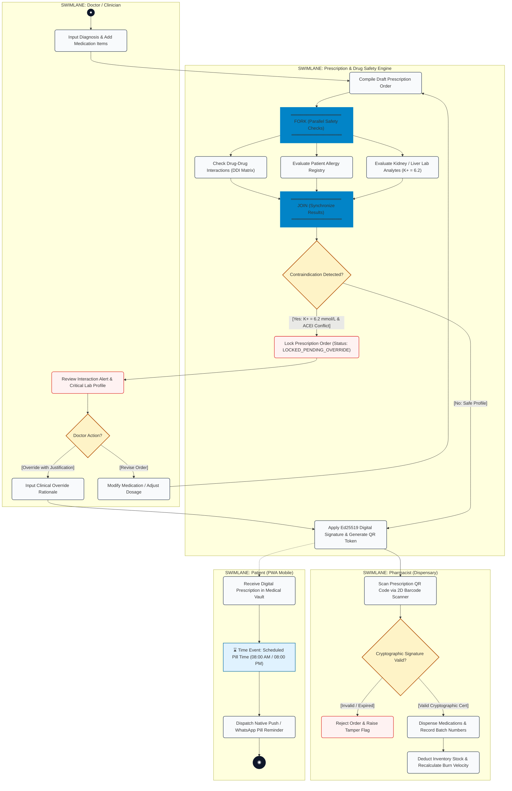

---

## 32. Universal Scanner Pipeline Activity Flow (Fork-Join OCR)

The **Universal Medical Scanner** allows patients to digitize medical documents across 5 categories. It utilizes a **Fork-Join concurrency pattern** to process optical character recognition and structured cloud JSON extraction in parallel:

```
┌────────────────────────────────────────────────────────────────────────┐
│             UNIVERSAL 5-CATEGORY SCANNER ACTIVITY FLOW                 │
│                                                                        │
│   ● (User Selects Category: OTC, Rx, Lab, MRI, Vaccine)               │
│   │                                                                    │
│   ▼                                                                    │
│   [ Capture Image via Camera / File Upload ]                           │
│   │                                                                    │
│   ▼                                                                    │
│   ◇ { Image Quality & Blurriness Check }                               │
│    ├─► [Blurry / Underexposed] ──► [ Prompt User to Retake Photo ] ──┐ │
│    │                                                                 │ │
│    └─► [Image Pass]                                                  │ │
│         │                                                            │ │
│         ▼                                                            │ │
│   ═══════════════════ FORK (Parallel Extractors) ═══════════════════ │ │
│      │                                                      │        │ │
│      ▼                                                      ▼        │ │
│   [ Tesseract Offline OCR ]                [ Cloud Multi-Modal LLM ] │ │
│   [ (Fast Token Stream)   ]                [ (Structured JSON DTO) ] │ │
│      │                                                      │        │ │
│      ▼                                                      ▼        │ │
│   ═══════════════════ JOIN (Synchronize Pipelines) ═════════════════ │ │
│         │                                                            │ │
│         ▼                                                            │ │
│   [ Correlate Clinical Vitals with Patient Vault ]                   │ │
│         │                                                            │ │
│         ▼                                                            │ │
│   [ Encrypt Artifact with AES-256 GCM & Save to Vault ]              │ │
│         │                                                            │ │
│         ▼                                                            │ │
│         ◉ Final State (Document Digitized)                           │ │
└────────────────────────────────────────────────────────────────────────┘
```

---

## 33. Step-by-Step Guide to Drawing Activity Diagrams in Exam / Tools

### Drawing the Activity Diagram in Draw.io / Lucidchart / StarUML:
1. **Create Swimlane Partitions**:
   * Add a **Swimlane / Pool container** with 4 vertical columns:
     * Column 1: `Doctor / Clinician`
     * Column 2: `Prescription & Safety Engine`
     * Column 3: `Pharmacist (Dispensary)`
     * Column 4: `Patient (PWA Mobile)`
2. **Place the Initial State (`●`)**:
   * Place a solid black circle at the top of the `Doctor` swimlane.
3. **Add Action Boxes**:
   * Add rounded rectangles for operational tasks inside the corresponding swimlanes.
4. **Draw Fork Bars (Parallel Execution)**:
   * Insert a thick, solid horizontal bar labeled `FORK`.
   * Connect one incoming control flow arrow into the bar.
   * Draw multiple outgoing arrows from the bar to the parallel tasks (`Check DDI`, `Check Allergy`, `Check Labs`).
5. **Draw Join Bars (Synchronization)**:
   * Insert another thick, solid bar below the parallel tasks labeled `JOIN`.
   * Connect all incoming arrows from the parallel tasks into the join bar.
   * Draw a single outgoing arrow from the join bar to the next step.
6. **Add Decision Diamonds & Guards**:
   * Draw diamonds for branching points.
   * Write guard conditions in **square brackets `[ ]`** along each outgoing branch (e.g., `[Contraindication Found]`, `[Safe]`).
7. **Add Time Events (`⌛`)**:
   * Insert an hourglass symbol for scheduled delays (e.g., daily dosage times).
8. **Place the Final State (`◉`)**:
   * Terminate the workflow with a bullseye symbol (a filled black circle inside an outer ring).

---

## 34. University Viva & Oral Defense FAQ (Activity Diagrams)

### Q1: What is the fundamental difference between a Fork and a Decision node?
> **Answer:**
> * A **Decision Node (`◇`)** represents **alternative conditional branching**: it has 1 incoming flow and selects **exactly one** outgoing flow based on guard conditions. Only one path executes.
> * A **Fork Bar (`═══`)** represents **concurrent parallel execution**: it has 1 incoming flow and triggers **all outgoing flows simultaneously**. All parallel paths execute concurrently.

### Q2: What is the difference between a Join and a Merge node?
> **Answer:**
> * A **Join Bar (`═══`)** represents **synchronization**: it has multiple incoming flows and waits until **all parallel incoming threads finish** before allowing the single outgoing flow to proceed.
> * A **Merge Node (`◇`)** represents the **rejoining of alternate paths**: it has multiple incoming flows and continues the outgoing flow as soon as **any single incoming path arrives** (no synchronization).

### Q3: Why are Swimlanes essential in complex system design?
> **Answer:** Swimlanes divide the activity diagram into functional or organizational columns. They clarify **responsibility and ownership** by answering *"WHO does WHAT"*. In Sanjeevani, swimlanes prove that medical safety checks are handled autonomously by the backend engine, while override decisions remain strictly with the licensed clinician.

### Q4: What happens if one parallel branch in a Join bar never completes?
> **Answer:** The system experiences a **deadlock**. A Join bar has blocking semantics: it cannot emit an outgoing control token until it receives an arrival token from *every single incoming parallel branch*. In Sanjeevani, all async safety check sub-tasks implement strict timeout circuits (e.g., 500ms timeout per check) to guarantee the join bar always resolves.

### Q5: How is an Activity Diagram different from a Sequence Diagram?
> **Answer:**
> * An **Activity Diagram** emphasizes **workflow, internal operations, concurrency (fork/join), and decision logic**.
> * A **Sequence Diagram** emphasizes **message exchange over time between specific object instances** (lifelines, synchronous calls, and return messages).

---

# PART VII: UML SEQUENCE DIAGRAM (4.7)

---

## 35. Sequence Diagram Overview & UML Notations

A **UML Sequence Diagram** is an **interaction diagram** that models how objects, components, and actors communicate with one another **in a precise chronological order over time**. It illustrates the lifeline of each entity, the invocation of synchronous and asynchronous operations, internal self-delegations, dynamic object instantiation/deletion, and conditional execution using **Interaction Frames** (`alt`, `opt`, `loop`, `par`).

```
┌────────────────────────────────────────────────────────────────────────┐
│                     UML SEQUENCE DIAGRAM NOTATIONS                     │
├────────────────────────────────────────────────────────────────────────┤
│                                                                        │
│      웃 Actor           objectA : ClassA             objectB : ClassB  │
│         │                      │                            │          │
│         │  1. Synchronous (──►)│                            │          │
│         ├─────────────────────►│                            │          │
│         │                      │  2. Synchronous (──►)      │          │
│         │                      ├───────────────────────────►│          │
│         │                      │                            │ █        │
│         │                      │                            │ █ 3. Self│
│         │                      │                            │ █ (↺)    │
│         │                      │  4. Reply (<---)           │          │
│         │                      │◄ - - - - - - - - - - - - - ┤          │
│         │  5. Reply (<---)     │                                       │
│         │◄ - - - - - - - - - - ┤                                       │
│         │                      │  6. Asynchronous (──>)                │
│         │                      ├───────────────────────────►           │
│         │                      │                            │          │
│         │                      │  7. Create («create»)      │          │
│         │                      │ - - - - - - - - - - - - - ►┌────────┐ │
│         │                      │                            │newObj  │ │
│         │                      │  8. Delete Message         └────┬───┘ │
│         │                      │────────────────────────────────►│     │
│         │                      │                                 X     │
│         ▼                      ▼                                       │
│     (Time flows downwards along the vertical dashed Lifeline)          │
└────────────────────────────────────────────────────────────────────────┘
```

### 35.1 Message Types & Symbol Directory

| Message Type | Visual Arrow Style | Communication Semantics in Sanjeevani |
| :--- | :---: | :--- |
| **Synchronous Call** | **Solid line, filled arrowhead (`──►`)** | **Blocking call**: Caller waits until callee finishes execution and returns control (e.g., `doctor` calls `POST /api/prescriptions`). |
| **Asynchronous Call** | **Solid line, open/stick arrowhead (`──>`)** | **Non-blocking call**: Caller dispatches message and continues execution without waiting (e.g., enqueue background audit log or SMS notification). |
| **Reply / Return** | **Dashed line, open arrowhead (`< - -`)** | Passes computed result or HTTP response payload back to the awaiting caller. |
| **Self Message** | **U-shaped curved loop (`↺`)** | An object invokes an internal private method on itself (e.g., `DrugSafetyEngine` calls `computeRiskScore()`). |
| **Create Message** | **Dashed line labeled `«create»` (`- -►`)** | Instantiates a brand new object instance in memory during execution. |
| **Delete Message** | **Arrow terminating in a bold `X` (`──► X`)** | Destroys an object or invalidates a session, freeing its memory. |
| **Found Message** | **Filled circle to Lifeline (`●──►`)** | Message arriving from an external boundary or unspecified origin outside the model scope. |
| **Lost Message** | **Lifeline to Filled circle (`──► ●`)** | Message dispatched to an unknown or unhandled destination (e.g., dropped packet or unrouted error). |
| **Lifeline** | **Vertical dashed line below Head Box** | Represents the existence and duration of an individual object over time. |
| **Activation Bar** | **Vertical shaded rectangle on Lifeline (`█`)** | Indicates the precise duration during which an object is actively executing code or awaiting a child call. |

---

### 35.2 Interaction Frames (Combined Fragments)

| Fragment Operator | Meaning & Clinical Application in Sanjeevani |
| :--- | :--- |
| **`alt` (Alternative)** | Mutually exclusive **if-else** blocks. Evaluates guard conditions; executes exactly one operand (e.g., `[Safe Profile]` vs `[Contraindication Detected]`). |
| **`opt` (Optional)** | **If-then** block with no else. Executes only if the guard condition evaluates to true (e.g., `[Doctor Provides Clinical Override]`). |
| **`loop` (Iteration)** | Repeats the message sequence for each item in a collection (e.g., `loop [for each Medication in Prescription]`). |
| **`par` (Parallel)** | Concurrent execution: messages inside parallel sub-frames execute simultaneously. |
| **`break` (Exception)** | Breaks out of the enclosing interaction if an error or critical exception occurs. |

---

---

## 36. Role 1: Attending Physician (Doctor) Sequence Diagram

### Clinical Scenario: Outpatient Consultation, Drug Safety Interlock & Clinical Override
* **Actor**: `Doctor (Dr. V. K. Rai, Cardiologist)`
* **Scenario**: The doctor examines patient *Ramesh Kumar*, reviews diagnostic history, and prescribes *Clopidogrel 75mg* and *Enalapril 5mg*. The `PrescriptionController` triggers the `DrugSafetyEngine`, which discovers serum potassium is $6.2\text{ mmol/L}$ (Critical High). The system locks the prescription order. The doctor enters a mandatory clinical override rationale (*"Concurrent potassium binder initiated; ICU telemetry monitoring"*), which applies an Ed25519 digital signature and commits the order to the database.

```mermaid
sequenceDiagram
    autonumber
    actor Doctor as 웃 Doctor (Dr. Rai)
    participant UI as docUI : DoctorWorkstation
    participant API as rxCtrl : PrescriptionController
    participant Safety as safetyEngine : DrugSafetyEngine
    participant LabRepo as labRepo : LabDataRepository
    participant Crypto as cryptoSvc : Ed25519Signer
    participant DB as db : PostgreSQLDatabase

    Doctor ->> UI: 1. Input Diagnosis & Select Clopidogrel + Enalapril
    activate UI
    UI ->> API: 2. POST /api/prescriptions (patientId, medItems)
    activate API

    API ->> Safety: 3. evaluateInteractions(patientId, medIds)
    activate Safety

    Safety ->> LabRepo: 4. getRecentLabAnalytes(patientId)
    activate LabRepo
    LabRepo -->> Safety: 5. Return LabProfile (K+ = 6.2 mmol/L, Critical_High)
    deactivate LabRepo

    Safety ->> Safety: 6. correlateDrugWithElectrolytes(medIds, K+)
    
    alt Critical Hyperkalemia / Drug Contraindication Detected
        Safety -->> API: 7. Return SafetyReportDTO (Severity: CRITICAL, Rule: ACEI_K_HAZARD)
        API ->> DB: 8. INSERT Prescription (status: "LOCKED_PENDING_OVERRIDE")
        activate DB
        DB -->> API: 9. Acknowledge Saved Draft
        deactivate DB

        API -->> UI: 10. HTTP 409 Conflict (SafetyWarningDTO, rxId: "RX-902")
        UI -->> Doctor: 11. Render Red Interlock Warning (K+ = 6.2 mmol/L)
        
        Doctor ->> UI: 12. Enter Override Rationale ("Concurrent K-Binder; ICU Monitoring")
        UI ->> API: 13. POST /api/prescriptions/RX-902/override (rationale)
        
        API ->> Crypto: 14. signPrescriptionPayload(rxPayload, doctorCert)
        activate Crypto
        Crypto -->> API: 15. Return DigitalSignature & Encoded QR Token
        deactivate Crypto

        API ->> DB: 16. UPDATE Prescription (status: "ISSUED", is_overridden: true)
        activate DB
        DB -->> API: 17. Confirm Commit
        deactivate DB

        API -->> UI: 18. HTTP 200 OK (Signed Prescription + QR Code)
        UI -->> Doctor: 19. Display Verified Prescription & QR Passport
    else Clean Profile (No Contraindications)
        Safety -->> API: 20. Return SafetyReportDTO (Status: APPROVED)
        deactivate Safety
        API ->> Crypto: 21. signPrescriptionPayload(rxPayload, doctorCert)
        activate Crypto
        Crypto -->> API: 22. Return DigitalSignature & QR Token
        deactivate Crypto
        API ->> DB: 23. INSERT Prescription (status: "ISSUED")
        activate DB
        DB -->> API: 24. Confirm Commit
        deactivate DB
        API -->> UI: 25. HTTP 201 Created (Signed Prescription)
        UI -->> Doctor: 26. Display Order Confirmed
    end

    deactivate API
    deactivate UI
```

---

## 37. Role 2: Patient & Caregiver Sequence Diagram

### Clinical Scenario: Universal Scanner Hub Ingestion & Daily Medication Intake Logging
* **Actor**: `Patient (Ramesh Kumar / Mobile PWA)`
* **Scenario**: 
  1. **Flow A (Document Digitization)**: Patient uploads a photo of an OTC medicine strip or past lab report. The `ScannerHub` invokes the OCR pipeline, normalizes medication data, and archives the file in the Encrypted Vault.
  2. **Flow B (Intake Adherence Logging)**: At 08:30 PM, the scheduled reminder prompts the patient to confirm their *Clopidogrel 75mg* dose. The patient marks it `taken`, which updates the adherence score.

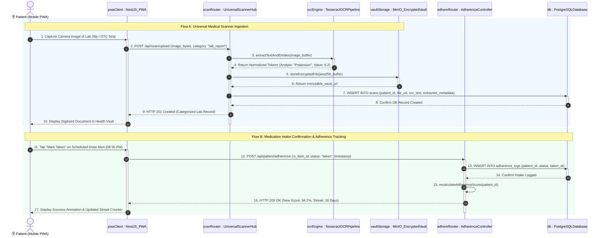

---

## 38. Role 3: Pharmacist (Dispensary) Sequence Diagram

### Clinical Scenario: QR Code Verification, Safety Lock Check, Dispensation & Stock Velocity
* **Actor**: `Pharmacist (Apollo Central Dispensary)`
* **Scenario**: Pharmacist scans a patient's prescription QR code. The system checks the Ed25519 digital signature and verifies that all safety interlocks were clinically overridden. The pharmacist dispenses the medication, which atomically decrements the inventory batch and recalculates the daily burn velocity.

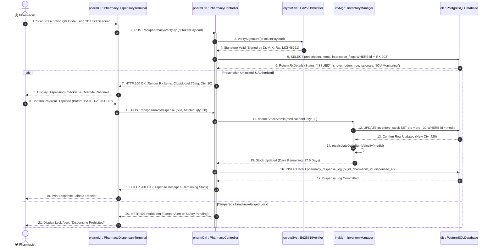

---

## 39. Role 4: Front-Desk Receptionist & Triage Nurse Sequence Diagram

### Clinical Scenario: Patient Telephone Lookup, AI Acuity Triage & Doctor Queue Routing
* **Actor**: `Receptionist / Triage Nurse`
* **Scenario**: A patient arrives at outpatient reception. The receptionist searches their 10-digit mobile number. The patient reports acute chest pressure. The AI triage classifier evaluates the complaint, flags priority as *Critical (Red)*, and routes the patient directly to the Cardiology OPD priority token queue.

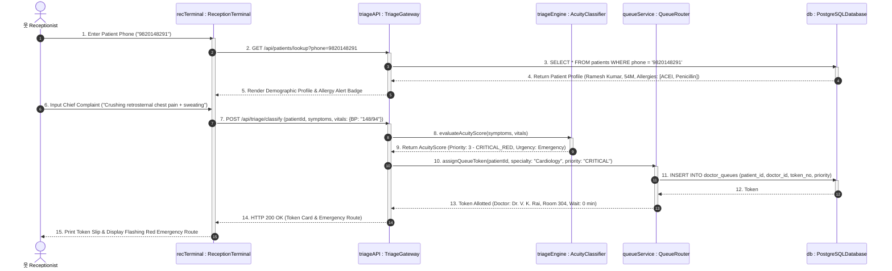

---

## 40. Role 5: Diagnostic Laboratory Technician Sequence Diagram

### Clinical Scenario: Pathology Slip Ingestion, Panic Value Interlock & Direct Vault Publishing
* **Actor**: `Lab Technician`
* **Scenario**: Lab technician receives a serum electrolyte sample for *Ramesh Kumar*. The analyzer outputs Potassium at $6.2\text{ mmol/L}$. The technician uploads the result slip; the system flags the panic value ($\ge 6.0\text{ mmol/L}$), publishes the verified record to the patient's Vault, and broadcasts an emergency alert to the attending cardiologist.

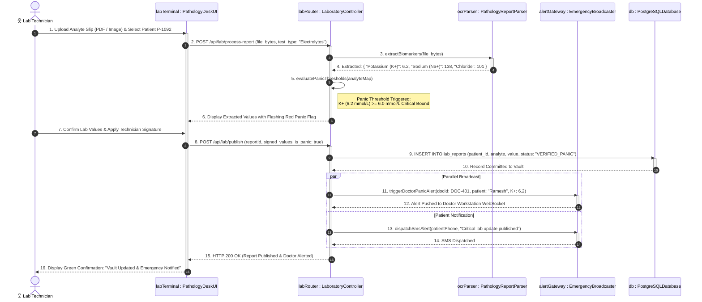

---

## 41. Role 6: Emergency Paramedic / First Responder Sequence Diagram

### Clinical Scenario: Zero-Auth Emergency QR Passport Scan & Critical Profile Rendering
* **Actor**: `Emergency Paramedic / Ambulance Responder`
* **Scenario**: A patient is found unconscious at the scene of an accident. The paramedic scans the patient's physical Emergency QR Passport card using a mobile browser. The request hits a stateless, zero-auth public endpoint. The system verifies the cryptographic signature without requiring login, immediately rendering blood group, severe allergies, active medications, and tap-to-call SOS contacts.

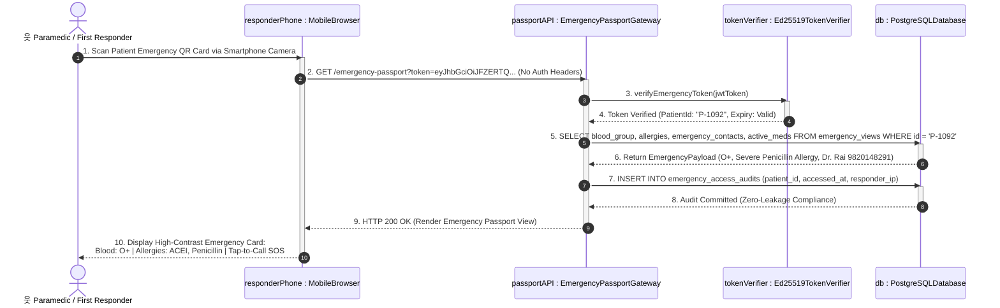

---

## 42. Role 7: Hospital Administrator Sequence Diagram

### Clinical Scenario: Staff Role Provisioning & Immutable Clinical Audit Trail Inspection
* **Actor**: `Hospital Administrator`
* **Scenario**: The administrator provisions a new cardiologist, assigning departmental clinical privileges. Subsequently, the admin inspects the immutable clinical audit log to verify all prescription safety overrides signed during the week.

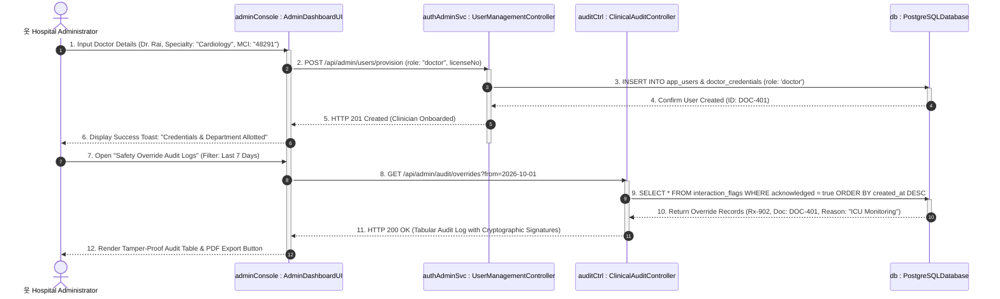

---

## 43. Hybrid AI Copilot Cascade Sequence Diagram

This sequence diagram visualizes how Sanjeevani enforces **sub-second AI response times** while maintaining **100% clinical availability** via an automated circuit-breaker fallback:

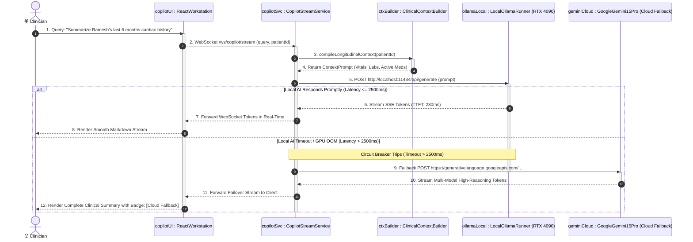

---

## 44. Step-by-Step Guide to Drawing Role-Based Sequence Diagrams

### Drawing Sequence Diagrams in Draw.io / Lucidchart / StarUML:
1. **Identify the Actor & Core Subsystems**:
   * Place the primary human actor on the far left (Stick Figure).
   * Arrange the software layers from left to right: `Client UI` $\rightarrow$ `API Controller` $\rightarrow$ `Business/Safety Engine` $\rightarrow$ `Security/Crypto` $\rightarrow$ `Database`.
2. **Drop Vertical Dashed Lines (Lifelines)**:
   * Draw dashed lines extending vertically downwards from the center of each header box.
3. **Draw Synchronous Messages (`──►`)**:
   * Draw horizontal solid lines with **filled triangular arrowheads** pointing from sender to receiver.
   * Add a narrow **shaded activation bar (`█`)** on the receiver's lifeline for the duration of the call.
4. **Draw Return Messages (`< - -`)**:
   * Draw horizontal **dashed lines with open arrowheads** pointing back to the caller once the operation completes.
5. **Draw Self Messages (`↺`)**:
   * Draw a U-shaped arrow departing from the lifeline and re-entering lower down on the same lifeline.
6. **Enclose Branches in Interaction Frames (`alt` / `par`)**:
   * Draw a large rectangle around the conditional section labeled with `alt` or `par`.
   * Divide the frame horizontally with a dashed line into mutually exclusive or concurrent compartments.
7. **Number All Messages Chronologically**:
   * Top-to-bottom numbering (1, 2, 3...) strictly reflects execution sequence over time.

---

## 45. University Viva & Oral Defense FAQ (Sequence Diagrams)

### Q1: Why are there different Sequence Diagrams for each user role in Sanjeevani?
> **Answer:** Each role (Doctor, Patient, Pharmacist, Receptionist, Lab Tech, Paramedic, Admin) interacts with a completely different operational slice of the architecture:
> * The **Doctor** exercises synchronous safety-gated prescribing and digital signing.
> * The **Patient** exercises asynchronous OCR document ingestion and intake logging.
> * The **Pharmacist** executes cryptographic QR verification and atomic inventory decrements.
> * The **Paramedic** accesses a stateless zero-auth public endpoint for instant emergency telemetry.
> Creating separate sequence diagrams proves that the system maintains strict **separation of concerns** and role-specific security boundaries.

### Q2: What is the semantic difference between Synchronous and Asynchronous messages?
> **Answer:**
> * **Synchronous Call (`──►`, filled arrowhead)**: The calling thread **blocks and suspends execution** while waiting for the receiver to process the request and return a response (e.g., `evaluateInteractions()` must finish before the prescription can proceed).
> * **Asynchronous Call (`──>`, open arrowhead)**: The caller **fires and forgets**, immediately continuing its own execution without waiting for the recipient (e.g., dispatching an SMS reminder or logging an async audit trail).

### Q3: What is an Activation Bar, and when is it required?
> **Answer:** An **Activation Bar** (also known as an *Execution Specification*) is a vertical rectangle drawn over a lifeline indicating that the object is actively executing internal code or waiting for sub-routines to return. It begins when a message reaches the object and ends when the return message is sent.

### Q4: What is the purpose of the `alt` Combined Fragment?
> **Answer:** The `alt` (Alternative) operator models **conditional if-else branching**. It partitions the lifelines into multiple mutually exclusive compartments separated by dashed horizontal lines. Only the compartment whose guard condition evaluates to true will execute. In Sanjeevani, `alt` clearly separates the *Clinical Override Branch* from the *Standard Approval Branch*.

### Q5: How does the Paramedic sequence diagram enforce security without a login password?
> **Answer:** It uses **Asymmetric Cryptographic Proof of Possession**. The physical QR passport contains a digitally signed Ed25519 token generated by the hospital. The public gateway verifies the cryptographic signature with the hospital's public key; if valid, it returns only emergency-relevant data (blood group, allergies, active meds), ensuring life-saving speed without opening unauthorized administrative database access.

---

# PART VIII: UML SEQUENCE DIAGRAM WITH REFERENCE FRAMES (`ref` INTERACTION USES)

---

## 46. The UML 2.0 `ref` (Interaction Use) Concept & Notational Specification

In the **UML 2.0+ standard**, a **`ref` Frame** (formally known as an **Interaction Use**) is an interaction operator used to **modularize, abstract, and reuse** sequence flows. 

Instead of creating massive, monolithic sequence diagrams with dozens of repetitive lifelines and redundant messages (e.g., repeating the 15-step authentication or drug safety algorithm in every diagram), the designer places a **`ref` frame** that points to an external, independently documented sequence diagram.

```
┌────────────────────────────────────────────────────────────────────────┐
│                       UML 2.0 `ref` FRAME NOTATION                     │
├────────────────────────────────────────────────────────────────────────┤
│                                                                        │
│       Lifeline A                     Lifeline B           Lifeline C   │
│           │                              │                    │        │
│           │   1. Initial Message         │                    │        │
│           ├─────────────────────────────►│                    │        │
│           │                              │                    │        │
│   ┌───────┴──────────────────────────────┴────────────────────┴────┐   │
│   │ ref                                                            │   │
│   │                                                                │   │
│   │       SD-04: EvaluateDrugSafety(patientId, medList) : AlertDTO │   │
│   │                                                                │   │
│   └───────┬──────────────────────────────┬────────────────────┬────┘   │
│           │                              │                    │        │
│           │   2. Post-Verification Action│                    │        │
│           │◄ - - - - - - - - - - - - - - ┤                    │        │
│           ▼                              ▼                    ▼        │
│                                                                        │
└────────────────────────────────────────────────────────────────────────┘
```

### 46.1 Key Architectural Benefits of `ref` Frames

1. **High Cohesion & Low Coupling**: Isolates complex subsystem interactions (e.g., cryptographic verification, AI cascades) into standalone modules.
2. **De-cluttering & Readability**: Reduces diagram visual noise by abstracting 15+ low-level API calls into a single named reference box.
3. **Reusability Across Roles**: The same `ref: SD-01 Authenticate & Verify RBAC` frame is referenced by the Doctor, Pharmacist, Receptionist, and Lab Technician sequence flows without copy-pasting.
4. **Formal Parameter Passing**: A `ref` frame can take formal input arguments and declare typed return values (e.g., `ref: VerifyPrescriptionSignature(qrToken) : RxPayload`).

---

## 47. Sanjeevani Master End-to-End Reference Sequence Diagram

This master diagram tracks a patient's complete journey through the Sanjeevani healthcare ecosystem:
1. **Intake**: Front-desk triage allocates a priority token.
2. **Consultation**: Doctor examines 360° patient timeline and authors a prescription.
3. **Safety Interlock**: Reusable drug safety engine evaluates contraindications.
4. **Cryptographic Signing**: Prescription is signed with an Ed25519 digital certificate.
5. **Dispensary**: Pharmacist verifies QR code and decrements inventory.
6. **Adherence**: Automated time event triggers daily dosage reminders.

Each major subsystem interaction is modeled as a standardized **`ref` Interaction Frame**:

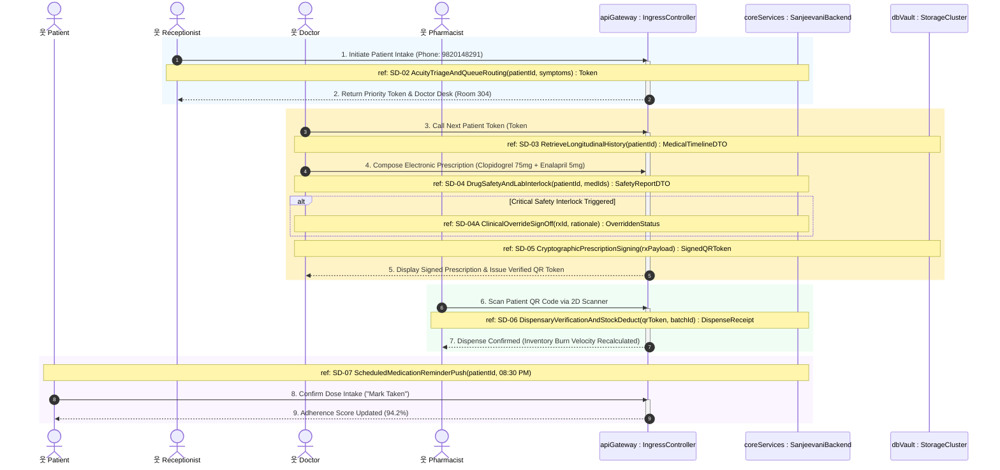

---

## 48. Detailed Specification of Referenced Interactions (`ref` Catalog)

Each `ref` frame in the master diagram corresponds to an encapsulated, independently testable interaction module:

```
┌────────────────────────────────────────────────────────────────────────┐
│                   SANJEEVANI `ref` INTERACTION MODULES                 │
├────────────────────────────────────────────────────────────────────────┤
│                                                                        │
│   [SD-01] ref: AuthenticateUserAndValidateRBAC(credentials)            │
│           Verifies Argon2 password hash / JWT token; checks role       │
│           permissions (Doctor, Patient, Pharmacist, Lab, Admin).       │
│                                                                        │
│   [SD-02] ref: AcuityTriageAndQueueRouting(patientId, symptoms)        │
│           Runs NLP Acuity Classifier; assigns Red/Amber/Green priority;│
│           issues sequential token and routes to doctor OPD queue.      │
│                                                                        │
│   [SD-03] ref: RetrieveLongitudinalHistory(patientId)                  │
│           Fetches historical prescriptions, past lab trends (K+=6.2),  │
│           allergies, and MinIO encrypted scan attachments.             │
│                                                                        │
│   [SD-04] ref: DrugSafetyAndLabInterlock(patientId, medIds)            │
│           Evaluates multi-drug contraindications, active lab bounds,   │
│           and returns structured SafetyReportDTO.                      │
│                                                                        │
│   [SD-05] ref: CryptographicPrescriptionSigning(rxPayload)             │
│           Applies doctor's Ed25519 digital signature; generates high-  │
│           density tamper-evident QR passport payload.                  │
│                                                                        │
│   [SD-06] ref: DispensaryVerificationAndStockDeduct(qrToken, batchId)  │
│           Verifies signature validity; checks safety override log;     │
│           executes atomic SQL inventory decrement; updates velocity.   │
│                                                                        │
│   [SD-07] ref: ScheduledMedicationReminderPush(patientId, cronTime)    │
│           Evaluates daily cron triggers; pushes WhatsApp/Native alert; │
│           logs intake confirmation and streak analytics.               │
│                                                                        │
└────────────────────────────────────────────────────────────────────────┘
```

### 48.1 Decomposition of `ref: SD-04 DrugSafetyAndLabInterlock`

To demonstrate how a referenced sequence expands into internal message exchanges, here is the dedicated sub-interaction specification for `SD-04`:

* **Signature**: `SD-04: DrugSafetyAndLabInterlock(in patientId : UUID, in medIds : List<UUID>) : SafetyReportDTO`
* **Pre-condition**: Draft prescription composed by doctor.
* **Post-condition**: Prescription locked if severe contraindications found; otherwise marked safe.

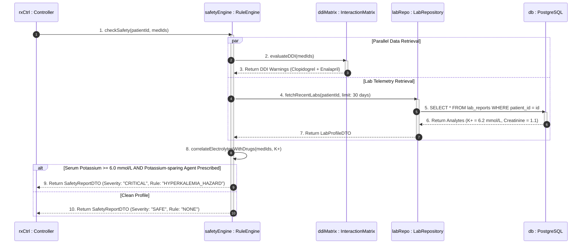

---

## 49. Step-by-Step Guide to Drawing `ref` Sequence Diagrams in Exam / Tools

### Drawing `ref` Diagrams in Draw.io / Lucidchart / StarUML:
1. **Draw Top-Level Master Sequence**:
   * Place high-level actors and primary tier lifelines horizontally (`Patient`, `Receptionist`, `Doctor`, `Pharmacist`, `API Gateway`, `Core Engine`).
2. **Identify Cohesive Sub-Processes**:
   * Determine which multi-step procedures occur repeatedly (e.g., Triage, Drug Safety Checking, Digital Signing, Stock Decrementing).
3. **Insert the `ref` Operator Shape**:
   * In Draw.io: Search for `Interaction Use` or `ref` in the UML Sequence library.
   * Draw a clean rectangle spanning across the participating lifelines.
4. **Format the Operator Tag**:
   * In the top-left corner, place the standard pentagon or rectangular tag containing the text `ref`.
5. **Label the Reference Interaction Signature**:
   * In the center of the box, write the unique sequence identifier, method name, input parameters, and return type:
     $$\text{ref: } \textbf{InteractionName}(\text{param1}, \text{param2}) : \text{ReturnType}$$
     *Example*: `ref: SD-04 DrugSafetyAndLabInterlock(patientId, medIds) : SafetyReportDTO`.
6. **Provide Child Decomposed Diagrams**:
   * In your project documentation or exam answer sheet, accompany the master diagram with individual sub-diagrams expanding each referenced module.

---

## 50. University Viva & Oral Defense FAQ on `ref` Interaction Frames

### Q1: What is an Interaction Use (`ref`) in UML 2.0 Sequence Diagrams?
> **Answer:** An **Interaction Use (`ref`)** is a UML sequence diagram operator that allows one sequence diagram to **reference another sequence diagram**. It is visually depicted as a frame labeled `ref` spanning the participating lifelines, with the referenced diagram's name and arguments centered inside. It acts like a **function call** in structured programming, enabling modularity and reusability.

### Q2: Why is the `ref` frame superior to drawing one giant sequence diagram?
> **Answer:** In enterprise systems like Sanjeevani, drawing an end-to-end patient workflow without `ref` frames would require 60+ vertical message arrows, making the diagram unreadable and error-prone. The `ref` frame introduces **hierarchical decomposition**:
> * The **Master Sequence Diagram** gives architects and examiners the high-level operational picture.
> * The **Child Sequence Diagrams** give developers the granular, line-by-line API, socket, and database mechanics.

### Q3: Can a `ref` frame accept arguments and return values?
> **Answer:** **Yes.** Following OMG UML 2.5 standards, an interaction use can declare formal input parameters inside parentheses and a return value following a colon:
> $$\text{ref: VerifySignature(in qrToken : String) : out Boolean}$$

### Q4: What is the difference between an `alt` fragment and a `ref` frame?
> **Answer:**
> * An **`alt` frame** represents **conditional if-else branching** within a single diagram (only one branch executes based on guard conditions).
> * A **`ref` frame** represents an **external modular subroutine reference** that executes unconditionally or inside an `alt` branch, delegating control to a standalone interaction model.

### Q5: How do `ref` frames align with Clean Architecture and Microservices?
> **Answer:** In modern microservice architectures, each microservice encapsulates its own internal database and domain logic. A `ref` frame cleanly models an **inter-service API call or gRPC transaction**: the caller invokes the referenced service boundary without exposing the service's internal private helper functions or database tables to the master diagram.


